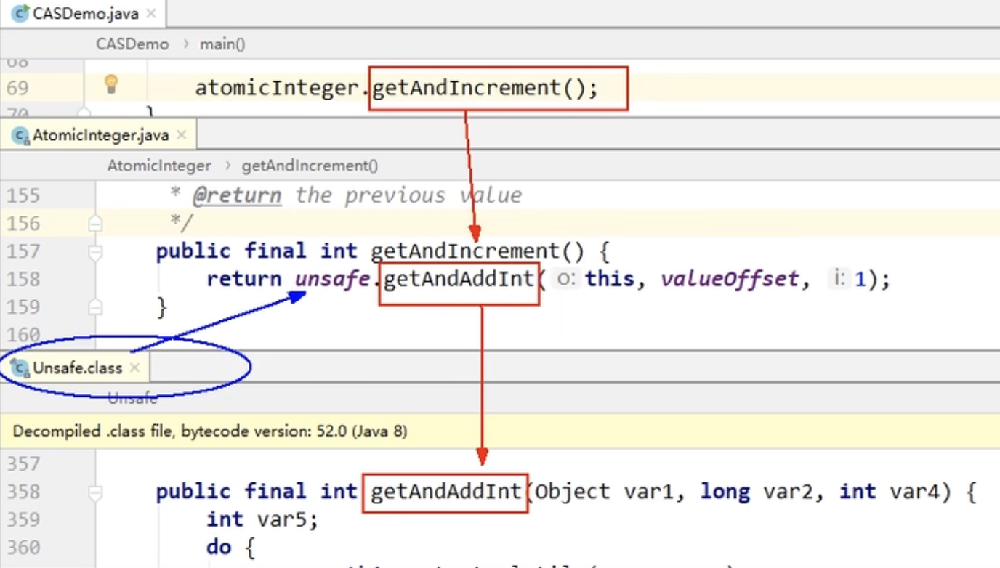
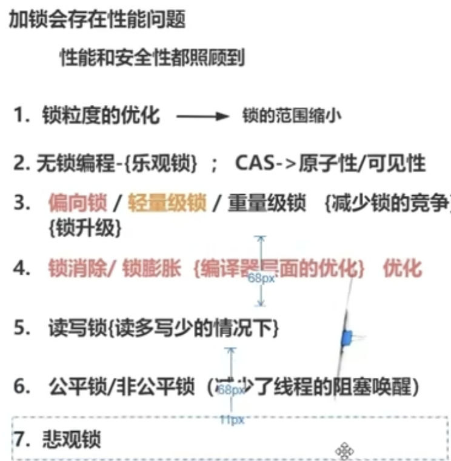

[toc]


# CAS

当且仅当旧的预期值A和内存V想同时,将内存值V修改为B否则什么都不做或重来

==当它重来重试这种行为称之为------自旋！==


Unsafe里面大多数都是native,直接操作操作系统的





```java
public class AtomicReferenceDemo {
    public static void main(String[] args) {
        AtomicReference<User> atomicReference = new AtomicReference<>();

        User z3 = new User("z3", 22);
        User li4 = new User("li4", 28);

        atomicReference.set(z3);

        System.out.println(atomicReference.compareAndSet(z3, li4) + "\t" + atomicReference.get().toString());
        System.out.println(atomicReference.compareAndSet(z3, li4) + "\t" + atomicReference.get().toString());


    }
}
```

## 自旋锁


## CAS两大问题

### 循环时间过长开销过大

### 解决ABA的问题用哪个类


解决ABA问题用AtomicStampedReference<Book> stampedReference类


## 总结

CAS是比较并且交换,是unsafe类下面的原子操作,unsafe大多都是native修饰的,而native底层是直接操作内存的,所以CAS是原子操作,他能实现自旋,自旋是指不停的重试修改

automatic原子类就是通过cas+volatile实现的

会产生ABA问题,就是两个线程,A将a改成b之前,B已经将b改成a了,所以A还是a没有改成b,用AtomicStampedReference可以解决问题

# volatile

## 可见性

写完后立即刷新回主内存并及时发出通过,大家可以去主内存拿最新版本,前面的需改对后面所有内存可见

## 禁止指令重排


## ==内存屏障(memory barrier)==

### 是什么


### 可见性如何保证

内存屏障之前的写操作都回写到主内存

内存屏障之后的读操作都能获取最新结果

### 禁止指令重排如何保证


是CPU货编译器对内存随机访问的一个同步点,使得此点之前到所有读写操作执行完之后才可以开始该同步点读操作

### 为什么不保证原子性


两个线程同时将0加1操作,但是A线程改了,B还没改完,主内存就会将值改为1,但是B内存就会失效,所以volatile不能保证原子性,对于多线程修改主内存共享变量的场景只能加==同步锁==

### 怎么实现的

### 场景落地

volatile boolean flag = false

高并发里面,靠变量来通知其他线程来改变后续动作


单例


问题: 多线程环境下,由于重排序,该对象可能还未完成初始化就被其他线程读取

解决: 利用volatile,禁止初始化对象和设置singleton指向内存空间重排序

双重检查锁

# 举个volatile关键字例子

# 有用过future类吗

## 你觉得线程池中用这个Future类是解决了什么问题

# AQS

## 是什么

抽象的队列同步器

整体就是一个抽象的FIFO队列来完成资源获取线程的排队工作，并通过一个int类变量
表示持有锁的状态

和AQS有关的

ReentrantLock
CountDownLatch
ReentrantReadWriteLock
Semaphore


既然说到了排队等候机制，那么就一定会有某种队列形成，这样的队列是什么数据结构呢？

如果共享资源被占用，就需要一定的阻塞等待唤醒机制来保证锁分配。这个机制主要用的是CLH队列的变体实现的，将暂时获取不到锁的线程加入到队列中，这个队列就是AQS同步队列的抽象表现。它将要请求共享资源的线程及自身的等待状态封装成队列的结点对象(Node),通过CAS、自旋以LockSupport.park()的方式，维护state变量的状态，使并发达到同步的效果。


AQS使用一个volatile的int类型的成员变量来表示同步状态，通过内置的FIFO队列来完成资源获取的排队工作将每条要去抢占资源的线程封装成一个Node节点来实现锁的分配，通过CAS完成对State值的修改。


属性说明


## 底层原理

Lock lock = new ReentrantLock();

不传就是默认非公平锁

Lock lock = new ReentrantLock(true);

传了true就是公平锁

ReentrantLock具体实现


## AQS 栅栏锁

# 20 锁用过哪些

# 21 锁升级

# 22 锁降级

# 23 juc包下的用过哪些

# 24 分段锁的原理

# 25 自旋中的ABA问题

# Threadlocal底层的原理锁升级

## 是什么(说一下大概概念)


## 底层原理实现


## 内存泄漏

什么是内存泄漏?

如何引起的?

### 为什么要用弱引用?


## 强软弱虚引用


### 强引用


### 软引用


### 弱引用


### 虚引用


## 场景落地

```java
ThreadLocal<Integer> saleVolume = ThreadLocal.withInitial(() -> 0);

public void saleVolumeByThreadLocal() {
    saleVolume.set(1 + saleVolume.get());
}
```

```java
class House { //资源类
    int saleCount = 0;

    public synchronized void saleHouse() {
        ++saleCount;
    }

    /*ThreadLocal<Integer> saleVolume = new ThreadLocal<Integer>(){
        @Override
        protected Integer initialValue()
        {
            return 0;
        }
    };*/
    ThreadLocal<Integer> saleVolume = ThreadLocal.withInitial(() -> 0);

    public void saleVolumeByThreadLocal() {
        saleVolume.set(1 + saleVolume.get());
    }
}

/**
 * @auther zzyy
 * @create 2021-12-31 15:46
 * <p>
 * 需求1： 5个销售卖房子，集团高层只关心销售总量的准确统计数。
 * <p>
 * 需求2： 5个销售卖完随机数房子，各自独立销售额度，自己业绩按提成走，分灶吃饭，各个销售自己动手，丰衣足食
 */
public class ThreadLocalDemo {
    public static void main(String[] args) throws InterruptedException {

        House house = new House();

        for (int i = 1; i <= 5; i++) {
            new Thread(() -> {
                int size = new Random().nextInt(5) + 1;
                try {
                    for (int j = 1; j <= size; j++) {
                        house.saleHouse();
                        house.saleVolumeByThreadLocal();
                    }
                    System.out.println(Thread.currentThread().getName() + "\t" + "号销售卖出：" + house.saleVolume.get());
                } finally {
                    house.saleVolume.remove();
                }
            }, String.valueOf(i)).start();
        }
        ;

        //暂停毫秒
        try {
            TimeUnit.MILLISECONDS.sleep(300);
        } catch (InterruptedException e) {
            e.printStackTrace();
        }

        System.out.println(Thread.currentThread().getName() + "\t" + "共计卖出多少套： " + house.saleCount);
    }
}
```


# Synchronized和Lock的区别

从功能角度来看，Lock 和 Synchronized 都是 Java 中用来解决线程安全问题的工具。

从特性来看

Synchronized 是 Java 中的同步关键字，Lock 是 J.U.C 包中提供的接口，这个接口有很多实 现类，其中就包括 ReentrantLock 重入锁

Synchronized 可以通过两种方式来控制锁的粒度，

一种是把 synchronized 关键字修饰在方法层面，
 另一种是修饰在代码块上，并且我们可以通过 Synchronized 加锁对象的生命周期来控制锁的作用范 围，比如锁对象是静态对象或者类对象，那么这个锁就是全局锁。 如果锁对象是普通实例对象，那这个锁的范围取决于这个实例的生命周期。
 Lock 锁的粒度是通过它里面提供的 lock()和 unlock()方法决定的(贴图)，包裹在这两个方法之间 的代码能够保证线程安全性。而锁的作用域取决于 Lock 实例的生命周期。


Lock 比 Synchronized 的灵活性更高，Lock 可以自主决定什么时候加锁，什么时候释放锁， 只需要调用 lock()和 unlock()这两个方法就行，同时 Lock 还提供了非阻塞的竞争锁方法 tryLock()方法，这个方法通过返回 true/false 来告诉当前线程是否已经有其他线程正在使用 锁。

Synchronized 由于是关键字，所以它无法实现非阻塞竞争锁的方法，另外，Synchronized 锁的释放 是被动的，就是当 Synchronized 同步代码块执行完以后或者代码出现异常时才会释放。

 Lock 提供了公平锁和非公平锁的机制，公平锁是指线程竞争锁资源时，如果已经有其他线程 正在排队等待锁释放，那么当前竞争锁资源的线程无法插队。而非公平锁，就是不管是否有线 程在排队等待锁，它都会尝试去竞争一次锁。 Synchronized 只提供了一种非公平锁的实现。

从性能方面来看，Synchronized 和 Lock 在性能方面相差不大，在实现上会有一些区别， Synchronized 引入了偏向锁、轻量级锁、重量级锁以及锁升级的方式来优化加锁的性能，而 Lock 中则用到了自旋锁的方式来实现性能优化。

功能层面有两类锁

# 共享锁

# 排它锁




# JUC

JUC：指的是java.util三个并发编程工具包

1. java.util.concurrent
2. java.util.concurrent.atomic
3. java.util.concurrent.locks
