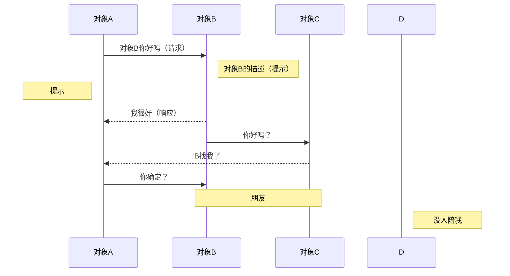
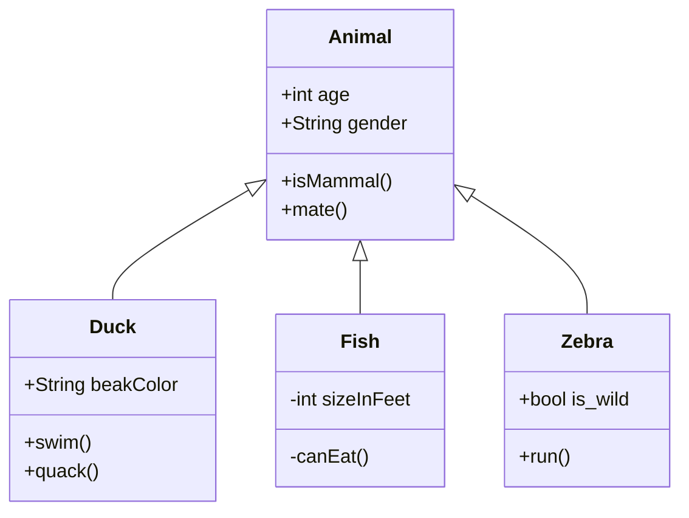
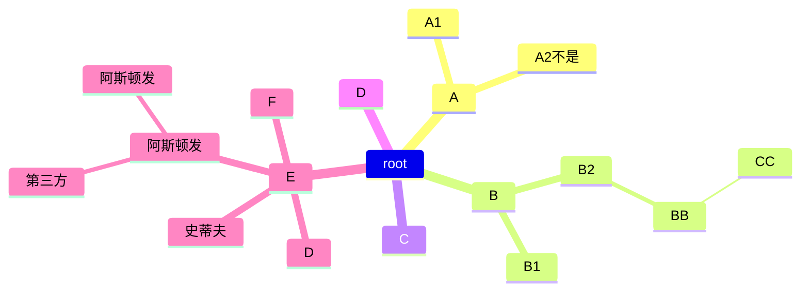

# 环境

 工号 41

云效访问地址：https://devops.aliyun.com/
用户登录名称 xi.chen@future-insight.onaliyun.com
登录密码 5BX!wOGk1NG#GrpmD3tz6d$dC{eEEHwf fujichika4;
AccessKey ID LTAI5t9u4zguQ7vr1feRMKgM
AccessKey Secret z9IFO9AYmXVsrNoVcN1GmEs92MMcyq

ZK 地址：http://101.200.170.120:34444/
登录账号密码：root/fi51888

测试服务器的IP 47.95.4.88 端口22 密码：000200admin

测试环境查看日志  docker logs -f --tail=1000 fi-selfhelp-miniapp

postman连接的ip地址  http://47.95.4.88:30020

# xxjob

查看了公司的xxjob定时任务模块
常用cron表达式例子
（1）0/2 * * * * ?  表示每2秒 执行任务
（1）0 0/2 * * * ?  表示每2分钟 执行任务
（1）0 0 2 1 * ?  表示在每月的1日的凌晨2点调整任务
（2）0 15 10 ? * MON-FRI  表示周一到周五每天上午10:15执行作业
（3）0 15 10 ? 6L 2002-2006  表示2002-2006年的每个月的最后一个星期五上午10:15执行作
（4）0 0 10,14,16 * * ?  每天上午10点，下午2点，4点 
（5）0 0/30 9-17 * * ?  朝九晚五工作时间内每半小时 
（6）0 0 12 ? * WED   表示每个星期三中午12点 
（7）0 0 12 * * ?  每天中午12点触发 
（8）0 15 10 ? * *   每天上午10:15触发 
（9）0 15 10 * * ?   每天上午10:15触发 
（10）0 15 10 * * ?   每天上午10:15触发 
（11）0 15 10 * * ? 2005   2005年的每天上午10:15触发 
（12）0 * 14 * * ?   在每天下午2点到下午2:59期间的每1分钟触发 
（13）0 0/5 14 * * ?   在每天下午2点到下午2:55期间的每5分钟触发 
（14）0 0/5 14,18 * * ?   在每天下午2点到2:55期间和下午6点到6:55期间的每5分钟触发 
（15）0 0-5 14 * * ?   在每天下午2点到下午2:05期间的每1分钟触发 
（16）0 10,44 14 ? 3 WED   每年三月的星期三的下午2:10和2:44触发 
（17）0 15 10 ? * MON-FRI   周一至周五的上午10:15触发 
（18）0 15 10 15 * ?   每月15日上午10:15触发 
（19）0 15 10 L * ?   每月最后一日的上午10:15触发
（20）0 15 10 ? * 6L   每月的最后一个星期五上午10:15触发
（21）0 15 10 ? * 6L 2002-2005  2002年至2005年的每月的最后一个星期五上午10:15触发
（22）0 15 10 ? * 6#3  每月的第三个星期五上午10:15触发
30/5 54 17 ? * *

# 堡垒机

```
天伦的数据库增加了访问限制，，大家后面如果没有白名单访问数据库的话，可以通过堡垒机访问帐号密码如下，用的同学先缓存一下：
用户adminaq1、adminaq2，密码都是Admin@123
```

# doris

```mysql
显示创建语句
SHOW CREATE TABLE ods_fukuan_leixing


删除
DELETE FROM erp_ys WHERE ys_lsh !=  '220fg1300690139'


创建
CREATE TABLE `ods_fukuan_leixing` (
  `id` varchar(20) NULL COMMENT "编码",
  `des` varchar(50) NULL COMMENT "描述"
) ENGINE=OLAP
UNIQUE KEY(`id`)
COMMENT "付款类型"
DISTRIBUTED BY HASH(`id`) BUCKETS 10
PROPERTIES (
"replication_allocation" = "tag.location.default: 3",
"in_memory" = "false",
"storage_format" = "V2"
);


添加
insert into ods_khtype(id,des) VALUES(1,'工商户');


https://ds-pc.mps.tianlungas.com/prod-api/api/f1d5413e/GET


增加列
ALTER TABLE del_erp_ss ADD COLUMN SS_RQ1 DATETIME DEFAULT NULL;

修改表名
alter table erp_ss_ss rename  erp_ss_ss1;

删除表名
drop table

//查id重复
SELECT ICJL_ID 
FROM ic_caozuo_jilu a
WHERE ((SELECT COUNT(*)
FROM ic_caozuo_jilu
WHERE ICJL_ID = a.ICJL_ID) > 1)
AND rownum < 100
ORDER BY ICJL_ID DESC
```

```
Doris连接信息： ip: 114.116.234.182 port: 9030 username: fiadmin password: admin#123


更大权限
Doris连接信息：
ip: 114.116.234.182
port: 9030
username: dfadmin
password: admin#123
```

# fi-pay-center-channel cebpayserviceimpl

fi etbc

先有渠道 , 再缴费查询  appid 不能重复  appsecret

channelserviceaccount   dic_channel   租户配置渠道 一个租户一个渠道  自建渠道可以多个

channelserviceaccountpartner   两个appid 两个机构码不同 csaid关联

subpartner 子商户

tradepaychannelid

supporpaytype  支付类型 扫码什么的   对应tradepayChannelid

tradePaytype

tradepaychannel

gateway不能直接掉支付网关, 要调paychannel   unifiedOrder )(订单金额 , 是否是元)

刷码支付  authcode

pay channel center plat 他也调第三方支付机构   CebPayservice 这里面的几个

paycallback

center.channel.service

正事环境 测试环境  商户订单号查询

# 对账 ,  fi pay center plat

商户对账

定时任务配置

先下载 , 再对账

bizchanneltradeorder

交易

同步

fi-preststem , 标准的直接用

fi-preststem-biz   乱的转换成标准的

window.localStorage.removeItem(Object.keys(window.localStorage).find(i=>i.startsWith('@@auth0spajs')))

有欠费,缴欠费.没欠费,缴预存

下单时两步,先下交易单,再下支付单

光大银行支付收单

我们的架构上层是渠道>>微信小程序,公众号,atm,第三方银行,政府

如何体现我们数据库>>表结构设计biz_channelServiceAccount

自助一定要先有渠道再开展缴费,查询业务

渠道表比较核心的appId不能重复, 渠道配置时, (比如天伦,key+ownership)

渠道生活缴费,自助机, atm+ownership , 小程序+ownership ,   重要 appId , appscrect,验签,accesstoken

租户配置渠道, ownership对应小程序的渠道,对应appId

胜利股份atm是某个租户下面建立渠道

如果胜利股份公司要上atm,微信公众号,biz_channelserviceaccout中添加一条记录,对应哪个渠道就是在渠道字典表查

biz_channelServiceAccountpartner表,渠道涉及到付款,参数进行配置,签名秘钥等配置

一个渠道有多个付款方式,一个付款方式建立多条,做分账,收款根据标识,哪个区先收到一个商户, 进行orgNo进行分账,销账机构编码

biz_channelServiceAccountpartner表和biz_channelServiceAccount表通过csaId关联,销账机构编码, 分账用的.商户号,商户秘钥(微信服务商). subPartner子商户,我们帮他申请, 所有发起支付都是通过服务商这种模式调用调用的,tradePayChannel,微信有公众号支付

商户订单号就是支付流水号


unifiedOrder


# 商户渠道配置相关表

biz_channelserviceaccount					渠道表
accessToken			同appId
accountNo			同appId
aesKey				同appId
token				同appId
appId				第三方应用Id，比如微信的应用id，如果是内部的话就自定义
name				自定义，格式 公司-渠道，比如 天伦燃气-农行生活缴费
secret				一般同appId
accountOwner_id     同ownership
channelProvider_id  同ownership
status				是否有效，一般1
channel_id			渠道id， dic_channel


biz_channelserviceaccountpartner				渠道付款方式表
csaId			服务渠道ID
orgNo			组织结构编码(对应某个租户,比如许昌 100001001002001)
partnerId  		商户号(第三支付需要分配比如微信支付宝分配的号，不需要支付随便配，但是要对应biz_prelinkinfo.link_type后缀)
partnerKey		商户支付key(subPartner=1时随便配，subPartner=0时要配商户号的partnerKey)
subPartner		是否子商户 ，区别服务商模式（微信公众号支付使用）
appId			应用Id,对应biz_channelserviceaccount表的appId
payChannelId	对账渠道ID(無用)
tradePayChannelId 支付渠道,dic_tradepaychannel表
supporPayType	支持的支付方式，dic.tradepaytype表
refundconfig	配置是否允许系统退款,只是个开关，主要看第三方那边做了逻辑没有


# 对账相关表

BillFileCheckConfig	核心对账配置信息中心表(手动配置，需要对账的项目配置后可以对账，不需要对账的就不配置)		
ownership			租户(根据定时器传过来的参数查询)		
billChannelName		对账渠道名称,对应biz_channelserviceaccount.name
payChannelId		支付渠道ID,dic_tradepaychannel表
mchId				商户ID,对应 biz_channelserviceaccountpartner.partnerId
billServiceCode		对账处理服务编码，对应实现类前缀
isDownloadFile		是否下载对账文件
isCheckingBill		是否进行对账
orgNo				机构号
billIdentify		对账标识（1：生活缴费）
remoteMsgProtocol_id 11普表 13物联网表，

biz_thirdapi_org_config					商户配置表 
重点是ownership/ org_no（机构码）  third_org_no（第三方机构码） app_secret 签名

biz_thirdapi_org_config			前置用户配置表
app_id				应用ID，biz_channelserviceaccount.app_id
channel_code		渠道代码, 比如光大是 CEB
org_no				机构代码,本系统机构码
third_org_no		第3方机构代码,由第三方提供，比如光大的是 000701
protocol_type		协议类型 11-普表 13-物联网表 00-先普表，再物联网表
iot_query_type		物联网查询类型 0-户号 1-表号

BillFileInfo		文件列表信息(一)
自动创建的，对账文件相关的信息，有最新批次号，对账状态，日期 等

BillFileTradeRecord	交易记录明细(多)
银行ftp下来的文件解析后存入本表，有很多条,
fileId				BillFileInfo.id
	

biz_preLinkInfo							ftp配置表  
link_type				配置实现类， 实现类前缀 + 商户号（biz_channelserviceaccountpartner表的 partherId） 

前置表
biz_channelremoteservicepoint				                   
(一)重点是 ownership/ remoteIP(目标地址，测试环境是https://cis.mps-qa.f-insight.com/xxapi/biz/net-hall)

前置表
biz_remoteservicepoint					
(多)重点是 ownership/ csaId()	/appId(biz_thirdaapi_org_configid)/channelReqMesProtocolId(表具类型)   remoteSp_id(biz_remoteservicepoint表id)
配好后付费  远传表什么的

下单交易单,支付单,gateway,

同步是指将付款结果更新,是否支付,更新了之后就是同步了

下单把参数传给光大, 调用支付进行支付, 然后光大将支付结果返回

https://mp.weixin.qq.com/wxamp/newtmpl/tmpllib?view=cate&nav=10019&token=1232273026&lang=zh_CN

# ==业务一张图==																																																																


# 兴业

### 表配置


配置  

能拿到协议和什么表


pk是户号


找前置去了


对面的参数 需要解密 


appid 来自bizchannelserviceaccout.appid(来自微信应用的appid,第三方支付时我们随机取)

channel_code来自 dic_tradepaychannel

org_no cis提供

third_org_no 客户机构码 客户提供

app_secret 验签

asd_mer_no

---

### 问题

以下两个的区别

```
/**
* 三方收费时 代表微信生活缴费代扣标识
*/
WECHAT_LIFEPAY_WITHHOLD("WECHAT_LIFEPAY_WITHHOLD", "微信生活缴费代收"),
/**
* 三方收费时, 代表生活缴费
*/
LIFEPAY("LIFEPAY", "生活缴费");
```


（1）若接入微信生活缴费通道 - 常规模式， 

必选 3.1.1；3.1.2；3.1.3；3.1.5； 

可选 3.1.4；3.1.7；3.3.1；

---

### 查询缴费

开发文档

```html
http://211.142.98.218:6002/handler/receive.ashx?+ 参数。（收费单位地址）

参数：
accountCode   //公司编号（可为固定值，无需要可忽略）
pk_paymentBill    //用户户号（DES加密）
sign   //签名（可选择校验）
appid   //第三方支付接入的唯一系统识别码（可为固定值，无需要可忽略）
nonce_str  //随即数

返回值：
StateCode   0：请求成功；2：服务器错误；3:参数错误；4：用户不存在 5不欠费 6 金额不符合规则

ErrorMsg    当且仅当StateCode=0时，该字段不存在。
   
   成功应答：
{ 
"stateCode":0,                   //状态码
"result":{"companySerial":
        [ {"code":"xwrq",        //公司编码
         "name":"修武中裕燃气", //公司名称
          "money":5.06}],       //余额（支持预存使用）
    "ownerName":"祝兴强",          //姓名
    "roomNamber":"修武-山水文苑14号楼1单元5楼东户",  //地址
    "paymendDays":"201807",         //账期
    "payableMoney":12.00,            //欠费金额
            }
}
失败应答：
{ "stateCode":3,"ErrorMsg":"参数错误" }
```

解析请求参数

```java
ZhengZhouCebPayReq cebPayReq = getCebReq(req);

private ZhengZhouCebPayReq getCebReq(HttpServletRequest req) throws Exception {
    String accountCode = req.getParameter("accountCode");
    String userNo = req.getParameter("pk_paymentBill");
    String sign = req.getParameter("sign");
    String appId = req.getParameter("appid");
    String nonceStr = req.getParameter("nonce_str");
    String deductTime = req.getParameter("deductTime");
    String paymentPlatformBillCode = req.getParameter("paymentPlatformBillCode");
    String paidMoney = req.getParameter("paidMoney");
    String payStrings = req.getParameter("payStrings");
```

欠费查询

```java
resp = zhengZhouCebPayService.feeQuery(cebPayReq);

public ZhengZhouCebPayResp feeQuery(ZhengZhouCebPayReq cebPayReq)
```

然后调presystem项目

---

### 开发流程

#### 查询

配置 OrgConfig

怎么知道哪一家?
第三方商户号判断是任丘, 三家公司是否会重复 , 配置 OrgConfig.thirdOrgNo

#### 欠费

feeid如何处理,查询接口带过来

##### 商户订单取这个

transaction_id:通道侧支付订单号(微信或支付宝支付订单号,兴业的系统跟踪号)

##### channel_bill_no 有什么用

收费单位,缴费单号, 有什么用  询问

#### ATC销账结果查询

查询 channelTradeOrder  (有参考,问ly)

transaction_id(别人传给我)

#### 对账

对账文件名 日期在前


是否只有微信生活缴费

缴费类型预存补


11和13 都要做 11时为普表,按照用户查,iot_query_type不需要, 13时,iot_query_type需要(爱山东和微信缴费逻辑)

yuncun_flag 是否预存

# 挂维护

维护时候不能查,参考以前做的

日志不需要

attach(传账单号)

1804300071829,1806240692500,1807310823746


查询类型

1. 有账户余额和欠费(物联网表)


查询结果


2. 余额为0,有欠费(普表)


查询结果


# 做交易生成交易记录

```
{
    "userNo":"2300006872",
    "meterNo":"WL37423141",
    "tradeNo":"424564499999", //不能重复!!!!
    "payAmt":"20",
    "operaTime":"20231212000001",
    "payTypeId":"21",
    "acctOrgId":"100001001002001",
    "feeIds":"",
    "tradePayInfo":{
        "serviceChannelCode":"OTHER",
        "payChannelCode":"WECHAT",
        "payTypeCode":"LIFEPAY",
        "payTime":"20231212000001",
        "deviceInfo":"",
        "channelOrderNo":"",
        "operatorNo":"",
        "operatorDesc":""
    }
}
```

# jrebel

jrebel  ctrl + shift + F9

# git commit

```
git add .
git commit -m 'ping commit3 热线电话' --no-verify
git push

table多选:rowSelction.preserveSelectRowKeys设为true

feat: 增加新功能；
fix: 修复错误；
docs: 修改文档；
style: 修改样式；
refactor: 代码重构；
test: 增加测试模块，不涉及生产环境的代码；
chore: 更新核心模块，包配置文件，不涉及生产环境的代码；
```

| emoji            | 代码                         | 说明                  |
| ---------------- | ---------------------------- | --------------------- |
| 🎨 (调色板)       | `:art:`                      | 改进代码结构/代码格式 |
| ⚡️ (闪电)🐎 (赛马) | `:zap:“:racehorse:`          | 提升性能              |
| 🔥 (火焰)         | `:fire:`                     | 移除代码或文件        |
| 🐛 (bug)          | `:bug:`                      | 修复 bug              |
| 🚑 (急救车)       | `:ambulance:`                | 重要补丁              |
| ✨ (火花)         | `:sparkles:`                 | 引入新功能            |
| 📝 (备忘录)       | `:memo:`                     | 撰写文档              |
| 🚀 (火箭)         | `:rocket:`                   | 部署功能              |
| 💄 (口红)         | `:lipstick:`                 | 更新 UI 和样式文件    |
| 🎉 (庆祝)         | `:tada:`                     | 初次提交              |
| ✅ (白色复选框)   | `:white_check_mark:`         | 增加测试              |
| 🔒 (锁)           | `:lock:`                     | 修复安全问题          |
| 🍎 (苹果)         | `:apple:`                    | 修复 macOS 下的问题   |
| 🐧 (企鹅)         | `:penguin:`                  | 修复 Linux 下的问题   |
| 🏁 (旗帜)         | `:checked_flag:`             | 修复 Windows 下的问题 |
| 🔖 (书签)         | `:bookmark:`                 | 发行/版本标签         |
| 🚨 (警车灯)       | `:rotating_light:`           | 移除 linter 警告      |
| 🚧 (施工)         | `:construction:`             | 工作进行中            |
| 💚 (绿心)         | `:green_heart:`              | 修复 CI 构建问题      |
| ⬇️ (下降箭头)     | `:arrow_down:`               | 降级依赖              |
| ⬆️ (上升箭头)     | `:arrow_up:`                 | 升级依赖              |
| 👷 (工人)         | `:construction_worker:`      | 添加 CI 构建系统      |
| 📈 (上升趋势图)   | `:chart_with_upwards_trend:` | 添加分析或跟踪代码    |
| 🔨 (锤子)         | `:hammer:`                   | 重大重构              |
| ➖ (减号)         | `:heavy_minus_sign:`         | 减少一个依赖          |
| 🐳 (鲸鱼)         | `:whale:`                    | Docker 相关工作       |
| ➕ (加号)         | `:heavy_plug_sign:`          | 增加一个依赖          |
| 🔧 (扳手)         | `:wrench:`                   | 修改配置文件          |
| 🌐 (地球)         | `:globe_with_meridians:`     | 国际化与本地化        |
| ✏️ (铅笔)         | `:pencil2:`                  | 修复 typo             |

# 兴业网上立户

```xml
同步  异步   http
抽象实现类
bizhandleController

接口支持
网厅端
1) 审批结果通知接收接口(给审批中心调用) 
2) 立户结果通知接收接口(给营收系统调用)

审批中心
1) 需提供一个办件审批数据同步的接口 
2) 提供一个审核结果查询接口

营收系统
1) 小区列表查询
2) 水表号校验接口(校验对应的水表号是否存在) 3) 客户类型、地址类型、抄表册、产品信息查询接口 4) 立户申请接收接口(给审批中心调用)
3) 立户结果查询接口(给网厅端调用)
```


## 申请资料入库接口

> 用户提交资料,网厅进行入库处理
> 同时将提交信息提交给审批中心(调用审批中心的审批接口),同时,审批中心会返回待处理状态
>
> 调用审批中心时要异步处理, 将申请资料发送给mq,mq接收消息时,就去调用接口,实现异步

### 请求

- **URL**: 

- **方法**: POST

#### 请求参数

| 参数名 | 字段名      | 长度   | 是否必须 | 说明 |
| ------ | ----------- | ------ | -------- | ---- |
| param1 | 所属小区    | string | 是       |      |
| param2 | 姓名等      | string | 是       |      |
| state  | 状态,待处理 |        |          |      |

#### 请求体

```json
httpCopy code
POST /api/api
Content-Type: application/json

{
  "param1": "华西村",
  "param2": "张三",
  "state":"待处理状态"
}
```

### 响应

#### 响应参数

| 参数名 | 说明     |
| ------ | -------- |
| param1 | 所属小区 |
| param2 | 姓名等   |
| state  | 状态     |
| code   | 1        |
| msg    | 成功     |

#### 响应体

(将审批中心的响应数据组装成响应体)

```
jsonCopy code
{
  "state": "待处理状态",
  "code": 1,
  "msg": "成功"
}
```


## 审批结果通知接收接口

> 给审批中心调用
>
> 审批中心提供审核结果信息,网厅拿到结果后,对入库信息进行更新(比如驳回后,更新状态为驳回)
> 驳回:然后通过微信/短信消息推送给用户,用户可修改立户申请数据，重新提交立户申请
> 通过:然后给发送审批通过状态给营收系统(营收提供接受结果接口,入参为用户信息和提交信息)

### 请求

- **URL**: 

- **方法**: POST

#### 请求参数

| 参数名 | 字段名                 | 长度   | 是否必须 | 说明                                                         |
| ------ | ---------------------- | ------ | -------- | ------------------------------------------------------------ |
| remark | 说明驳回原因或通过原因 | string | 是       |                                                              |
| state  | 状态,驳回或通过        |        |          | 驳回,更新库状态为驳回,发送消息给用户,重新立户申请<br />通过,调用"营收接受结果接口"传入用户信息 |

#### 请求体

```json
httpCopy code
POST /api/api
Content-Type: application/json

{
  "state": "驳回状态"/"通过状态"
}
```

### 响应

#### 响应参数

| 参数名 | 说明              |
| ------ | ----------------- |
| state  | 状态,驳回/通过    |
| remark | 驳回原因/通过原因 |
| code   | 1                 |
| msg    | 成功              |

#### 驳回响应体

将审批中心的响应数据组装成响应体

```
jsonCopy code
{
	"remark":"驳回原因为不合规范",
  "state": "驳回状态",
  "code": 1,
  "msg": "成功"
}
```

#### 通过响应体

将通过信息传参给营收的"营收接受结果接口",
营收立户完成后,调用"网厅立户结果通知接收接口"返回立户完成状态,并组装成通过响应体,
在"网厅立户结果通知接收接口"中更新库状态为通过状态

```
jsonCopy code
{
  "state": "通过状态",
  "code": 1,
  "msg": "成功"
}
```


## 立户结果通知接收接口

> 给营收系统调用
>
> 网厅得到通知要修改办件状态为,已完成办件,并微信通知用户立户完成.

### 请求

- **URL**: 

- **方法**: POST

#### 请求参数

| 参数名 | 字段名        | 长度   | 是否必须 | 说明 |
| ------ | ------------- | ------ | -------- | ---- |
| param2 | 姓名等        | string | 是       |      |
| state  | 状态,通过状态 |        |          |      |

#### 请求体

```json
httpCopy code
POST /api/api
Content-Type: application/json

{
  "state":"通过状态"
}
```

### 响应

#### 响应参数

| 参数名 | 说明       |
| ------ | ---------- |
| state  | 状态为成功 |
| code   | 1          |
| msg    | 成功       |

#### 响应体

```
jsonCopy code
{
  "state": "通过状态",
  "code": 1,
  "msg": "成功"
}
```


提交立户申请,是否走办理流需要设置一个标识

```java
        // 是否走办理流!

        // 2.调用公司流程引擎-实例化办理流程    调用工作流接口  入参：process_def_id    返回process_id   记录业务办理记录表
        String recordUUID = UUID.randomUUID().toString();
        Map<String,Object> paraMap = new HashMap<>();
        paraMap.put("recordUUID",recordUUID);
        paraMap.put("tenantId",userTenantAsso.getTenantId());
        dataList.forEach(item->{
            paraMap.put(item.getCname(),item.getCvalue());
        });
        String processId = iProcessService.startProcessInstanceById(tenantBizItemConfig.getProcessDefId(),paraMap);
        if(StringUtil.isEmpty(processId)){
            throw new BizException(AppBizExceptionEnum.PARAM_NULL_ERROR,"流程初始化失败");
        }
```

是否走我们的审批中心需要一个标识

需要讨论唯一标识,识别立户信息


异步处理响应:
入库时就将发送mq, 消费者收到时就 调用审批接口传参过去








# hosts系统配置

系统hosts

```
192.168.1.251 lowcode.mps-dev.f-insight.com
192.168.1.251 config-center.mps-dev.f-insight.com
192.168.1.251 mps-dev.server.com
192.168.1.251 mps-dev.f-insight.com
192.168.1.251 account.mps-dev.f-insight.com
192.168.1.251 alarm.mps-dev.f-insight.com
192.168.1.251 alarm-pc.mps-dev.f-insight.com
192.168.1.251 console.mps-dev.f-insight.com
192.168.1.251 audit.mps-dev.f-insight.com
192.168.1.251 big-screen-pc.mps-dev.f-insight.com
192.168.1.251 ds-pc.mps-dev.f-insight.com
192.168.1.251 datav.mps-dev.f-insight.com
192.168.1.251 data-visualization-pc.mps-dev.f-insight.com
192.168.1.251 doris.mps-dev.f-insight.com
192.168.1.251 downloader.mps-dev.f-insight.com
192.168.1.251 downloader-pc.mps-dev.f-insight.com
192.168.1.251 ds.mps-dev.f-insight.com
192.168.1.251 dubbo.mps-dev.f-insight.com
192.168.1.251 ealcm.mps-dev.f-insight.com
192.168.1.251 ealcm-pc.mps-dev.f-insight.com
192.168.1.251 alarm-ws.mps-dev.f-insight.com
192.168.1.251 ancient-push-ov-pc.mps-dev.f-insight.com
192.168.1.251 ancient-push-pc.mps-dev.f-insight.com
192.168.1.251 attendance-management-pc.mps-dev.f-insight.com
192.168.1.251 cis-pc.mps-dev.f-insight.com
192.168.1.251 portal.mps-dev.f-insight.com
192.168.1.251 report.mps-dev.f-insight.com
192.168.1.251 smart-water-webview.mps-dev.f-insight.com
192.168.1.251 system.mps-dev.f-insight.com
192.168.1.251 worker-order2-pc.mps-dev.f-insight.com
192.168.1.251 worker-order-pc.mps-dev.f-insight.com
192.168.1.251 workflow-pc.mps-dev.f-insight.com
192.168.1.251 workflow-model.mps-dev.f-insight.com
192.168.1.251 monitor-analysis-pc.mps-dev.f-insight.com
192.168.1.251 lowcode.mps-dev.f-insight.com

192.168.3.20 mps-dev.f-insight.com
192.168.3.20 portal.mps-dev.f-insight.com
192.168.3.20 account.mps-dev.f-insight.com
192.168.3.20 console.mps-dev.f-insight.com

192.168.3.20 sso-pc.mps-dev.f-insight.com
192.168.3.20 sso.mps-dev.f-insight.com
192.168.3.20 system-pc.mps-dev.f-insight.com
192.168.3.20 system.mps-dev.f-insight.com

```

ping

```
127.0.0.1 console.mps-qa.f-insight.com
127.0.0.1 console.mps-dev.f-insight.com
```

dev

```
192.168.1.251 lowcode.mps-dev.f-insight.com
192.168.1.251 config-center.mps-dev.f-insight.com
192.168.1.251 mps-dev.server.com
192.168.1.251 mps-dev.f-insight.com
192.168.1.251 account.mps-dev.f-insight.com
192.168.1.251 alarm.mps-dev.f-insight.com
192.168.1.251 alarm-pc.mps-dev.f-insight.com
192.168.1.251 console.mps-dev.f-insight.com
192.168.1.251 audit.mps-dev.f-insight.com
192.168.1.251 big-screen-pc.mps-dev.f-insight.com
192.168.1.251 ds-pc.mps-dev.f-insight.com
192.168.1.251 datav.mps-dev.f-insight.com
192.168.1.251 data-visualization-pc.mps-dev.f-insight.com
192.168.1.251 doris.mps-dev.f-insight.com
192.168.1.251 downloader.mps-dev.f-insight.com
192.168.1.251 downloader-pc.mps-dev.f-insight.com
192.168.1.251 ds.mps-dev.f-insight.com
192.168.1.251 dubbo.mps-dev.f-insight.com
192.168.1.251 ealcm.mps-dev.f-insight.com
192.168.1.251 ealcm-pc.mps-dev.f-insight.com
192.168.1.251 alarm-ws.mps-dev.f-insight.com
192.168.1.251 ancient-push-ov-pc.mps-dev.f-insight.com
192.168.1.251 ancient-push-pc.mps-dev.f-insight.com
192.168.1.251 attendance-management-pc.mps-dev.f-insight.com
192.168.1.251 cis-pc.mps-dev.f-insight.com
192.168.1.251 portal.mps-dev.f-insight.com
192.168.1.251 report.mps-dev.f-insight.com
192.168.1.251 smart-water-webview.mps-dev.f-insight.com
192.168.1.251 system.mps-dev.f-insight.com
192.168.1.251 worker-order2-pc.mps-dev.f-insight.com
192.168.1.251 worker-order-pc.mps-dev.f-insight.com
192.168.1.251 workflow-pc.mps-dev.f-insight.com
192.168.1.251 workflow-model.mps-dev.f-insight.com
192.168.1.251 monitor-analysis-pc.mps-dev.f-insight.com
192.168.1.251 lowcode.mps-dev.f-insight.com

192.168.3.20 mps-dev.f-insight.com
192.168.3.20 portal.mps-dev.f-insight.com
192.168.3.20 account.mps-dev.f-insight.com
192.168.3.20 console.mps-dev.f-insight.com

192.168.3.20 sso-pc.mps-dev.f-insight.com
192.168.3.20 sso.mps-dev.f-insight.com
192.168.3.20 system-pc.mps-dev.f-insight.com
192.168.3.20 system.mps-dev.f-insight.com
```

# 呼叫-知识库

## 我的知识库-创建知识库

### 调用dubbo接口查询 部门表(部门接口)

| 出参 |          |
| ---- | -------- |
|      | 部门id   |
|      | 部门名称 |

### 新增知识库接口

kd_knowledge_base + kd_visible_scope

| 入参     |                                                              |
| -------- | ------------------------------------------------------------ |
| kd_name  | 知识库名称                                                   |
| kd_intro | 知识库简介                                                   |
| kd_type  | '知识库类型 00-普通知识库 01-应答知识库'                     |
|          |                                                              |
| dept_id  | 部门ID(调用部门接口)(新增kd_visible_scope : kd_id ,  dept_id) |

| 出参         |              |
| ------------ | ------------ |
| create_by    | 创建人       |
| create_by_id | 创建人用户id |
| create_at    | 创建时间     |
| update_at    | 更新时间     |
| kd_logo      | 知识库logo   |

### 更新权限接口(编辑知识库权限结接口)

kd_member_info

| 入参    |        |
| ------- | ------ |
| user_id | 成员ID |

| 出参           |                         |
| -------------- | ----------------------- |
| authority_code | 权限编码 对应数据字典   |
| kd_id          | 知识库ID                |
| create_at      | 创建时间                |
| update_at      | 更新时间                |
| is_creator     | 是否是创建人 0-不是1-是 |


## 查询我的知识库

### 调用登录接口

| 出参    |        |
| ------- | ------ |
| user_id |        |
| dept_id | 部门id |

### 查询我的知识库接口

kd_knowledge_base + kd_visible_scope

| 入参    |        |
| ------- | ------ |
| dept_id | 部门id |

| 出参         |            |
| ------------ | ---------- |
| kd_name      | 知识库名称 |
| kd_intro     | 知识库简介 |
| kd_logo      | 知识库logo |
| create_by    |            |
| create_by_id |            |
| create_at    |            |
| update_at    |            |

## 我的知识库-设置我的知识库

### 上传图片的接口

### 查询是否有可编辑知识库的权限接口(查询知识库权限接口)

| 入参                  |            |
| --------------------- | ---------- |
| user_id               | 成员用户id |
| kd_knowledge_base(id) | 知识库id   |

| 出参           |                         |
| -------------- | ----------------------- |
| authority_code | 权限编码 对应数据字典   |
| kd_id          | 知识库ID                |
| create_at      | 创建时间                |
| update_at      | 更新时间                |
| is_creator     | 是否是创建人 0-不是1-是 |

### 根	据知识库id查询知识库信息接口 

kd_knowledge_base	

| 入参 |          |
| ---- | -------- |
| id   | 知识库id |

| 出参         |                                        |
| ------------ | -------------------------------------- |
| kd_name      | 知识库名称                             |
| kd_intro     | 知识库简介                             |
| kd_type      | 知识库类型 00-普通知识库 01-应答知识库 |
| create_by    | 创建人                                 |
| create_at    | 创建时间                               |
| update_at    | 更新时间                               |
| create_by_id | 创建人用户id                           |
| t_id         | 知识库归属的租户                       |
| kd_logo      | 知识库logo                             |
| remark       | 备注                                   |

### (部门接口)

### 编辑知识库设置接口

kd_knowledge_base + kd_visible_scope

| 入参     |            |
| -------- | ---------- |
| kd_logo  | 知识库logo |
| kd_name  | 知识库标题 |
| kd_intro | 知识库简介 |
|          |            |
| dept_id  | 部门ID     |

### (编辑知识库权限结接口)

### 成员管理

#### 添加成员

##### (部门接口)

##### 调用dubbo查询成员接口

| 入参 |      |
| ---- | ---- |
| 姓名 |      |
| 部门 |      |

| 出参 |          |
| ---- | -------- |
|      | 姓名     |
|      | 工号     |
|      | 头像     |
|      | 所属部门 |

##### 立即添加新增接口==(编辑知识库权限结接口)

kd_member_info

| 入参           |                                 |
| -------------- | ------------------------------- |
| user_id        | 成员用户ID                      |
| authority_code | 默认给可编辑权限                |
| is_creator     | 是否是创建人 0-不是1-是 默认为0 |

#### 成员权限修改接口	==(	编			辑知识		库								权限结接口)

kd_member_info

| 入参           |                       |
| -------------- | --------------------- |
| authority_code | 权限编码 对应数据字典 |

#### 查询成员接口

kd_member_info

| 入参                         |          |
| ---------------------------- | -------- |
| kd_knowledge_base(id)>>kd_id | 知识库id |

#### (查询知识库权限接口)

| 出参                    |      |
| ----------------------- | ---- |
| kd_member_info(user_id) |      |
| authority_code          |      |
| is_creator              |      |

#### 删除接口

kd_member_info

| 入参    |        |
| ------- | ------ |
| user_id | 成员id |

## 我的知识库-普通库-文档

### 知识库标题查询搜索(如果是知识库成员就是查kd_doc , 如果是不是成员就查kd_doc_publish)

#### 判断是否是知识库成员接口(查询知识库权限接口)

(查询知识库权限接口)>>传入user_id , 查询kd_member_info中的kd_id , 判断kd_doc里面的kd_id有没有kd_member_info中的kd_id

### 知识库成员

#### (查询知识库权限接口)

#### (查询文档信息接口)

kd_doc

| 入参    |                  |
| ------- | ---------------- |
| kd_id   | 知识库ID         |
| p_dc_id | 父文档id(非必填) |

| 出参            |                                              |
| --------------- | -------------------------------------------- |
| title           | 文档标题                                     |
| content         | 文档内容                                     |
| cstate          | 状态 00-已发布 01-编辑中 02-待发布 03-已删除 |
| create_by       | 创建人                                       |
| create_by_id    | 创建人ID                                     |
| look_count      | 浏览量                                       |
| p_dc_id         | 父文档ID(list)                               |
| last_editor     | 最后编辑人                                   |
| last_editor_id  | 最后编辑人ID                                 |
| last_opt_status | 最后一次的操作状态                           |

#### 知识库成员-知识库标题查询搜索

kd_doc

| 入参  |          |
| ----- | -------- |
| kd_id | 知识库id |
| title | 标题     |

| 出参            |          |
| --------------- | -------- |
| id              |          |
| title           | 文档标题 |
| content         | 文档内容 |
| cstate          |          |
| create_by       |          |
| create_by_id    |          |
| look_count      |          |
| p_dc_id         |          |
| last_editor     |          |
| last_editor_id  |          |
| last_opt_status |          |

####  新增文档接口

kd_doc

| 入参            |      |
| --------------- | ---- |
| kd_id           |      |
| title           |      |
| content         |      |
| t_id            |      |
| ownership       |      |
| create_by       |      |
| create_by_id    |      |
| p_dc_id         |      |
| last_editor     |      |
| last_edit_time  |      |
| last_editor_id  |      |
| last_opt_status |      |

#### (文档修改接口)

#### 发布文档接口

新增kd_doc_publish  /   修改 (是否传id)

| 入参              |        |
| ----------------- | ------ |
| kd_doc(id)>>kd_id | 文档id |
| publisher_id      |        |
| publisher         |        |
| create_at         |        |
| content           |        |
| title             |        |
| update_at         |        |
| cversion          |        |

### 删除接口

kd_doc删除

| 入参   |                                              |
| ------ | -------------------------------------------- |
| id     |                                              |
| cstate | 状态 00-已发布 01-编辑中 02-待发布 03-已删除 |

kd_doc_publish删除

kd_doc_publish  +  kd_doc  where  cstate = 已发布

### 非知识库成员

#### (非知识库成员查询文档接口)

kd_doc_publish + kd_doc

| 入参               |        |
| ------------------ | ------ |
| kd_doc(id)>>doc_id | 文档ID |

| 出参            |                    |
| --------------- | ------------------ |
| publisher_id    | 发布人ID           |
| publisher       | 发布人             |
| create_at       |                    |
| content         |                    |
| title           |                    |
| update_at       |                    |
| cversion        |                    |
|                 |                    |
| look_count      | 浏览量             |
| p_dc_id         | 父文档ID           |
| last_editor     | 最后编辑人         |
| last_edit_time  | 最后编辑时间       |
| last_editor_id  | 最后编辑人ID       |
| last_opt_status | 最后一次的操作状态 |

#### 非知识库成员-知识库标题查询搜索接口(非知识库成员查询文档接口)

### 修改记录接口(预览,恢复)

每改变一次状态就新增一条记录

kd_doc_opt_log

| 入参      |                                                        |
| --------- | ------------------------------------------------------ |
| doc_id    | 文档id                                                 |
| opt_type  | 操作类型 0-新增 1-编辑 2-申请发布 3-发布 4-删除 5-恢复 |
| opt_by    | 操作员                                                 |
| opt_by_id | 操作员ID                                               |
| content   | 文档内容                                               |
| title     | 文档标题                                               |

## 我的知识库-回收站

### (查询知识库权限结接口)				

### 回收站文章记录接口(查询文档信息接口)

### 回收站文章预览接口(查询文档信息接口)

### 恢复(修改)文档接口(文档修改接口)

## 我的知识库-应答库-文档

### (查询知识库权限结接口)

### (查询文档信息接口)

kd_doc

| 入参    |          |
| ------- | -------- |
| kd_id   | 知识库ID |
| p_dc_id | 1?>      |

| 出参            |                                              |
| --------------- | -------------------------------------------- |
| title           | 文档标题                                     |
| content         | 文档内容                                     |
| cstate          | 状态 00-已发布 01-编辑中 02-待发布 03-已删除 |
| create_by       | 创建人                                       |
| create_by_id    | 创建人ID                                     |
| look_count      | 浏览量                                       |
| p_dc_id         | 父文档ID(list)                               |
| last_editor     | 最后编辑人                                   |
| last_editor_id  | 最后编辑人ID                                 |
| last_opt_status | 最后一次的操作状态                           |
|                 |                                              |
| ckeyword        | 关键字                                       |
| create_at       | 创建时间                                     |
| update_at       | 更新时间                                     |
| del_flag        | 删除标识 0-启用 1-删除                       |

### (文档修改接口)

## 知识库搜索

### (部门接口)

### 知识库标题搜索接口-知识库标题查询搜索(如果是知识库成员就是查kd_doc , 如果是不是成员就查kd_doc_publish)

(查询知识库权限接口)>>传入user_id , 查询kd_mem	ber_info中的kd_id , 判断kd	_doc里面的kd_id有没有kd_member_info中的kd	_id

kd_doc

| 入参    |          |
| ------- | -------- |
| title   | 文档标题 |
|         |          |
| dept_id | 部门id   |

| 出参    |          |
| ------- | -------- |
| id      |          |
| kd_id   | 知识库id |
| title   | 文章标题 |
| content | 文章内容 |

# documentCamera

## 点击事件 API

table fi_event 给客户用  quan 权限设计

| 入参         |                |
| ------------ | -------------- |
| tenant_id    | 租户id         |
| source       | 来源(定好标准) |
| callback_url | 回调地址       |
| link_url     | 跳转页面       |
|              |                |

| 出参      |        |
| --------- | ------ |
| event_id  | 事件id |
| local_url |        |


## 证件查询 API   本地管理后台 校验

shun xu

table fi_doc_type

| 入参      |        |
| --------- | ------ |
| tenant_id | 租户id |
| eventid   |        |

| 出参          |              |
| ------------- | ------------ |
| id            | 类型id       |
| doc_type      | 证件类型     |
| doc_type_name | 证件类型名称 |
| cstuate       | 状态         |
| tenant_id     | 租户号       |

## 证件添加 API 

fi_documents fi_deed fi_id_card 判断是否房产证 身份证 添加到不同的表

| 入参      |          |
| --------- | -------- |
| doc_type  | 证件类型 |
| event_id  | 事件id   |
| base_code | base64   |

| 出参      |          |
| --------- | -------- |
| tenant_id | 租户id   |
| msg       | 响应结果 |

## 提交 API (回调)

调用提供的url , 拿到一些参数event_id,tenant_id

根据event_id,tenant_id回调数据给他

erm.mps-qa.f-insight.com


-- --

# documentCamera

## 点击事件 API

table fi_event

| 入参      |        |
| --------- | ------ |
| tenant_id | 租户id |
| event_id  | 事件id |

| 出参 |          |
| ---- | -------- |
| msg  | 响应结果 |
|      |          |


## 证件查询 API

table fi_doc_type

| 入参      |        |
| --------- | ------ |
| tenant_id | 租户id |
| cstuate   | 状态   |
|           |        |

| 出参          |              |
| ------------- | ------------ |
| id            | 类型id       |
| doc_type      | 证件类型     |
| doc_type_name | 证件类型名称 |
| cstuate       | 状态         |
| tenant_id     | 租户号       |

## 证件添加 API 

fi_documents fi_deed fi_id_card 判断是否房产证 身份证 添加到不同的表

| 入参          |              |
| ------------- | ------------ |
| tenant_id     | 租户id       |
| doc_type      | 证件类型     |
| doc_type_name | 证件类型名称 |
| event_id      | 事件id       |
| picture_url   | 图片url      |
| base_code     | base64       |

| 出参      |          |
| --------- | -------- |
| tenant_id | 租户id   |
| msg       | 响应结果 |

## 提交 API (回调)

回调之前调用一次证件查询接口

| 入参      |      |
| --------- | ---- |
| tenant_id |      |
| event_id  |      |
|           |      |

| 出参        |          |
| ----------- | -------- |
| base_code   | base64   |
| doc_type    | 证件类型 |
| tenant_id   | 租户id   |
| event_id    | 事件id   |
| create_time | 创建时间 |
| picture_url | 图片url  |

### 提交api

fi_event

| 入参         |          |
| ------------ | -------- |
| event_id     | 事件id   |
| callback_url | 回调地址 |
| link_url     | 跳转页面 |
| tenant_id    | 租户ID   |


给我一个地址回调给他

点击按钮 》 打开一个网址  〉 

别人调用要生成envid  他那里要存


http://e-record-web.eslink.cc/#/?eventId=d2c57c93d5d048c9ba853fc408dbd959

http://e-record-web.eslink.cc/#/?eventId=56619d2e843b41b581140114c2113aa0

http://e-record-web.eslink.cc/#/?eventId=62dcbd86f4ad43dc85dcde981a319441


```mysql
CREATE TABLE fi_doc_type (
  id INT AUTO_INCREMENT PRIMARY KEY,
  doc_type VARCHAR(255),
  tenant_id INT,
  -- 添加外键约束
  FOREIGN KEY (tenant_id) REFERENCES tenants (id)
);
```

```mysql
CREATE TABLE fi_documents (
  id INT AUTO_INCREMENT PRIMARY KEY,
  doc_type_id VARCHAR(255),
  `picture_url` varchar(255) CHARACTER SET utf8mb4 COLLATE utf8mb4_unicode_ci NOT NULL DEFAULT '' COMMENT '菜单的logo',
  event_id,
  tenant_id INT,
  -- 添加外键约束
  FOREIGN KEY (tenant_id) REFERENCES tenants (id)
);
```

# report

```mysql
Doris连接信息：
ip: 114.116.234.182
port: 9030
username: dfadmin
password: admin#123
```

```mysql
SELECT
        -- cd.id,
        cd.end_time 结束时间,
        cf.company_id 公司id,
        DATE_FORMAT(cd.month_bill_date,'%Y-%m') 账期,
        cd.cust_identity_id 客户ID,
        cd.cust_name 客户名,
        cd.cust_phone 客户电话,
        cd.addr_code 用户号,
        cf.amt 金额,
        cf.use_kind 使用性质
FROM
        ods_cust_day_bill_fee_vo cf 
        LEFT JOIN ods_cust_day_bill_vo cd on cf.day_bill_id = cd.id
        order by cd.end_time desc
        limit 49;
```

```mysql
"查询时间:" + format(now(), "yyyy-MM-dd HH:mm:ss") + "    查询人:" + $cisUsername

"使用性质：" + IF(len(useKind) = 0, "-", MAP(useKind, "useKind", 1, 2)) 
+ "    收款时间：" + if(len(endTime) = 0 && len(startTime) = 0, "-", startTime + " 至 " + endTime)
```

```
var params = [];
parent.window.callback(params);
```

```mysql
${IF(len(cisCompanyId) == 0,"","and cf.company_id = '" + cisCompanyId + "'")}
${if(len(useKind) == 0,"","and cf.use_kind = '" + useKind + "'")}
${if(len(startTime) == 0,"","and cd.end_time >= '" + startTime + "'" )}
${if(len(endTime) == 0,"","and cd.end_time <= '" + endTime + "'")}
```

```mysql
分页
${if(len(page) == 0,"","limit " + (page - 1)*rows + "," + rows)}

ceil(count(*)/${rows}) as num, count(*) zl
```

```mysql
CREATE TABLE `dwd_demo` (
  `id` varchar(150) NOT NULL COMMENT "Id",
  `end_time` datetime NULL COMMENT "结束时间",
  `company_id` varchar(150) NULL COMMENT "公司id",
  `month_bill_date` varchar(150) NULL COMMENT "账期",
  `cust_identity_id` varchar(150) NULL COMMENT "客户ID",
  `cust_name` varchar(150) NULL COMMENT "客户ID",
  `cust_phone` varchar(150) NULL COMMENT "客户电话",
  `addr_code` varchar(150) NULL COMMENT "用户号",
  `amt` varchar(150) NULL COMMENT "金额",
  `use_kind` varchar(300) NULL COMMENT "使用性质"
) ENGINE=OLAP
UNIQUE KEY(`id`, `end_time`, `company_id`)
COMMENT "演示报表"
DISTRIBUTED BY HASH(`id`) BUCKETS 10
PROPERTIES (
"replication_allocation" = "tag.location.default: 3",
"in_memory" = "false",
"storage_format" = "V2"
);


INSERT INTO dwd_demo (
  id,
  end_time,
  company_id,
  month_bill_date,
  cust_identity_id,
  cust_name,
  cust_phone,
  addr_code,
  amt,
  use_kind
) 
SELECT
cd.id,
cd.end_time 结束时间,
cf.company_id 公司id,
DATE_FORMAT(cd.month_bill_date,'%Y-%m') 账期,
cd.cust_identity_id 客户ID,
cd.cust_name 客户名,
cd.cust_phone 客户电话,
cd.addr_code 用户号,
cf.amt 金额,
cf.use_kind 使用性质
FROM
ods_cust_day_bill_fee_vo cf 
LEFT JOIN ods_cust_day_bill_vo cd on cf.day_bill_id = cd.id
order by cd.end_time desc
;
```

```
菏泽市广菏天然气有限公司
hzsghtrqyxgs/Qqkh1gm2
正式环境参数：
appid：91371702734730467C
appsecret：bfc725d701264b3aa461664c58175adc
token：4cab00b6e729400c945db926e59cc3b0

曹县中天燃气有限公司
cxztrqyxgs/p4gFaQNv
正式环境参数：
appid：91371721595239570X
appsecret：2cf01697f384467a81f520a06ea00286
token：d3a6aeb1c3924bf4bb9bf48ff0a82bce

sxztrqyxgs/MSRfknL1
单县中天燃气有限公司   生产
appid：913717227884719073
appsecret：09fa64ea04024e058ea4fd20750d9cfc
token：5c94000dfae6406dabe086dca0ac96bc

dmwjtrqsyyxgs/JSz821VUub
东明万吉天然气实业有限公司   生产
appid：91371728775295254G
appsecret：a7580fd8e8f14485ac5afff25fb3cad1
token：fa5dfd60007f4496a2ad11977ab23fa0
```

# 彭泽工改系统

fi-business-handle

/accept/biz/pengZe 

接受彭泽工改系统提交的申请 

/selfhelp/biz/callback/pengZe

*彭泽工改系统回调*


给工改系统一个接口, 提交数据过来, 将工改系统的字段转换成表单的字段

```java
            hashMap.put("engineeringName", req.getEngineeringName());
            hashMap.put("projectguid", req.getProjectguid());
            hashMap.put("projectCode", req.getProjectCode());
            hashMap.put("applyDate", req.getApplyDate());
            hashMap.put("applyUnitName", req.getApplyUnitName());
            hashMap.put("applyUnitCreditCode", req.getApplyUnitCreditCode());
            hashMap.put("userName", req.getElcName());
            ha成哦我shMap.put("contact", req.getElcPhone());
            hashMap.put("userUUID", req.getElcPhone());
            hashMap.put("thirdUUID", req.getProjectguid());
```

提交之后云自助会进行审核, 审核完会回调结果给工改系统提供的url

# 爱山东和兴业福费缴下载对账

## 光大支付收银台对账

下载对面提供的url账单, toTradeRecordList这个方法中调用,或者账单

首先分析url的json的数据结构解析出来,

把记录插入到BillFileTradeRecord里面


表配置,测试时配置文件上传路径


获取对账文件示例:


找到定时任务运行模式标签(下载和对账的是定任务标签)

存储redis数据,生产者发送mq(billFileDownloadProducer)

```java
String redisKey = AliMQConstant.TAG_BILLFILE_DOWNLOAD.replaceAll("_", "")
        + "_" + fileDate + "_" + batchNo;

redisUtil.setEx(redisKey, AliMQConstant.REDIS_BILLFILE_ACTIVETIME, JSON.toJSONString(conf));
mqProducer.billFileDownloadProducer(redisKey, getDelay(num++));
```

配置biz_billfilecheckconfig表:

payChannelId (dic_tradepaychannel.id)


mechid (fi_etbc.biz_channelserviceaccountpartner.partnerId)

 


对账文件的名称为:
fileNameIdentify = config.getFileNameIdentify() + fileDate;


CEBCASHIER,982315199,000200,20230920

biz_channelserviceaccountpartner
partnerId:云缴费编号itemCode
partnerKey:渠道标识siteCode
公钥:partnerQueryKey


支付下单扣款的时候需要这三个,兴业福费缴不是在我们这里扣款,不需要配置

## 兴业福费缴缴费信息查询

几种情况, 表具和余额

1. 表具为负 余额为正
2. 表具为负 余额为负
3. 表具为正 余额为正
4. 表具为正 余额为负


首先验签

然后交易校验验证

然后根据协议判断是普表还是物联网表,然后进行查询

多出文件记录如何处理: 重新进行补单,通过商户订单号再次查询数据库中我方订单列表,新增; 判断当天存在反交易,则取消进行补单,再次尝试同步

(对账 查询 对账文件多出如何处理 其他相关逻辑 数据库配置熟悉)


//再次尝试同步
boolean result = billCheckHandler(order.getMchOrderNo(), fileInfo, config);


做交易的商户id mchid与 下载文件的商户id要一致


普表

有欠费 直接缴欠费

无欠费 预存


物联网表

有欠费 

1. 余额为负
2. 余额为正

无欠费


fi_etbc.biz_prelinkinfo

fi_etbc.biz_billfilecheckconfig


***\*对账\****

1.表配置,测试时配置文件上传路径fi_etbc.biz_prelinkinfo

 

字段link_type固定格式为:
fi_etbc.biz_billfilecheckconfig.billServiceCode + fi_etbc.biz_billfilecheckconfig.mchId

2. 设置定时任务运行模式标签(下载和对账的是定任务标签)

 

 

任务参数分别为:payChannelCode,mchId,ownership,fileDate

只配置payChannelCode时,对账日期默认为昨天

 

光大配置为31,CEBCASHIER

3.配置fi_etbc.biz_billfilecheckconfig表:

biz_billfilecheckconfig.payChannelId为dic_tradepaychannel.id

billServiceCode为:ZZCEBPAY

 

 

biz_billfilecheckconfig.mechid 为fi_etbc.biz_channelserviceaccountpartner.partnerId

 

 

 

4.对账文件的名称为:

fileNameIdentify = config.getFileNameIdentify() + fileDate;(光大文件格式)

fileNameIdentify = fileDate + fi_etbc.biz_billfilecheckconfig.fileNameIdentify;(福费缴文件格式)

 

5. 配置fi_etbc.biz_channelserviceaccountpartner表

光大:业务的支付下单扣款功能在我们这里时需要配置这三个参数(兴业福费缴不是在我们这里扣款,不需要配置)

fi_etbc.biz_channelserviceaccountpartner.partnerId:云缴费编号itemCode

fi_etbc.biz_channelserviceaccountpartner.partnerKey:渠道标识siteCode

公钥:
fi_etbc.biz_channelserviceaccountpartner.partnerQueryKey

fi_etbc.biz_channelserviceaccountpartner.tradePayChannel_id为dic_tradepaychannel.id

 

多出文件记录如何处理: 重新进行补单,通过商户订单号再次查询数据库中我方订单列表,新增; 判断当天存在反交易,则取消进行补单,再次尝试同步

 

做交易的商户id mchid(fi_etbc.biz_channelserviceaccountpartner.mchId)与 下载文件的商户id(fi_etbc.biz_billfilecheckconfig.mchId)要一致

做交易的机构编码 orgNo(fi_etbc.biz_channelserviceaccountpartner.orgNo)与 下载文件的org_no(fi_etbc.biz_billfilecheckconfig.org_no)要一致

6. fi_etbc.biz_billfilecheckconfig.billServiceCode固定为ZZCEBPAY

 

 

***\*兴业福费缴缴费信息查询\****

fi_etbc.biz_thirdapi_org_config表配置

 

app_id				应用ID，biz_channelserviceaccount.app_id

channel_code		渠道代码, 比如光大是 CEB

org_no				机构代码,本系统机构码

third_org_no		  第3方机构代码,由第三方提供，比如光大的是 000701

protocol_type		协议类型 11-普表 13-物联网表 00-先普表，再物联网表

iot_query_type		物联网查询类型 0-户号 1-表号

yucun_flag     是否支持预存

app_secret     验签秘钥


POS机管理

# 澄海


ods_df_cis同步oracle里面的数据  有FEIYONG_JILU_SS等表

ods_df_cis里面写sql

```mysql
SELECT
	dw.kh_mc enterprise_name,
	fyjl_yqzh uniscid,
	dw.kh_zzjg_dm userinfo,
	REPLACE ( a.jf, ',', ';' ) payment_detail,
	b.sl monthly_consumption_3,
	c.sl monthly_consumption_6,
	CASE WHEN d.s IS NOT NULL THEN 'true' ELSE 'false'  END is_in_arrears
FROM (
SELECT
	fyjl_yqzh,
	kh_id,
	group_concat(concat(sj, ':', cast(sl as varchar))) jf
FROM (
SELECT
	fyjl_yqzh,
	kh_id,
	date_format(fyjl_sjjfrq, '%Y-%m') sj,
	sum(fyjl_yje) sl
FROM FEIYONG_JILU_SS
WHERE 1 = 1
-- 	AND fyjl_sjjfrq >= '2022-10-01'
-- 	AND fyjl_sjjfrq < '2023-03-31'
	AND kh_lx = '1'
	AND ywdx_lx IN ('1', '2')
	AND org_id LIKE '0030%'
GROUP BY
	fyjl_yqzh,
	kh_id,
	date_format(fyjl_sjjfrq, '%Y-%m') ) t
GROUP BY
	fyjl_yqzh,
	kh_id ) a
LEFT JOIN danweikehu dw ON a.kh_id = dw.kh_id
LEFT JOIN (
SELECT
	cbjl_yqdz,
	floor(avg(ifnull(cbjl_bcbd - cbjl_scbd, 0))) AS sl
FROM CHAOBIAO_JILU
WHERE 1 = 1
-- 	AND cbjl_sjcbrq >= '2022-10-01' 
-- 	AND cbjl_sjcbrq < '2023-03-31'
	AND cbjl_kh_lx = '1' 
	AND org_id LIKE '0030%'
GROUP BY
	cbjl_yqdz ) b ON a.fyjl_yqzh = b.cbjl_yqdz
LEFT JOIN (
SELECT
	cb.cbjl_yqdz,
	FLOOR(AVG(IFNULL(cb.cbjl_bcbd - cb.cbjl_scbd, 0))) sl 
FROM CHAOBIAO_JILU cb 
WHERE 1 = 1
-- 	AND cb.cbjl_sjcbrq >= DATE_FORMAT('2022-10-01', '%Y-%m-%d') 
-- 	AND cb.cbjl_sjcbrq < DATE_FORMAT('2023-03-31', '%Y-%m-%d') 
	AND cb.cbjl_kh_lx = '1' 
	AND cb.org_id LIKE '0030%' 
GROUP BY
	cb.cbjl_yqdz ) c ON a.fyjl_yqzh = c.cbjl_yqdz
LEFT JOIN (
SELECT DISTINCT
	y.fyjl_yqzh s 
FROM FEIYONG_JILU_YS y 
WHERE 1 = 1
	AND y.kh_lx = '1' 
	AND y.ywdx_lx IN ( '1', '2' ) 
	AND y.org_id LIKE '0030%' 
	AND y.fyjl_zt = '4' ) d ON a.fyjl_yqzh = d.s 
WHERE 1 = 1 
	AND dw.kh_zzjg_dm IS NOT NULL 
	AND b.sl IS NOT NULL;
```

插入澄海政务中间库

enterprie_credit_collection_gas


用户信息配置到服务管理!

一个便于使用 emoji 的插件
特性：
输入 emoji-unicode 或 emoji-code 的简单方法。
自定义提示列表。
自定义以 : 开头提示。
自定义 emoji 扩展
管理所有的emoji表情
自定义 emoji 扩展说明：
扩展根目录放置：emojis.json 文件
emojis.json 文件格式如下:
{
  "emojis": [
    {
      "emoji": "🦺",
      "entity": "",
      "code": ":safety_vest:",
      "description": "Add or update code related to validation.",
      "name": "safety_vest",
      "cn_description": "添加或更新与验证相关的代码。",
      "semver": null
    }
  ]
}
根目录下创建 icons 目录，存储对应 emoji 的 png 图片（只支持png）
emoji 对应的 png 图片名为 code 去除 : 所得


点击账户


点击立即预交


```java
    /**
     * 将用户和对应的渠道绑定
     * @param accountNo -- 用户唯一标志
     * @param tenantId -- 租户ID
     * @param opType -- 操作类型 0-绑定 1-解绑
     */
    public UserTenantAsso userAssoTenant(String accountNo,String tenantId,String opType){
        opType = StringUtil.trimNull(opType,"0");
        UserInfo userInfo = userInfoService.queryByAcctNo(accountNo,true);
        TenantInfo tenantInfo = tenantInfoService.queryByTenantId(tenantId,true);
        String key = userInfo.getAccountNo() + "-" + tenantInfo.getTenantId() + "-userAsso";
        UserTenantAsso userTenantAsso = null;
        try {
            distributedRedisLock.tryLock(key);
            userTenantAsso = userTenantAssoService.query(userInfo.getAccountNo(),tenantInfo.getTenantId());
            if(userTenantAsso == null){
                if("0".equals(opType)){
                    userTenantAsso = new UserTenantAsso();
                    userTenantAsso.setAssoTime(new Date());
                    userTenantAsso.setCstatus(1);
                    userTenantAsso.setUserToken(MD5.encode(userInfo.getAccountNo() + tenantInfo.getTenantId()));
                    userTenantAsso.setTenantId(tenantInfo.getTenantId());
                    userTenantAsso.setCreateTime(new Date());
                    userTenantAsso.setAccountNo(userInfo.getAccountNo());
                    userTenantAsso.setUpdateTime(new Date());
                    userTenantAssoService.save(userTenantAsso);
                }else{
                    throw new BizException(AppBizExceptionEnum.PARAM_NULL_ERROR,"未查询到对应的关联记录，无法删除");
                }
            }else{
                userTenantAsso.setAssoTime(new Date());
                userTenantAsso.setUpdateTime(new Date());
                userTenantAsso.setCstatus("0".equals(opType) ? 1 : 0);
                if("1".equals(opType)){
                    userTenantAsso.setCancelTime(new Date());
                }
                userTenantAssoService.updateById(userTenantAsso);
            }
        }catch (Exception ex){
            throw new BizException(AppBizExceptionEnum.PARAM_NULL_ERROR,ex.getLocalizedMessage());
        }finally {
            distributedRedisLock.unlock(key);
        }
        return userTenantAsso;
    }

这段代码实现了将用户与对应渠道（或租户）进行绑定或解绑的功能。下面是代码的主要功能和关键点的解释：

功能说明：

该方法用于将用户和对应的渠道（租户）进行绑定或解绑。
方法参数包括用户唯一标识（accountNo）、租户ID（tenantId）以及操作类型（opType），操作类型为0时表示绑定，为1时表示解绑。
Lock（锁）的作用：

在分布式环境中，多个服务实例可能同时访问共享资源，可能会导致数据不一致或冲突。为了避免这种情况，代码使用了分布式锁（distributedRedisLock）。
在这段代码中，分布式锁的作用是确保在对用户和渠道进行绑定或解绑的操作期间，同一时刻只有一个线程能够执行，从而保证数据的一致性和完整性。
Lock 的使用：

在代码中，通过 distributedRedisLock.tryLock(key) 尝试获取锁，这会阻塞直到获取到锁为止。
在 try 块中执行绑定或解绑操作。
finally 块中释放锁，无论操作是否成功都要释放锁，确保锁的释放，避免死锁或资源泄漏。
为什么使用锁：

使用锁的主要原因是确保在多线程或者分布式环境中对共享资源的操作是线程安全的。
在本例中，避免了多个线程同时对相同用户和渠道进行绑定或解绑操作，从而保证了数据的一致性和正确性。
总之，通过使用分布式锁，该代码确保了对用户和渠道进行绑定或解绑操作时的线程安全性，避免了数据混乱或冲突的情况发生。
```

