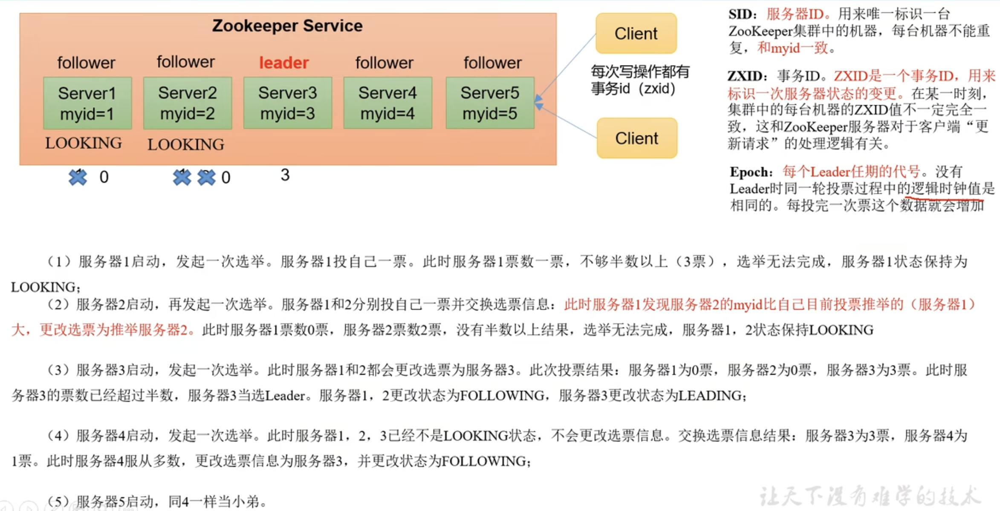
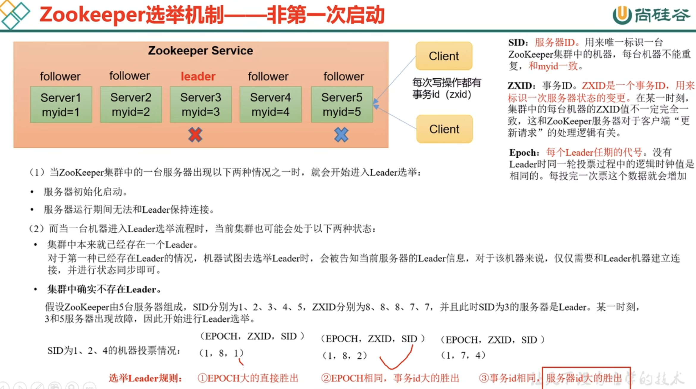

[toc]

# Zookeeper分布式锁案例

# Paxos算法

# ZAB协议

# CAP

# zk服务湍初始化源码

# 服务器湍加载数据源码

# 选举算法

# 状态同步算法

# Leader启动源码

# Fo11ower启动源码

# 客户端启动源码

# leader选举机制





## 总结

SID:服务器ID, 和myid一致。用来唯一标识一台ZooKeeper集群中的机器，每台机器不能重复。

ZXID:事务ID。用来标识一次服务器状态的变更。

Epoch:每个Leader任期的代号。

### 第一次启动zk的选举

假设有五台zk服务的集群

1. zk服务1启动,投自己一票,票数没过半,状态改为LOOKING
2. zk服务2启动,投自己一票,比较SID, 服务ID, 服务2大, 所以服务1的票给2, 此时服务1有0票服务2有2票,票数也没过半,状态改为LOOKING
3. zk服务3启动,投自己一票,比较SID, 服务ID, 服务3大,zk服务1和2的票给3,此时服务1和2为0票,服务3获得3票,当选leader,服务1和2的状态改为FOLLOWING,服务3状态改为LEADING
4. zk服务4启动,投自己一票,已经有leader,所以少数服从多数,改状态为FOLLOWING
5. zk服务5也和4一样

### 不是第一次启动的选举

1. EPOCH大大直接选举成功
2. CPOCH相同,ZXID事务ID大的选举成功
3. EPOCH和ZXID都相同,SID服务ID(和myid一致),服务ID大的选举成功


# 脑裂 

# 四种类型的数据节点 Znode

- PERSISTENT-持久节点
   除非手动删除 ，否则节点一直存在于 Zookeeper 上
- EPHEMERAL-临时节点
   临时节点的生命周期与客户端会话绑定 ，一旦客户端会话失效(
   一定会话失效) ， 那么这个客户端创建的所有临时节点都会被移除。
- PERSISTENT_SEQUENTIAL-持久顺序节点
   基本特性同持久节点 ，只是增加了顺序属性 ，节点名后边会追加一个由父节点维护的自增整形数字。 
- EPHEMERAL_SEQUENTIAL-临时顺序节点
   基本特性同临时节点 ， 增加了顺序属性 ， 节点名后边会追加一个由父节点维护的自增整形数字。

# **ZAB 协议?**

ZAB 协议是为分布式协调服务 Zookeeper 专门设计的一种支持崩溃恢复的原子广播协议。 ZAB 协议包括两种基本的模式 :**崩溃恢复和消息广播**。

当整个zookeeper集群刚刚启动或者 Leader服务器宕机、重启或者网络故障导致不 存在过半的服务器与 Leader 服务器保持正常通信时，所有进程( 服务器) 进 入崩溃恢复模式 ， 首先选举产生新的 Leader 服务器 ， 然后集群中 Follower 服务 器 开 始 与 新 的 Leader 服 务器进行数据同步 ，当集群中超过半数机器与该 Leader 服务器完成数据同步之后 ， 退出恢复模

式进入消息广播模式 ，Leader 服务器开始 接收客户端的事务请求生成事务提案来进行事务请求处 理。

# zk常用命令

- help 显示所有操作命令
- ls path 使用 ls 命令来查看当前 znode 的子节点 [可监听]
  -w 监听子节点变化
  -s 附加次级信息
- create 普通创建
  -s 含有序列
  -e 临时（重启或者超时消失）
- get path 获得节点的值 [可监听]
  -w 监听节点内容变化
  -s 附加次级信息
- set 设置节点的具体值
- stat 查看节点状态
- delete 删除节点
- deleteall 递归删除节点

```
create /aa test  # 创建持久化节点
create -e /cc test  # 创建临时节点
create -s /bb test  # 创建持久序列化节点
create -e -s /dd test  # 创建临时序列化节点
```