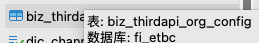
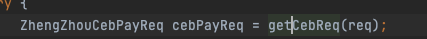

[toc]

# 环境

 工号 41

云效访问地址：https://devops.aliyun.com/
用户登录名称 xi.chen@future-insight.onaliyun.com
登录密码 5BX!wOGk1NG#GrpmD3tz6d$dC{eEEHwf fujichika4;
AccessKey ID LTAI5t9u4zguQ7vr1feRMKgM
AccessKey Secret z9IFO9AYmXVsrNoVcN1GmEs92MMcyq

ZK 地址：http://101.200.170.120:34444/
登录账号密码：root/fi51888

测试服务器的IP 47.95.4.88 端口22 密码：000200admin

测试环境查看日志  docker logs -f --tail=1000 fi-selfhelp-miniapp

postman连接的ip地址  http://47.95.4.88:30020

# xxjob

查看了公司的xxjob定时任务模块
常用cron表达式例子
（1）0/2 * * * * ?  表示每2秒 执行任务
（1）0 0/2 * * * ?  表示每2分钟 执行任务
（1）0 0 2 1 * ?  表示在每月的1日的凌晨2点调整任务
（2）0 15 10 ? * MON-FRI  表示周一到周五每天上午10:15执行作业
（3）0 15 10 ? 6L 2002-2006  表示2002-2006年的每个月的最后一个星期五上午10:15执行作
（4）0 0 10,14,16 * * ?  每天上午10点，下午2点，4点 
（5）0 0/30 9-17 * * ?  朝九晚五工作时间内每半小时 
（6）0 0 12 ? * WED   表示每个星期三中午12点 
（7）0 0 12 * * ?  每天中午12点触发 
（8）0 15 10 ? * *   每天上午10:15触发 
（9）0 15 10 * * ?   每天上午10:15触发 
（10）0 15 10 * * ?   每天上午10:15触发 
（11）0 15 10 * * ? 2005   2005年的每天上午10:15触发 
（12）0 * 14 * * ?   在每天下午2点到下午2:59期间的每1分钟触发 
（13）0 0/5 14 * * ?   在每天下午2点到下午2:55期间的每5分钟触发 
（14）0 0/5 14,18 * * ?   在每天下午2点到2:55期间和下午6点到6:55期间的每5分钟触发 
（15）0 0-5 14 * * ?   在每天下午2点到下午2:05期间的每1分钟触发 
（16）0 10,44 14 ? 3 WED   每年三月的星期三的下午2:10和2:44触发 
（17）0 15 10 ? * MON-FRI   周一至周五的上午10:15触发 
（18）0 15 10 15 * ?   每月15日上午10:15触发 
（19）0 15 10 L * ?   每月最后一日的上午10:15触发
（20）0 15 10 ? * 6L   每月的最后一个星期五上午10:15触发
（21）0 15 10 ? * 6L 2002-2005  2002年至2005年的每月的最后一个星期五上午10:15触发
（22）0 15 10 ? * 6#3  每月的第三个星期五上午10:15触发
30/5 54 17 ? * *

# 堡垒机

```
天伦的数据库增加了访问限制，，大家后面如果没有白名单访问数据库的话，可以通过堡垒机访问帐号密码如下，用的同学先缓存一下：
用户adminaq1、adminaq2，密码都是Admin@123
```

# fi-pay-center-channel cebpayserviceimpl

fi etbc

先有渠道 , 再缴费查询  appid 不能重复  appsecret

channelserviceaccount   dic_channel   租户配置渠道 一个租户一个渠道  自建渠道可以多个

channelserviceaccountpartner   两个appid 两个机构码不同 csaid关联

subpartner 子商户

tradepaychannelid

supporpaytype  支付类型 扫码什么的   对应tradepayChannelid

tradePaytype

tradepaychannel

gateway不能直接掉支付网关, 要调paychannel   unifiedOrder )(订单金额 , 是否是元)

刷码支付  authcode

pay channel center plat 他也调第三方支付机构   CebPayservice 这里面的几个

paycallback

center.channel.service

正事环境 测试环境  商户订单号查询

# 对账 ,  fi pay center plat

商户对账

定时任务配置

先下载 , 再对账

bizchanneltradeorder

交易

同步

fi-preststem , 标准的直接用

fi-preststem-biz   乱的转换成标准的

window.localStorage.removeItem(Object.keys(window.localStorage).find(i=>i.startsWith('@@auth0spajs')))

有欠费,缴欠费.没欠费,缴预存

下单时两步,先下交易单,再下支付单

光大银行支付收单

我们的架构上层是渠道>>微信小程序,公众号,atm,第三方银行,政府

如何体现我们数据库>>表结构设计biz_channelServiceAccount

自助一定要先有渠道再开展缴费,查询业务

渠道表比较核心的appId不能重复, 渠道配置时, (比如天伦,key+ownership)

渠道生活缴费,自助机, atm+ownership , 小程序+ownership ,   重要 appId , appscrect,验签,accesstoken

租户配置渠道, ownership对应小程序的渠道,对应appId

胜利股份atm是某个租户下面建立渠道

如果胜利股份公司要上atm,微信公众号,biz_channelserviceaccout中添加一条记录,对应哪个渠道就是在渠道字典表查

biz_channelServiceAccountpartner表,渠道涉及到付款,参数进行配置,签名秘钥等配置

一个渠道有多个付款方式,一个付款方式建立多条,做分账,收款根据标识,哪个区先收到一个商户, 进行orgNo进行分账,销账机构编码

biz_channelServiceAccountpartner表和biz_channelServiceAccount表通过csaId关联,销账机构编码, 分账用的.商户号,商户秘钥(微信服务商). subPartner子商户,我们帮他申请, 所有发起支付都是通过服务商这种模式调用调用的,tradePayChannel,微信有公众号支付

商户订单号就是支付流水号


unifiedOrder

# 商户渠道配置相关表

biz_channelserviceaccount					渠道表
accessToken			同appId
accountNo			同appId
aesKey				同appId
token				同appId
appId				第三方应用Id，比如微信的应用id，如果是内部的话就自定义
name				自定义，格式 公司-渠道，比如 天伦燃气-农行生活缴费
secret				一般同appId
accountOwner_id     同ownership
channelProvider_id  同ownership
status				是否有效，一般1
channel_id			渠道id， dic_channel


biz_channelserviceaccountpartner				渠道付款方式表
csaId			服务渠道ID
orgNo			组织结构编码(对应某个租户,比如许昌 100001001002001)
partnerId  		商户号(第三支付需要分配比如微信支付宝分配的号，不需要支付随便配，但是要对应biz_prelinkinfo.link_type后缀)
partnerKey		商户支付key(subPartner=1时随便配，subPartner=0时要配商户号的partnerKey)
subPartner		是否子商户 ，区别服务商模式（微信公众号支付使用）
appId			应用Id,对应biz_channelserviceaccount表的appId
payChannelId	对账渠道ID(無用)
tradePayChannelId 支付渠道,dic_tradepaychannel表
supporPayType	支持的支付方式，dic.tradepaytype表
refundconfig	配置是否允许系统退款,只是个开关，主要看第三方那边做了逻辑没有


# 对账相关表

BillFileCheckConfig	核心对账配置信息中心表(手动配置，需要对账的项目配置后可以对账，不需要对账的就不配置)		
ownership			租户(根据定时器传过来的参数查询)		
billChannelName		对账渠道名称,对应biz_channelserviceaccount.name
payChannelId		支付渠道ID,dic_tradepaychannel表
mchId				商户ID,对应 biz_channelserviceaccountpartner.partnerId
billServiceCode		对账处理服务编码，对应实现类前缀
isDownloadFile		是否下载对账文件
isCheckingBill		是否进行对账
orgNo				机构号
billIdentify		对账标识（1：生活缴费）
remoteMsgProtocol_id 11普表 13物联网表，

biz_thirdapi_org_config					商户配置表 
重点是ownership/ org_no（机构码）  third_org_no（第三方机构码） app_secret 签名

biz_thirdapi_org_config			前置用户配置表
app_id				应用ID，biz_channelserviceaccount.app_id
channel_code		渠道代码, 比如光大是 CEB
org_no				机构代码,本系统机构码
third_org_no		第3方机构代码,由第三方提供，比如光大的是 000701
protocol_type		协议类型 11-普表 13-物联网表 00-先普表，再物联网表
iot_query_type		物联网查询类型 0-户号 1-表号

BillFileInfo		文件列表信息(一)
自动创建的，对账文件相关的信息，有最新批次号，对账状态，日期 等

BillFileTradeRecord	交易记录明细(多)
银行ftp下来的文件解析后存入本表，有很多条,
fileId				BillFileInfo.id
	

biz_preLinkInfo							ftp配置表  
link_type				配置实现类， 实现类前缀 + 商户号（biz_channelserviceaccountpartner表的 partherId） 

前置表
biz_channelremoteservicepoint				                   
(一)重点是 ownership/ remoteIP(目标地址，测试环境是https://cis.mps-qa.f-insight.com/xxapi/biz/net-hall)

前置表
biz_remoteservicepoint					
(多)重点是 ownership/ csaId()	/appId(biz_thirdaapi_org_configid)/channelReqMesProtocolId(表具类型)   remoteSp_id(biz_remoteservicepoint表id)
配好后付费  远传表什么的

下单交易单,支付单,gateway,

同步是指将付款结果更新,是否支付,更新了之后就是同步了

下单把参数传给光大, 调用支付进行支付, 然后光大将支付结果返回

https://mp.weixin.qq.com/wxamp/newtmpl/tmpllib?view=cate&nav=10019&token=1232273026&lang=zh_CN

# ==业务一张图==																																																																


付款在我们这里走channel再走网关, 付款不在我们这边直接走网关,

# 兴业

### 表配置


配置  

能拿到协议和什么表


pk是户号


找前置去了



对面的参数 需要解密 


appid 来自bizchannelserviceaccout.appid(来自微信应用的appid,第三方支付时我们随机取)

channel_code来自 dic_tradepaychannel

org_no cis提供

third_org_no 客户机构码 客户提供

app_secret 验签

asd_mer_no

---

### 问题

以下两个的区别

```
/**
* 三方收费时 代表微信生活缴费代扣标识
*/
WECHAT_LIFEPAY_WITHHOLD("WECHAT_LIFEPAY_WITHHOLD", "微信生活缴费代收"),
/**
* 三方收费时, 代表生活缴费
*/
LIFEPAY("LIFEPAY", "生活缴费");
```


（1）若接入微信生活缴费通道 - 常规模式， 

必选 3.1.1；3.1.2；3.1.3；3.1.5； 

可选 3.1.4；3.1.7；3.3.1；

---

### 查询缴费

开发文档

```html
http://211.142.98.218:6002/handler/receive.ashx?+ 参数。（收费单位地址）

参数：
accountCode   //公司编号（可为固定值，无需要可忽略）
pk_paymentBill    //用户户号（DES加密）
sign   //签名（可选择校验）
appid   //第三方支付接入的唯一系统识别码（可为固定值，无需要可忽略）
nonce_str  //随即数

返回值：
StateCode   0：请求成功；2：服务器错误；3:参数错误；4：用户不存在 5不欠费 6 金额不符合规则

ErrorMsg    当且仅当StateCode=0时，该字段不存在。
   
   成功应答：
{ 
"stateCode":0,                   //状态码
"result":{"companySerial":
        [ {"code":"xwrq",        //公司编码
         "name":"修武中裕燃气", //公司名称
          "money":5.06}],       //余额（支持预存使用）
    "ownerName":"祝兴强",          //姓名
    "roomNamber":"修武-山水文苑14号楼1单元5楼东户",  //地址
    "paymendDays":"201807",         //账期
    "payableMoney":12.00,            //欠费金额
            }
}
失败应答：
{ "stateCode":3,"ErrorMsg":"参数错误" }
```

解析请求参数

```java
ZhengZhouCebPayReq cebPayReq = getCebReq(req);

private ZhengZhouCebPayReq getCebReq(HttpServletRequest req) throws Exception {
    String accountCode = req.getParameter("accountCode");
    String userNo = req.getParameter("pk_paymentBill");
    String sign = req.getParameter("sign");
    String appId = req.getParameter("appid");
    String nonceStr = req.getParameter("nonce_str");
    String deductTime = req.getParameter("deductTime");
    String paymentPlatformBillCode = req.getParameter("paymentPlatformBillCode");
    String paidMoney = req.getParameter("paidMoney");
    String payStrings = req.getParameter("payStrings");
```

欠费查询

```java
resp = zhengZhouCebPayService.feeQuery(cebPayReq);

public ZhengZhouCebPayResp feeQuery(ZhengZhouCebPayReq cebPayReq)
```

然后调presystem项目

---

### 开发流程

#### 查询

配置 OrgConfig

怎么知道哪一家?
第三方商户号判断是任丘, 三家公司是否会重复 , 配置 OrgConfig.thirdOrgNo

#### 欠费

feeid如何处理,查询接口带过来

##### 商户订单取这个

transaction_id:通道侧支付订单号(微信或支付宝支付订单号,兴业的系统跟踪号)

##### channel_bill_no 有什么用

收费单位,缴费单号, 有什么用  询问

#### ATC销账结果查询

查询 channelTradeOrder  (有参考,问ly)

transaction_id(别人传给我)

#### 对账

对账文件名 日期在前

是否只有微信生活缴费

缴费类型预存补


11和13 都要做 11时为普表,按照用户查,iot_query_type不需要, 13时,iot_query_type需要(爱山东和微信缴费逻辑)

yuncun_flag 是否预存

# 挂维护

维护时候不能查,参考以前做的

日志不需要

attach(传账单号)

1804300071829,1806240692500,1807310823746


查询类型

1. 有账户余额和欠费(物联网表)


查询结果


2. 余额为0,有欠费(普表)


查询结果


# 做交易生成交易记录

```
{
    "userNo":"2300006872",
    "meterNo":"WL37423141",
    "tradeNo":"424564499999", //不能重复!!!!
    "payAmt":"20",
    "operaTime":"20231212000001",
    "payTypeId":"21",
    "acctOrgId":"100001001002001",
    "feeIds":"",
    "tradePayInfo":{
        "serviceChannelCode":"OTHER",
        "payChannelCode":"WECHAT",
        "payTypeCode":"LIFEPAY",
        "payTime":"20231212000001",
        "deviceInfo":"",
        "channelOrderNo":"",
        "operatorNo":"",
        "operatorDesc":""
    }
}
```

# jrebel

jrebel  ctrl + shift + F9

# git commit

```
git add .
git commit -m 'ping commit3 热线电话' --no-verify
git push

table多选:rowSelction.preserveSelectRowKeys设为true

feat: 增加新功能；
fix: 修复错误；
docs: 修改文档；
style: 修改样式；
refactor: 代码重构；
test: 增加测试模块，不涉及生产环境的代码；
chore: 更新核心模块，包配置文件，不涉及生产环境的代码；
```

| emoji            | 代码                         | 说明                  |
| ---------------- | ---------------------------- | --------------------- |
| 🎨 (调色板)       | `:art:`                      | 改进代码结构/代码格式 |
| ⚡️ (闪电)🐎 (赛马) | `:zap:“:racehorse:`          | 提升性能              |
| 🔥 (火焰)         | `:fire:`                     | 移除代码或文件        |
| 🐛 (bug)          | `:bug:`                      | 修复 bug              |
| 🚑 (急救车)       | `:ambulance:`                | 重要补丁              |
| ✨ (火花)         | `:sparkles:`                 | 引入新功能            |
| 📝 (备忘录)       | `:memo:`                     | 撰写文档              |
| 🚀 (火箭)         | `:rocket:`                   | 部署功能              |
| 💄 (口红)         | `:lipstick:`                 | 更新 UI 和样式文件    |
| 🎉 (庆祝)         | `:tada:`                     | 初次提交              |
| ✅ (白色复选框)   | `:white_check_mark:`         | 增加测试              |
| 🔒 (锁)           | `:lock:`                     | 修复安全问题          |
| 🍎 (苹果)         | `:apple:`                    | 修复 macOS 下的问题   |
| 🐧 (企鹅)         | `:penguin:`                  | 修复 Linux 下的问题   |
| 🏁 (旗帜)         | `:checked_flag:`             | 修复 Windows 下的问题 |
| 🔖 (书签)         | `:bookmark:`                 | 发行/版本标签         |
| 🚨 (警车灯)       | `:rotating_light:`           | 移除 linter 警告      |
| 🚧 (施工)         | `:construction:`             | 工作进行中            |
| 💚 (绿心)         | `:green_heart:`              | 修复 CI 构建问题      |
| ⬇️ (下降箭头)     | `:arrow_down:`               | 降级依赖              |
| ⬆️ (上升箭头)     | `:arrow_up:`                 | 升级依赖              |
| 👷 (工人)         | `:construction_worker:`      | 添加 CI 构建系统      |
| 📈 (上升趋势图)   | `:chart_with_upwards_trend:` | 添加分析或跟踪代码    |
| 🔨 (锤子)         | `:hammer:`                   | 重大重构              |
| ➖ (减号)         | `:heavy_minus_sign:`         | 减少一个依赖          |
| 🐳 (鲸鱼)         | `:whale:`                    | Docker 相关工作       |
| ➕ (加号)         | `:heavy_plug_sign:`          | 增加一个依赖          |
| 🔧 (扳手)         | `:wrench:`                   | 修改配置文件          |
| 🌐 (地球)         | `:globe_with_meridians:`     | 国际化与本地化        |
| ✏️ (铅笔)         | `:pencil2:`                  | 修复 typo             |

# 兴业网上立户

```xml
同步  异步   http
抽象实现类
bizhandleController

接口支持
网厅端
1) 审批结果通知接收接口(给审批中心调用) 
2) 立户结果通知接收接口(给营收系统调用)

审批中心
1) 需提供一个办件审批数据同步的接口 
2) 提供一个审核结果查询接口

营收系统
1) 小区列表查询
2) 水表号校验接口(校验对应的水表号是否存在) 3) 客户类型、地址类型、抄表册、产品信息查询接口 4) 立户申请接收接口(给审批中心调用)
3) 立户结果查询接口(给网厅端调用)
```


## 申请资料入库接口

> 用户提交资料,网厅进行入库处理
> 同时将提交信息提交给审批中心(调用审批中心的审批接口),同时,审批中心会返回待处理状态
>
> 调用审批中心时要异步处理, 将申请资料发送给mq,mq接收消息时,就去调用接口,实现异步

### 请求

- **URL**: 

- **方法**: POST

#### 请求参数

| 参数名 | 字段名      | 长度   | 是否必须 | 说明 |
| ------ | ----------- | ------ | -------- | ---- |
| param1 | 所属小区    | string | 是       |      |
| param2 | 姓名等      | string | 是       |      |
| state  | 状态,待处理 |        |          |      |

#### 请求体

```json
httpCopy code
POST /api/api
Content-Type: application/json

{
  "param1": "华西村",
  "param2": "张三",
  "state":"待处理状态"
}
```

### 响应

#### 响应参数

| 参数名 | 说明     |
| ------ | -------- |
| param1 | 所属小区 |
| param2 | 姓名等   |
| state  | 状态     |
| code   | 1        |
| msg    | 成功     |

#### 响应体

(将审批中心的响应数据组装成响应体)

```
jsonCopy code
{
  "state": "待处理状态",
  "code": 1,
  "msg": "成功"
}
```


## 审批结果通知接收接口

> 给审批中心调用
>
> 审批中心提供审核结果信息,网厅拿到结果后,对入库信息进行更新(比如驳回后,更新状态为驳回)
> 驳回:然后通过微信/短信消息推送给用户,用户可修改立户申请数据，重新提交立户申请
> 通过:然后给发送审批通过状态给营收系统(营收提供接受结果接口,入参为用户信息和提交信息)

### 请求

- **URL**: 

- **方法**: POST

#### 请求参数

| 参数名 | 字段名                 | 长度   | 是否必须 | 说明                                                         |
| ------ | ---------------------- | ------ | -------- | ------------------------------------------------------------ |
| remark | 说明驳回原因或通过原因 | string | 是       |                                                              |
| state  | 状态,驳回或通过        |        |          | 驳回,更新库状态为驳回,发送消息给用户,重新立户申请<br />通过,调用"营收接受结果接口"传入用户信息 |

#### 请求体

```json
httpCopy code
POST /api/api
Content-Type: application/json

{
  "state": "驳回状态"/"通过状态"
}
```

### 响应

#### 响应参数

| 参数名 | 说明              |
| ------ | ----------------- |
| state  | 状态,驳回/通过    |
| remark | 驳回原因/通过原因 |
| code   | 1                 |
| msg    | 成功              |

#### 驳回响应体

将审批中心的响应数据组装成响应体

```
jsonCopy code
{
	"remark":"驳回原因为不合规范",
  "state": "驳回状态",
  "code": 1,
  "msg": "成功"
}
```

#### 通过响应体

将通过信息传参给营收的"营收接受结果接口",
营收立户完成后,调用"网厅立户结果通知接收接口"返回立户完成状态,并组装成通过响应体,
在"网厅立户结果通知接收接口"中更新库状态为通过状态

```
jsonCopy code
{
  "state": "通过状态",
  "code": 1,
  "msg": "成功"
}
```


## 立户结果通知接收接口

> 给营收系统调用
>
> 网厅得到通知要修改办件状态为,已完成办件,并微信通知用户立户完成.

### 请求

- **URL**: 

- **方法**: POST

#### 请求参数

| 参数名 | 字段名        | 长度   | 是否必须 | 说明 |
| ------ | ------------- | ------ | -------- | ---- |
| param2 | 姓名等        | string | 是       |      |
| state  | 状态,通过状态 |        |          |      |

#### 请求体

```json
httpCopy code
POST /api/api
Content-Type: application/json

{
  "state":"通过状态"
}
```

### 响应

#### 响应参数

| 参数名 | 说明       |
| ------ | ---------- |
| state  | 状态为成功 |
| code   | 1          |
| msg    | 成功       |

#### 响应体

```
jsonCopy code
{
  "state": "通过状态",
  "code": 1,
  "msg": "成功"
}
```


提交立户申请,是否走办理流需要设置一个标识

```java
        // 是否走办理流!

        // 2.调用公司流程引擎-实例化办理流程    调用工作流接口  入参：process_def_id    返回process_id   记录业务办理记录表
        String recordUUID = UUID.randomUUID().toString();
        Map<String,Object> paraMap = new HashMap<>();
        paraMap.put("recordUUID",recordUUID);
        paraMap.put("tenantId",userTenantAsso.getTenantId());
        dataList.forEach(item->{
            paraMap.put(item.getCname(),item.getCvalue());
        });
        String processId = iProcessService.startProcessInstanceById(tenantBizItemConfig.getProcessDefId(),paraMap);
        if(StringUtil.isEmpty(processId)){
            throw new BizException(AppBizExceptionEnum.PARAM_NULL_ERROR,"流程初始化失败");
        }
```

是否走我们的审批中心需要一个标识

需要讨论唯一标识,识别立户信息


异步处理响应:
入库时就将发送mq, 消费者收到时就调用审批接口传参过去

# 彭泽工改系统

fi-business-handle

/accept/biz/pengZe 

接受彭泽工改系统提交的申请 

/selfhelp/biz/callback/pengZe

*彭泽工改系统回调*


给工改系统一个接口, 提交数据过来, 将工改系统的字段转换成表单的字段

```java
            hashMap.put("engineeringName", req.getEngineeringName());
            hashMap.put("projectguid", req.getProjectguid());
            hashMap.put("projectCode", req.getProjectCode());
            hashMap.put("applyDate", req.getApplyDate());
            hashMap.put("applyUnitName", req.getApplyUnitName());
            hashMap.put("applyUnitCreditCode", req.getApplyUnitCreditCode());
            hashMap.put("userName", req.getElcName());
            ha成哦我shMap.put("contact", req.getElcPhone());
            hashMap.put("userUUID", req.getElcPhone());
            hashMap.put("thirdUUID", req.getProjectguid());
```

提交之后云自助会进行审核, 审核完会回调结果给工改系统提供的url

# 爱山东和兴业福费缴下载对账

## 光大支付收银台对账

下载对面提供的url账单, toTradeRecordList这个方法中调用,或者账单

首先分析url的json的数据结构解析出来,

把记录插入到BillFileTradeRecord里面

表配置,测试时配置文件上传路径


获取对账文件示例:


找到定时任务运行模式标签(下载和对账的是定任务标签)

存储redis数据,生产者发送mq(billFileDownloadProducer)

```java
String redisKey = AliMQConstant.TAG_BILLFILE_DOWNLOAD.replaceAll("_", "")
        + "_" + fileDate + "_" + batchNo;

redisUtil.setEx(redisKey, AliMQConstant.REDIS_BILLFILE_ACTIVETIME, JSON.toJSONString(conf));
mqProducer.billFileDownloadProducer(redisKey, getDelay(num++));
```

配置biz_billfilecheckconfig表:

payChannelId (dic_tradepaychannel.id)


mechid (fi_etbc.biz_channelserviceaccountpartner.partnerId)


对账文件的名称为:
fileNameIdentify = config.getFileNameIdentify() + fileDate;


CEBCASHIER,982315199,000200,20230920

biz_channelserviceaccountpartner
partnerId:云缴费编号itemCode
partnerKey:渠道标识siteCode
公钥:partnerQueryKey


支付下单扣款的时候需要这三个,兴业福费缴不是在我们这里扣款,不需要配置

## 兴业福费缴缴费信息查询

几种情况, 表具和余额

1. 表具为负 余额为正
2. 表具为负 余额为负
3. 表具为正 余额为正
4. 表具为正 余额为负


首先验签

然后交易校验验证

然后根据协议判断是普表还是物联网表,然后进行查询

多出文件记录如何处理: 重新进行补单,通过商户订单号再次查询数据库中我方订单列表,新增; 判断当天存在反交易,则取消进行补单,再次尝试同步

(对账 查询 对账文件多出如何处理 其他相关逻辑 数据库配置熟悉)


//再次尝试同步
boolean result = billCheckHandler(order.getMchOrderNo(), fileInfo, config);


做交易的商户id mchid与 下载文件的商户id要一致


普表

有欠费 直接缴欠费

无欠费 预存


物联网表

有欠费 

1. 余额为负
2. 余额为正

无欠费


fi_etbc.biz_prelinkinfo

fi_etbc.biz_billfilecheckconfig


*对账*

1.表配置,测试时配置文件上传路径fi_etbc.biz_prelinkinfo

 

字段link_type固定格式为:
fi_etbc.biz_billfilecheckconfig.billServiceCode + fi_etbc.biz_billfilecheckconfig.mchId

2. 设置定时任务运行模式标签(下载和对账的是定任务标签)

 

 

任务参数分别为:payChannelCode,mchId,ownership,fileDate

只配置payChannelCode时,对账日期默认为昨天

 

光大配置为31,CEBCASHIER

3.配置fi_etbc.biz_billfilecheckconfig表:

biz_billfilecheckconfig.payChannelId为dic_tradepaychannel.id

billServiceCode为:ZZCEBPAY

 

 

biz_billfilecheckconfig.mechid 为fi_etbc.biz_channelserviceaccountpartner.partnerId 

 

 

4.对账文件的名称为:

fileNameIdentify = config.getFileNameIdentify() + fileDate;(光大文件格式)

fileNameIdentify = fileDate + fi_etbc.biz_billfilecheckconfig.fileNameIdentify;(福费缴文件格式)

 

5. 配置fi_etbc.biz_channelserviceaccountpartner表

光大:业务的支付下单扣款功能在我们这里时需要配置这三个参数(兴业福费缴不是在我们这里扣款,不需要配置)

fi_etbc.biz_channelserviceaccountpartner.partnerId:云缴费编号itemCode

fi_etbc.biz_channelserviceaccountpartner.partnerKey:渠道标识siteCode

公钥:
fi_etbc.biz_channelserviceaccountpartner.partnerQueryKey

fi_etbc.biz_channelserviceaccountpartner.tradePayChannel_id为dic_tradepaychannel.id 

多出文件记录如何处理: 重新进行补单,通过商户订单号再次查询数据库中我方订单列表,新增; 判断当天存在反交易,则取消进行补单,再次尝试同步

做交易的商户id mchid(fi_etbc.biz_channelserviceaccountpartner.mchId)与 下载文件的商户id(fi_etbc.biz_billfilecheckconfig.mchId)要一致

做交易的机构编码 orgNo(fi_etbc.biz_channelserviceaccountpartner.orgNo)与 下载文件的org_no(fi_etbc.biz_billfilecheckconfig.org_no)要一致

6. fi_etbc.biz_billfilecheckconfig.billServiceCode固定为ZZCEBPAY

 

兴业福费缴缴费信息查询

fi_etbc.biz_thirdapi_org_config表配置

 

app_id				应用ID，biz_channelserviceaccount.app_id

channel_code		渠道代码, 比如光大是 CEB

org_no				机构代码,本系统机构码

third_org_no		  第3方机构代码,由第三方提供，比如光大的是 000701

protocol_type		协议类型 11-普表 13-物联网表 00-先普表，再物联网表

iot_query_type		物联网查询类型 0-户号 1-表号

yucun_flag     是否支持预存

app_secret     验签秘钥


点击账户


点击立即预交


