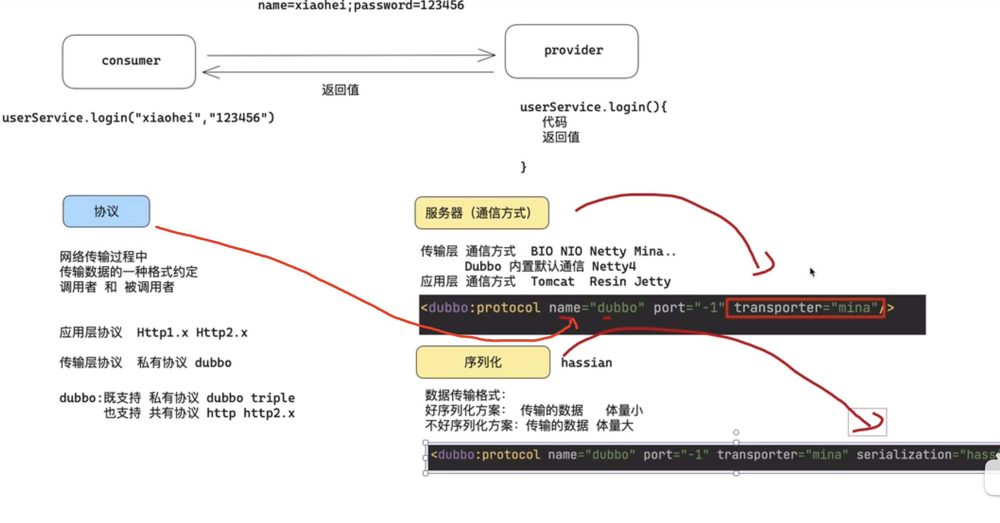
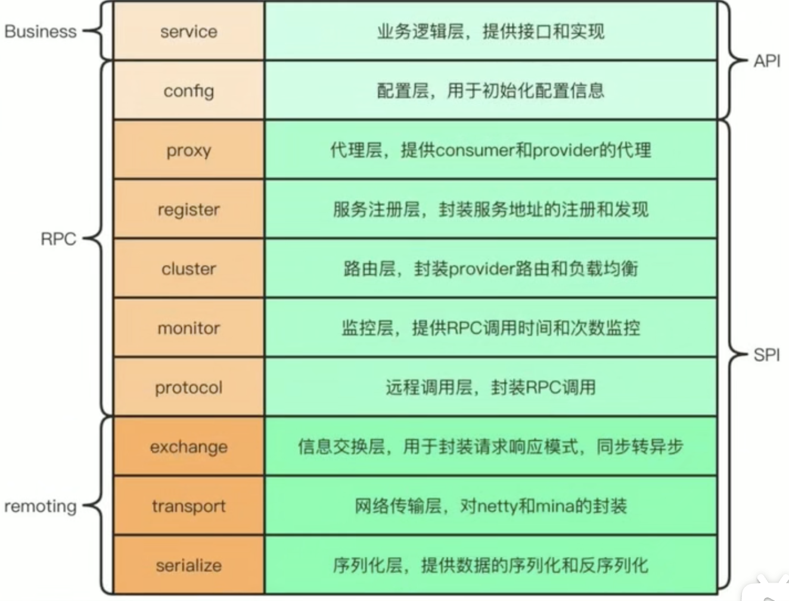
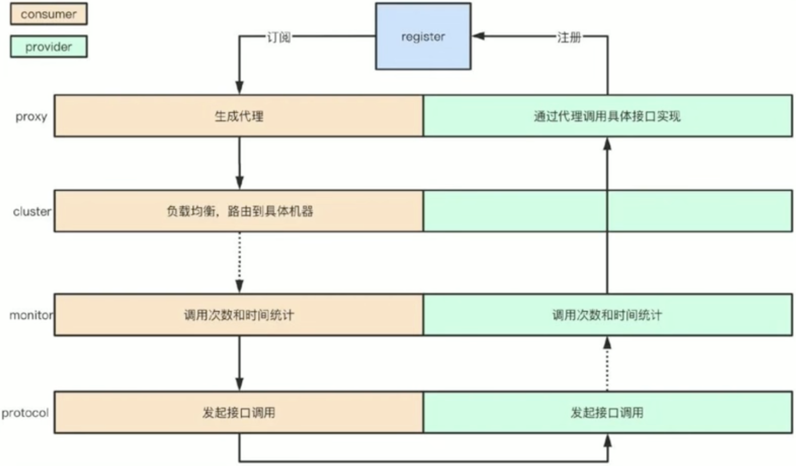
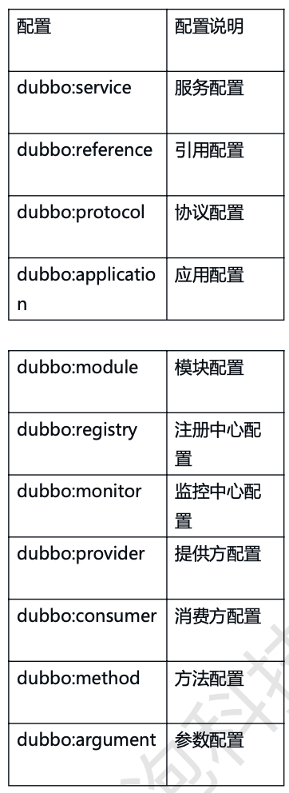

[toc]

# dubbo RPC直连开发

> 什么是dubbo
> 基于JAVA的高性能，轻量级RPC框架 【Java-based RPC framework】SOA【Service-Oriented Architecture 面向服务的架构】 = RPC+服务治理(注册中心,配置中心)
> RPC，全称为 Remote Procedure Call（远程过程调用），是一种计算机通信协议
> 现在SOA ≈ 微服务
> 阿里目前微服务方案基于dubbo3的DNS(dubbo+nacos+sentinel)方案

# dubbo注解

## @EnableDubbo

1. @EnableDubbo 用于扫描@DubboService 并把对应的对象实例化，发布成RPC服务。
2. 可以通过@DubboComponentScan(basePackages ={"org.suns.service”})，显示的指定扫描的路径
3. yml进行配置扫描@DubboSenvice 并把对应的对象实例化，发布成RPC服务, dubbo.scan.base-packages 等同于 @EnableDubbo

## @DubboService

1. 应用@DubboService注解修饰类型，SpringBoot会创建这个类型的对象，并发布成Dubbo服务。
2. @DubboService 等同于 @Component(@Service) @Bean注解的创建对象的作用。通过源码SingletonObjects可以验证, 发布成RPC服务
3. 后续开发过程中如果考虑兼容性，建议实现类不仅仅要加入@DubboSenvice注解，同时也要加入@Service注解

## @DubboReference

1. 在Consumer端，通过@DubboReference，注入远端服务的代理对象。

# 说说对dubbo对理解

## dubbo十层模型

dubbo是一个高性能的rpc框架, 有十层模型

- 第一层 Business 业务逻辑层由我们自己来提供接口和实现还有一些配置信息
- 第二层 RPC 调用的核心层负责封装和实现整个 RPC 的调用过程、负载均衡、集群容错、代理等核心功能
- Remoting 则是对网络传输协议和数据转换的封装

# Dubbo 提供了六大核心能力

根据 Dubbo 官方文档的介绍，Dubbo 提供了六大核心能力面向接口代理的高性能 RPC 调用。
智能容错和负载均衡，
服务自动注册和发现，
高度可扩展能力。
运行期流量调度。
可视化的服务治理与运维。

# Dubbo 负载均衡策略

Dubbo 有五种负载策略:

第一种是加权随机:假设我们有一组服务器 servers = [A, B, C]，他们对应的权重为 weights = [5, 3, 2]，权重总和为 10。现在把这些权重值平铺在一维坐标值上，0, 5) 区间属于服务器 A，5, 8) 区间属 于服务器 B，8, 10) 区间属于服务器 C。接下来通过随机数生成器生成一个范围在 0, 10) 之间的随 机数，然后计算这个随机数会落到哪个区间上就可以了。

第二种是最小活跃数:每个服务提供者对应一个活跃数 active，初始情况下，所有服务提供者活跃数均 为 0。每收到一个请求，活跃数加 1，完成请求后则将活跃数减 1。在服务运行一段时间后，性能好的 服务提供者处理请求的速度更快，因此活跃数下降得也越快，此时这样的服务提供者能够优先获取到新 的服务请求。

第三种是一致性 hash:通过 hash 算法，把 provider 的 invoke 和随机节点生成 hash，并将这个 hash 投射到 [0, 2^32 - 1] 的圆环上，查询的时候根据 key 进行 md5 然后进行 hash，得到第一个节点的 值大于等于当前 hash 的 invoker。

第四种是加权轮询:比如服务器 A、B、C 权重比为 5:2:1，那么在 8 次请求中，服务器 A 将收到其 中的 5 次请求，服务器 B 会收到其中的 2 次请求，服务器 C 则收到其中的 1 次请求。

第五种是最短响应时间权重随机:计算目标服务的请求的响应时间，根据响应时间最短的服务，配置更 高的权重进行随机访问。

# Dubbo 与 SpringCloud 的区别

- Dubbo 底层是使用 Netty 这样的 NIO 框架，是基于 TCP 协议传输的，配合以 Hession 序列化完成 RPC 通信
- SpringCloud 是基于 Http 协议+Rest 接口调用远程过程的通信，相对来说，Http 请求会有更大的报文，占的带宽也会更多。但是 REST 相比 RPC 更为灵活，服务 提供方和调用方的依赖只依靠一纸契约，不存在代码级别的强依赖

# dubbo的工作原理

1. 服务启动时，服务提供者和服务消费者根据配置信息会连接到注册中心，分别向注册中心去订阅和注册服务
2. 注册中心会根据订阅关系去返回服务提供者的信息到服务消费者，同时服务消费者会把服务提供者的信息缓存到本地，如果信息发生变更，消费者会收到注册中心的一个推送去更新本地的缓存
3. 服务消费者会生成代理对象，同时根据负载均衡策略去选择一台目标服务提供者并且定向向monitor记录接口的调用次数和时间信息。
4. 拿到代理对象后，服务消费者通过代理对象发起接口的一个调用
5. 服务提供者收到请求后会根据数据进行反序列化，然后通过代理调用具体的接口的

dubbo底层使用的netty的NIO框架

# 说一下你对 SPI 机制的理解以及 Dubbo 中有哪些 SPI 机制 的实现

SPI 全称为 Service Provider Interface，是 Java 中一种服务发现机制，在 SPI 机制中，服务提供者为某个接口实现具体的类，而在运行时，通过 SPI 机制，查找到对应的实现类，并将其加载进行使用。
比较典型的一个例子就是 java.jdbc.Driver 这个数据库驱动接口，在 Java 中只提供了接口的定义， 具体的实现类由各个数据库厂商提供的驱动包来完成，程序在运行的时候会根据当前导入的驱动包来完 成对应数据库的连接
 在 Dubbo 中，根据 Java SPI 的思想，衍生了不同的 SPI 实现。

- 指定名称的扩展点实现，也就是根据指定名称获取并加载对应的扩展点实现类
- @Adaptive 注解定义自适应扩展点，它会根据上下文参数动态适配一个具体的实现类
- @Activate 注解定义的激活扩展点，它会根据上下文的相关参数配置，来决定哪些扩展点会被动态激活，主要体现在 Filter 中。

# 服务调用是阻塞的吗? 

默认是阻塞的 ， 可以异步调用 ，没有返回值的可以这么做。
 Dubbo 是基于 NIO 的非阻塞实现并行调用，客户端不需要启动多线程即可完成并行调用 多个远程 服务 ，相对多线程开销较小 ， 异步调用会返回一个 Future 对象。

# 默认使用什么序列化框架 ，你知道的还有哪些?

推荐使用 Hessian 序列化 ， 还有 Duddo、 FastJson、Java 自带序列化。

# 服务提供者能实现失效踢出是什么原理?

服务失效踢出基于 zookeeper 的临时节点原理。

# 如何解决服务调用链过长的问题?

可以结合 zipkin 实现分布式服务追踪。

说说核心的配置有哪些?

