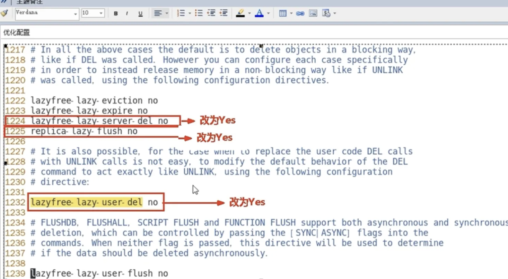

[TOC]

# String

```java
package com.chenxi.huawei;

import org.junit.Test;

import java.lang.reflect.Parameter;
import java.text.ParseException;
import java.text.SimpleDateFormat;
import java.util.*;

/**
 * @Author cxi
 * @Date 2022/7/11 18:51
 */
public class StringTest {
    public static void main(String[] args) {

    }

    @Test
    public void founction() {
        String str = "ChenxiWangying";
        //3.charAt(int index)从字符中取出指定索引的值
        System.out.println(str.charAt(3));
        //4.indexOf(String str)方法,查找对应字符在字符串中的索引位置，如果没有则返回-1，常与3配合使用，
        System.out.println(str.indexOf("i"));
        //lastIndexOf(String str)方法，查找对应字符最后在字符串中出现的索引位置，如果没有则返回-1
        System.out.println(str.lastIndexOf("i"));

        //toCharArray()方法，将字符串变成一个数组
        char[] charArray = str.toCharArray();
        for (char c : charArray) {
            System.out.print(c);
        }
        System.out.println(Arrays.toString(charArray));

        //toUpperCase()将字符串全部转换为大写
        String strBig = str.toUpperCase();
        System.out.println(strBig);

        //8.toLowerCase()将字符串全部转换为小写
        String strSmall = str.toLowerCase();
        System.out.println(strSmall);

        //split("字符")，根据给定的正则表达式来拆分字符串，形成一个String数组
        String[] strArray = str.split("");
        System.out.println(Arrays.toString(strArray));

        //trim()方法，去除字符串左右两端的空白，该方法只能去除左右，中间的没办法
        String strSpaces = "  Chenxi Wangying  ";
        System.out.println(strSpaces.trim());

        //11.substring(int beginIndex,int endIndex)截取字符串
        System.out.println(str.substring(1, 3));
        System.out.println(str.substring(4));

        //12.equalsIgnoreCase(String str),忽略字符串大小比较字符串的值，
        String strA = "absC";
        String strB = "absc";
        System.out.println(strA.equalsIgnoreCase(strB));

        // concat(String str),将str的字符串的内容添加到字符串的后面，效果等同于+
        System.out.println(str.concat("addTest"));

        //replace(char oldChar,char newChar),该方法用字符newChar替换掉当前字符串中所有的oldChar。
        System.out.println(str.replace("i", "???"));

        //replaceFirst(String regex,String replacement),该方法用字符replacement替换掉当前字符串中第一个匹配regex。
        System.out.println(str.replaceFirst("h", "???"));

        //17.startsWith(String prefix)，比较该字符串是否以prefix子字符串开始的
        System.out.println(str.startsWith("Chen"));
        System.out.println(str.startsWith("chen"));

        //endsWith(String prefix)，比较该字符串是否以prefix结尾的
        System.out.println(str.endsWith("ing"));

        //19.valueOf(Type type)用于将基本数据类型转换为String类型，补充一点，type不能为null，不然会报空指针异常
        String strType = String.valueOf(21);
        System.out.println(strType);

        //20.getBytes()，将该字符串转换为字节数组
        String strByte = "123421421";
        byte[] bytes = strByte.getBytes();
        System.out.println(Arrays.toString(bytes));

        //21.String.format()方法，字符串类型格式话
        //format(String format,Object obj)，新字符串使用本地语言环境，制定字符串格式和参数生成格式的新字符串
        //format(Locale locale,String format,Object obj),使用指定语言环境，制定字符串格式和参数生成格式的新字符串

        Date date = new Date();
        //c的使用
        System.out.printf("全部日期和时间信息：%tc%n", date);
        //f的使用
        System.out.printf("年-月-日格式：%tF%n", date);
        //d的使用
        System.out.printf("月/日/年格式：%tD%n", date);
        //r的使用
        System.out.printf("HH:MM:SS PM格式（12时制）：%tr%n", date);
        //t的使用
        System.out.printf("HH:MM:SS格式（24时制）：%tT%n", date);
        //R的使用
        System.out.printf("HH:MM格式（24时制）：%tR", date);

    }

}
```

# 基本数据类型和包装类的区别

包装类是对象，拥有方法和字段，对象的调用都是通过引用对象的地址，基本类型不是。

- 包装类型是引用的传递，基本类型是值的传递。
- 声明方式不同，基本数据类型不需要new关键字，而包装类型需要new在堆内存中进行new来分配内存空间。
- 存储位置不同，基本数据类型直接将值保存在值栈中，而包装类型是把对象放在堆中，然后通过对象的引用来调用他们。
- 初始值不同，eg： int的初始值为 0 、 boolean的初始值为false 而包装类型的初始值为null。

# 冒泡排序

```java
package com.chenxi.listTestDemo.bubblesort;

/**
 * 冒泡排序
 */
public class BubbleSort {
    public static void main(String[] args) {
        int[] ints = new int[]{-10, -20, -30, -15, 10, 16, 18, 19, 60, 45, 88};
        for (int i = 0; i < ints.length - 1; i++) {
            for (int j = 0; j < ints.length - 1 - i; j++) {
                if (ints[j] > ints[j + 1]) {
                    int exchange = ints[j];
                    ints[j] = ints[j + 1];
                    ints[j + 1] = exchange;
                }

            }
        }
        for (int i = 0; i < ints.length; i++) {
            System.out.println(ints[i] + "\t");
        }
    }
}
```

# 重载与重写的区别

●重写就是子类继承父类了，但是子类不想要父类那个方法，就可以将该方法重写

●重载就是方法名相同，但是形参不同

# equals与==的区别 

==比较的地址值

equals比较的是内容

# String、StringBuffer和StringBuilder的异同？ 

相同点：底层都是通过char数组实现的 不同点：

●String对象一旦创建，其值是不能修改的，如果要修改，会重新开辟内存空间来存储修改之后的对象；而StringBuffer和StringBuilder对象的值是可以被修改的；

●StringBuffer几乎所有的方法都使用synchronized实现了同步，线程比较安全，在多线程系统中可以保证数据同步，但是效率比较低；而StringBuilder 没有实现同步，线程不安全，在多线程系统中不能使用 StringBuilder，但是效率比较高。

●如果我们在实际开发过程中需要对字符串进行频繁的修改，不要使用String，否则会造成内存空间的浪费；当需要考虑线程安全的场景下使用 StringBuffer，如果不需要考虑线程安全，追求效率的场景下可以使用 StringBuilder。

# 计算机知识

一个位(bit)为计算机最小单位,010110中的0,一个字节由8个bit


