[toc]

# ThreadLocal有哪些应用场景？它底层是如何实现的？

## 是什么

是线程本地存储机制，将数据缓存在某个线程内部，该线程可以在任何时刻，任何方法中获取缓存的数据 ThreadLocalMap专门存放threadlocal的数据，当前线程中，将threadlocal对象存入ThreadLocalMap中的entry对象中的key中，将set的值放入value中

ThreadLocal提供线程局部变量。这些变量与正常的变量不同，因为每一个线程在访问ThreadLocal实例的时候（通过其get或set方法）==都有自己的、独立初始化的变量副本==。ThreadLocal实例通常是类中的私有静态字段，使用它的目的是希望将状态（例如，用户ID或事务ID）与线程关联起来。

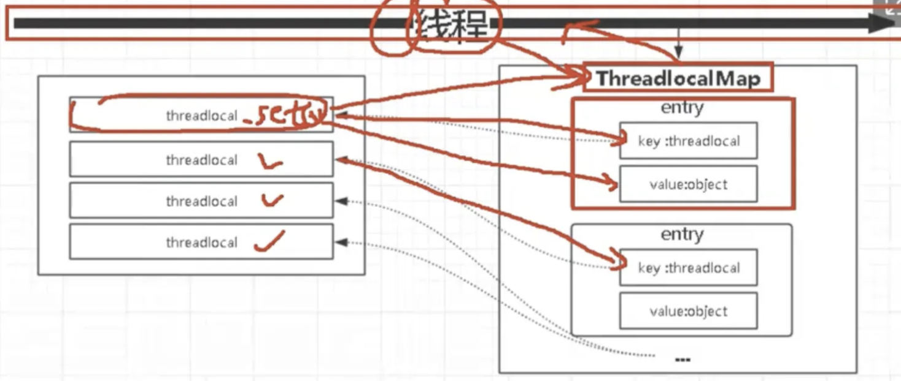

## 使用场景

实现==每一个线程都有自己专属的本地变量副本==（自己用自己的变量不麻烦别人，不和其他人共享，人人有份，人各一份)，主要解决了让每个线程绑定自己的值，通过使用get()和set()方法，获取默认值或将其值更改为当前线程所存的副本的值从而避免了线程安全问题，比如我们之前讲解的8锁案例，资源类是使用同一部手机，多个线程抢夺同一部手机使用，假如人手一份是不是天下太平？?

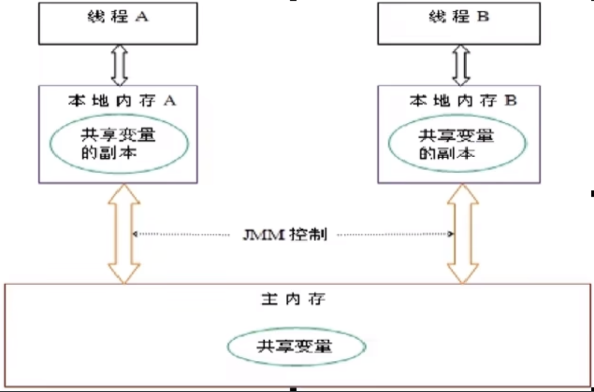

## 底层

是通过ThreadLocalMap来实现的，每个Thread线程对象中都存储着一个ThreadLocalMap

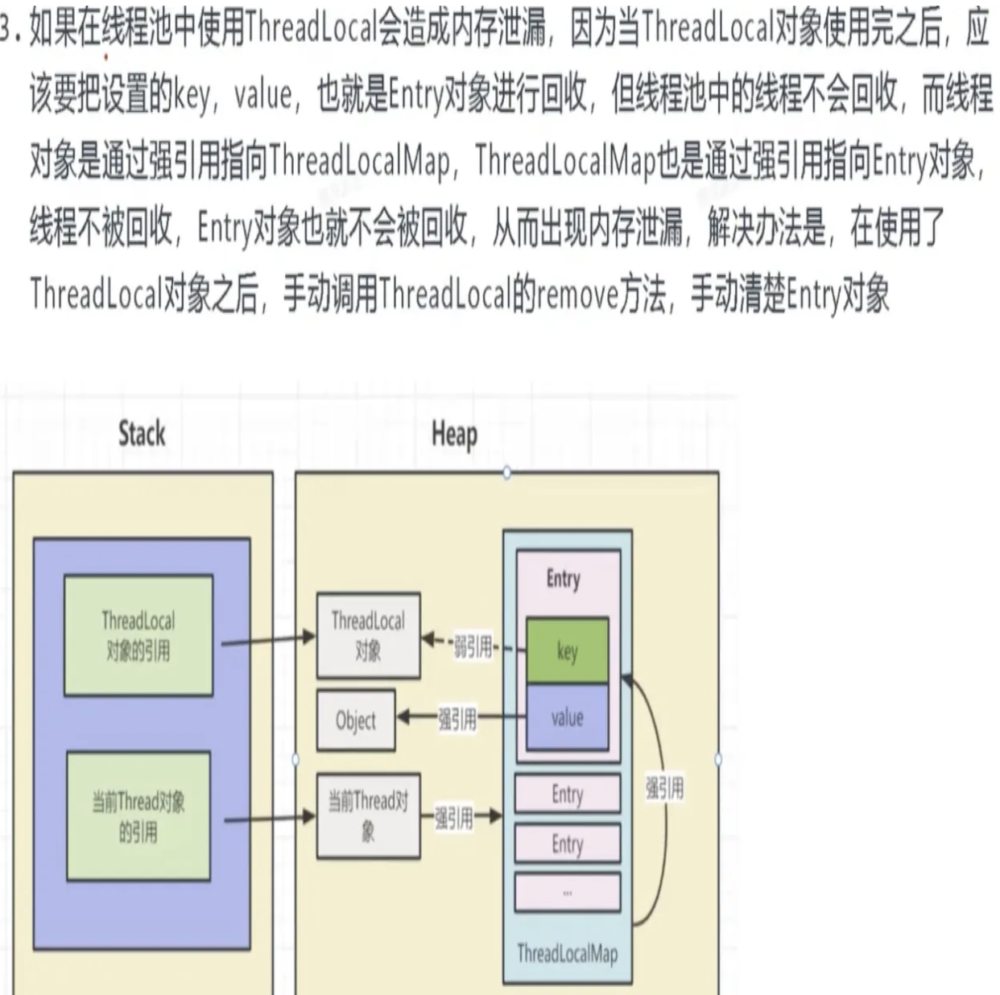

### Thread和ThreadLocal和ThreadLocalMap

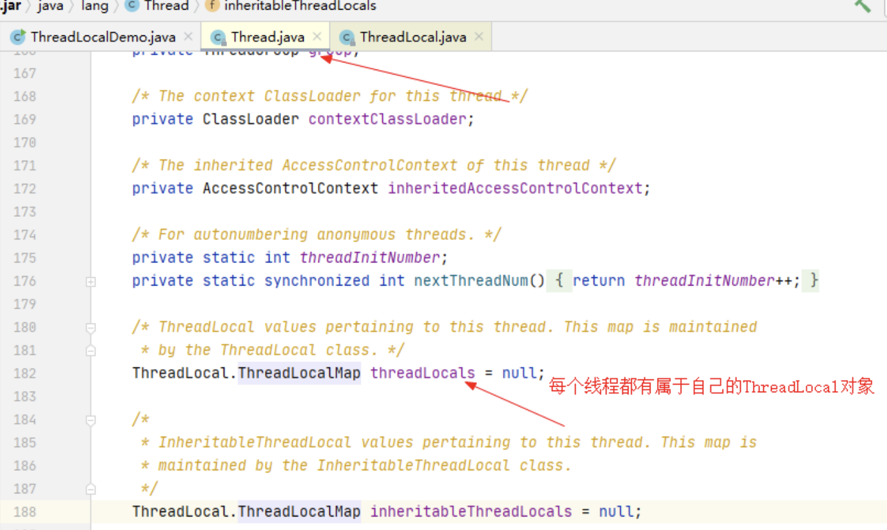

threadLocalMap实际上就是一个以threadLocal实例为key，任意对象为value的Entry对象。

```java
void createMap(Thread t, T firstValue) {
	t.threadLocals = new ThreadLocalMap(firstKey: this, firstValue);
}
```

当我们为threadLocal变量赋值，实际上就是以当前threadLocal实例为key，值为value的Entry往这个threadLooallMap中存放

==JVM内部维护了一个线程版的Map<ThreadLocal,Value>==(通过ThreadLocal对象的set方法，结果把ThreadLocal对象自己当做key，放进了ThreadLoalMap中），每个线程要用到这个T的时候，用当前的线程去Map里面获==通过这样让每个线程都拥有了自己独立的变量，人手一份==，竞争条件被彻底消除，在并发模式下是绝对安全的变量。

# 内存泄漏

## 阿里巴巴规格

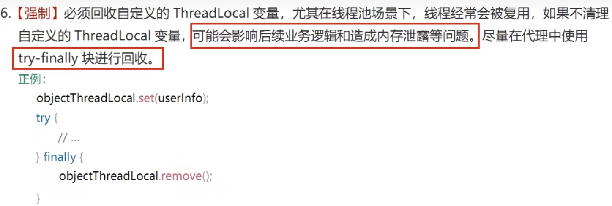

## 什么是内存泄漏

不再会被使用的对象或者变量占用的内存不能被回收，就是内存泄露。

## 内存泄露是谁惹的祸

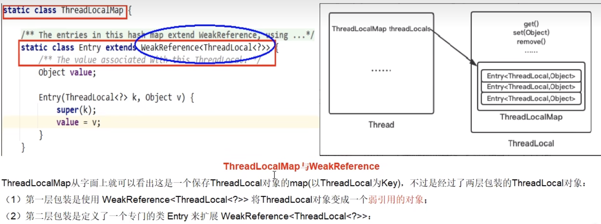

强引用、软引用、弱引用、虚引用分别是什么


## 强引用

当内存不足，JVM开始垃圾回收，对于强引用的对象，==就算是出现了OOM也不会对该对象进行回收==，死都不收。

强引用是我们最常见的普通对象引用，只要还有强引用指向一个对象，就能表明对象还“活着”，垃圾收集器不会碰这种对象。

在Java中最常见的就是强引用，把一个对象赋给一个引用变量，这个引用变量就是一个强引用。

当一个对象被强引用变量引用时，它处于可达状态，它是不可能被垃圾回收机制回收的，==即使该对象以后永远都不会被用到，JVM也不会回收==。因此强引用是造成Java内存泄漏的主要原因之一。

对于一个普通的对象，如果没有其他的引用关系，只要超过了引用的作用域或者显式地将相应(强）引用赋值为null，一般认为就是可以被垃圾收集的了(当然具体回收时机还是要看垃圾收集策略)。

## 软引用

软引用是一种相对强引用弱化了一些的引用，需要用java.lang.ref.SoftReference类来实现，可以让对象豁免一些访圾收集。

对于只有软引用的对象来说，==当系统内存充足时它不会被回收，当系统内存不足时它会被回收。==

软引用通常用在对内存敏感的程序中，比如高速缓存就有用到软引用，内存够用的时候就保留，不够用就回收！

## 弱引用

弱引用需要用java.lang.ref.WeakReference类来实现，它比软引用的生存期更短，对于只有弱引用的对象来说，只要垃圾回收机制一运行，不管JVM的内存空间是否足够，都会回收该对象占用的内存。

## 软引用和弱引用的适用场景

假如有一个应用需要读取大量的本地图片：

**如果每次读取图片都从硬盘读取则会严重影响性能，**

**如果一次性全部加载到内存中又可能造成内存溢出。**

此时使用软引用可以解决这个问题。

设计思路是：用一个HashMap来保存图片的路径和相应图片对象关联的软引用之间的映射关系，在内存不足时，JVM会自动回收这些缓存图片对象所占用的空间，从而有效地避免了OOM的问题。

Map<String, SoftReference<Bitmap>> imageCache = new HashMap<String, SoftReference<Bitmap>>();

## 虚引用

1 虚引用必须和引用队列（ReferenceQueue)联合使用

虚引用需要java.lang.ref.PhantomReference类来实现，顾名思义，==就是形同虚设==，与其他几种引用都不同，虚引用并不会决定对象的生命周期。如果一个对象仅持有虚引用，那么它就和没有任何引用一样，在任何时候都可能被垃圾回收器回收，它不能单独使用也不能通过它访问对象，==虚引用必须和引用队列（ReferenceQueue)联合使用。==

2 PhantomReference的get方法总是返回null

虚引用的主要作用是跟踪对象被垃圾回收的状态。==仅仅是提供了一种确保对象被finalize以后，做某些事情的通知机制。==PhantomReference的get方法总是返回null，因此无法访问对应的引用对象。

3处理监控通知使用

换句话说，设置虚引用关联对象的唯一目的，就是在这个对象被收集器回收的时候收到一个系统通知或者后续添加进一步的处理，用来实现比finalize机制更灵活的回收操作

ThreadLocal是一个壳子，真正的存储结构是ThreadLocal里有ThreadLocalMap这么个内部类，每个Thread对象维护着一个ThreadLocalMap的引用，ThreadLocallMap是ThreadLocal的内部类，用Entry来进行存储。

1)调用ThreadLocal的set()方法时，实际上就是往ThreadLocalMap设置值，key是ThreadLocal对象，值Value是传递进来的对象

2)调用ThreadLocal的get()方法时，实际上就是往ThreadLocalMap获取值，key是ThreadLocal对象

ThreadLocal本身并不存储值（ThreadLocal是一个壳子）.它只是自己作为一个key来让线程从ThreadLocalMap获取value。

正因为这个原理，所以ThreadLocal能够实现“数据隔离”，获取当前线程的局部变量值，不受其他线程影响~

## 为什么要使用弱引用？不用如何？

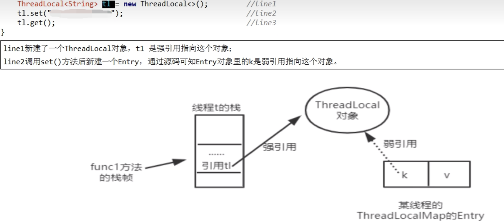

#### 为什么源代码用弱引用

<font color = 'blue'>为什么源代码用弱引用？</font>

当function01方法执行完毕后，栈帧销毁强引用t1也就没有了。但此时线程的ThreadLocallMap里某个entry的key引用还指向这个对象

若这个key引用是<font color = 'blue'>强引用</font>，就会导致key指向的ThreadLocal对象及v指向的对象不能被gc回收，造成内存泄漏；

若这个key引用是<font color = 'blue'>弱引用</font>就<font color = 'red'>大概率</font>会减少内存泄漏的问题(<font color = 'red'>还有一个key为null的雷</font>)。使用弱引用，就可以使ThreadLocal对象在方法执行完毕后顺利被回收且Entry的<font color = 'red'>key引用指向为null</font>。

<font color = 'orange'>此后我们调用get,set或remove方法时,就会尝试删除key对null的entry,可以释放value对象所占用的内存</font>

#### 弱引用就万事大吉了吗？

1当我们为threadLocal变量赋值，实际上就是当前的Entry(threadLocal实例为key,值为value)往这个threadLocalMap中存放。Entry中的key是弱引用，当threadLocal外部强引用被置为null(t1=null)，那么系统GC的时候，根据可达性分析，这个threadLocal实例就没有任何一条链路能够引用到它， 这个ThreadLocal势必会被回收。这样一来，<font color = 'red'>ThreadLocalMap中就会出现key为null的Entry, 就没有办法访问这些key为null的Entry的value，如果当前线程再迟迟不结束的话， 这些key为null的Entry的value就会一直存在一条强引用链： Thread Ref -> Thread -> ThreaLocalMap -> Entry -> value永远无法回收，造成内存泄漏。</font>

2当然，如果当前thread运行结束，threadLocal,threadLocalMap,Entry没有引用链可达，在垃圾回收的时候都会被系统进行回收。

3但在实际使用中我们有时候会用线程池去维护我们的线程，比如在Executors.newFixedThreadPool()时创建线程的时候，为了复用线程是不会结束的，所以threadLocal内存泄漏就值得我们小心

#### <font color = 'green'>key为null的entry，原理解析</font>

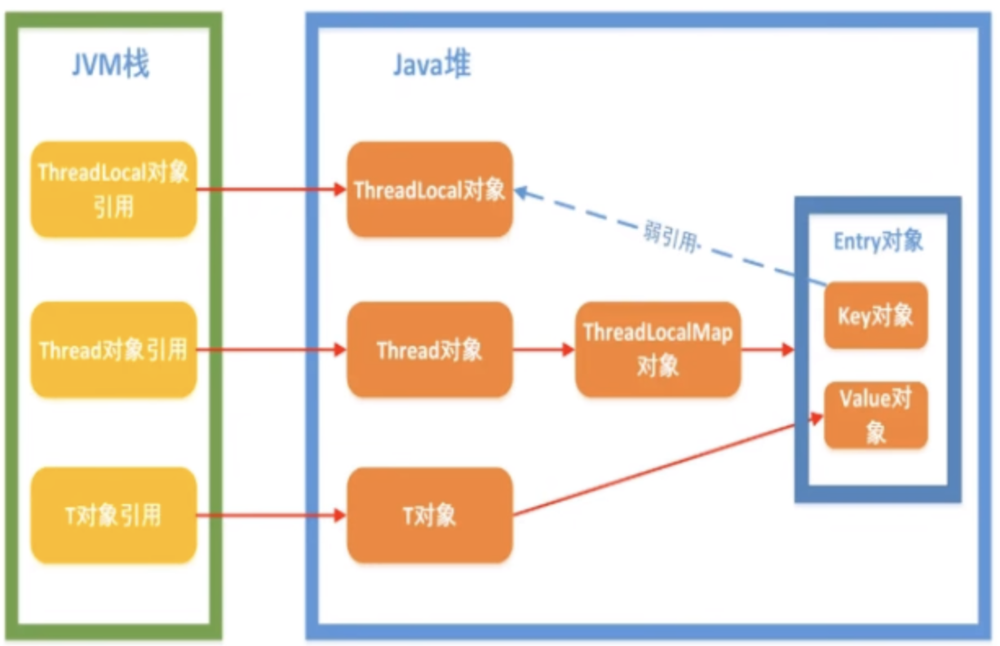

ThreadLocalMap使用ThreadLocal的弱引用作为key，如果一个ThreadLocal没有外部强引用引用他，那么系统gc的时候，这个ThreadLocal势必会被回收，这样一来，ThreadLocalMap中就会出现key为null的Entry,就没有办法访问这些key为null的Entry的
value，如果当前线程再迟迟不结束的话（比如正好用在线程池），这些key为null的Entry的value就会一直存在一条强引用链。

虽然弱引用，保证了key指向的ThreacLocal对象能被及时回收，但是v指向的value对象是需要ThreadLocalMap调用get、set时发现key为null时才会去回收整个entry、value。<font color = 'red'>因此弱引用不能100%保证内存不泄露。我们要在不使用某个ThreadLocal对象后，手动调用remoev方法来删除它</font>，尤其是在线程池中，不仅仅是内存泄露的问题，因为线程池中的线程是重复使用的，意味着这个线程的ThreadLocalMap对象也是重复使用的，如果我们不手动调用remove方法，那么后面的线程就有可能获取到上个线程遗留下来的value值，造成bug。

#### set、get方法会去检查所有键为null的Entry对象

##### expungeStaleEntry()，主要的清理方法

set()方法解析：

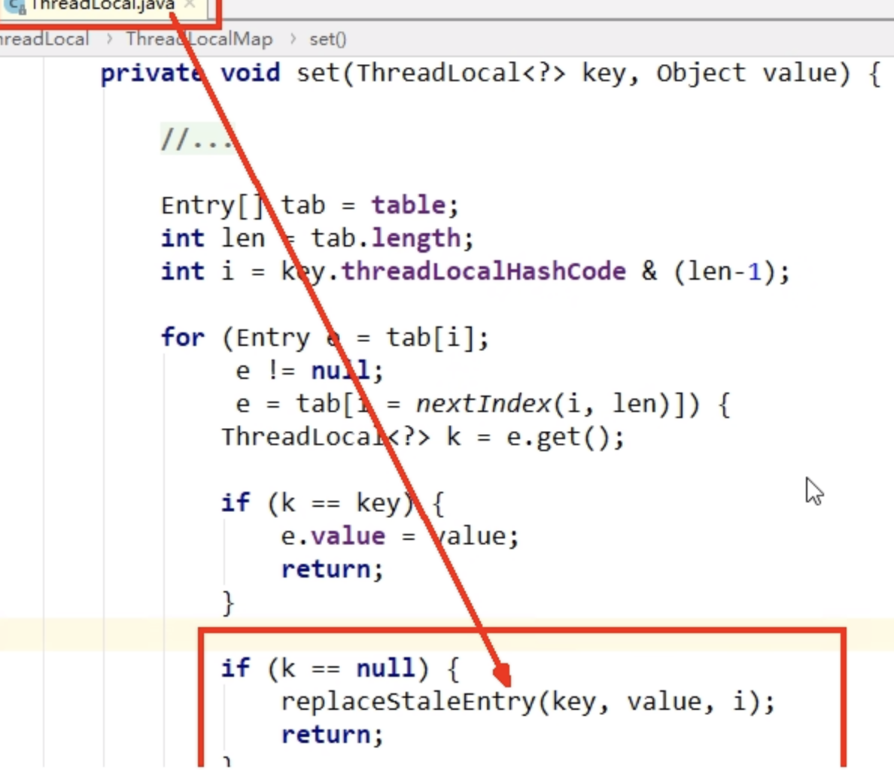

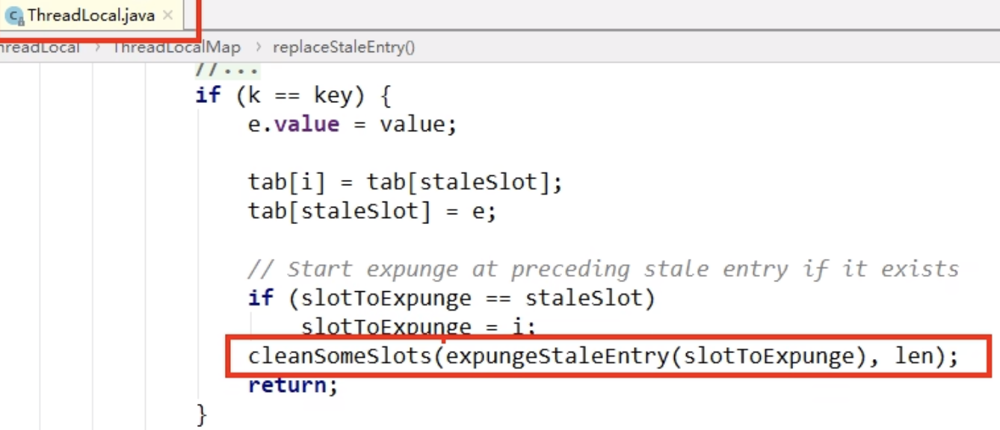

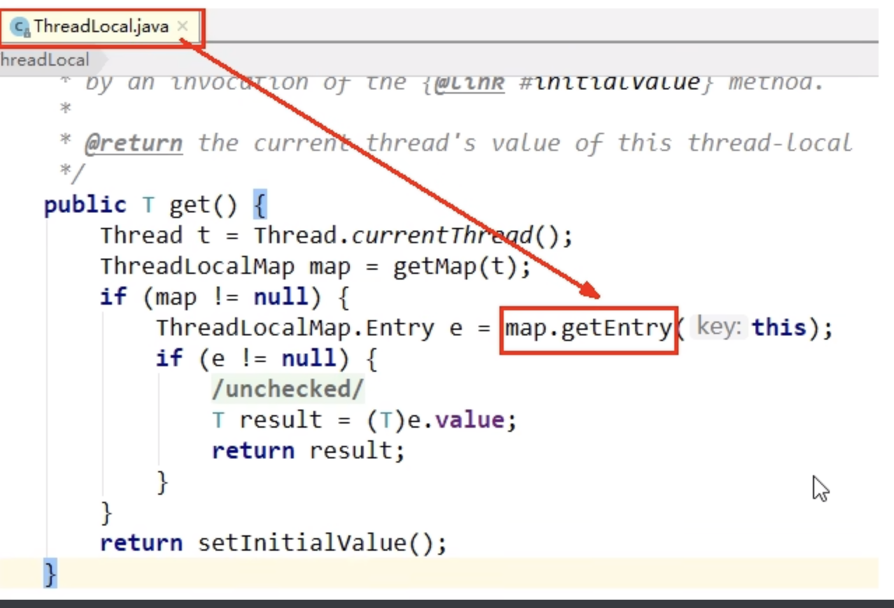

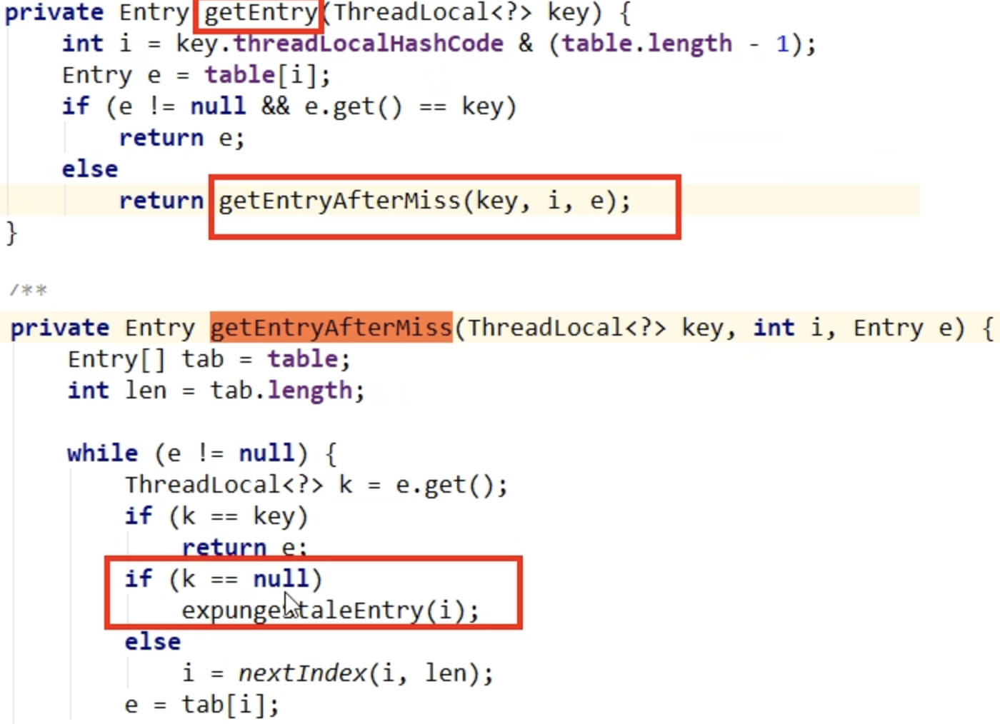

remove()方法：寻找脏Entry，即key=null的Entry，然后进行删除


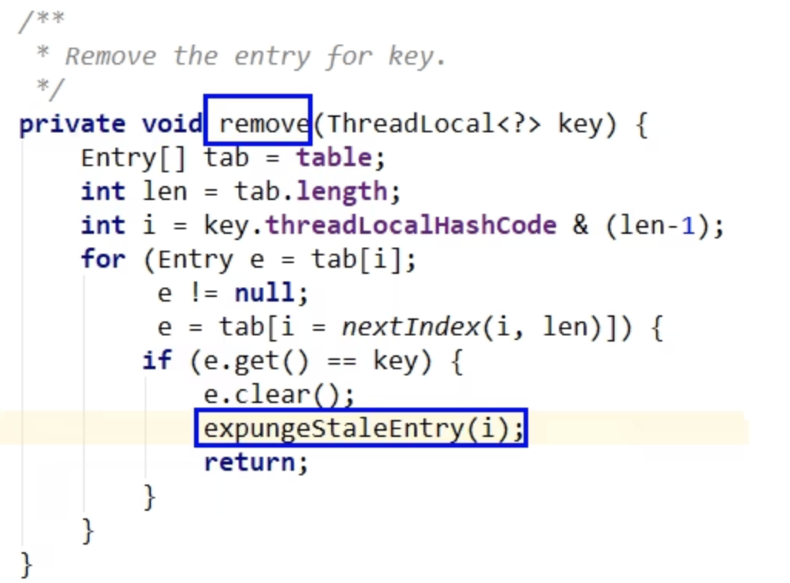

#### 结论

从前面的set，getEntry，remove方法看出，在threadLocal的生命周期里，针对threadLocal存在的内存溃漏的问题，都会通过<font color = 'red'>expungeStaleEntry</font>,cleanSomeSlots,replaceStaleEntry这三个方法清理掉key为null的entry。

### 最佳实践

- ThreadLocal.withInitial((）-> 初始化值);

- 建议把ThreadLocal修饰成static

  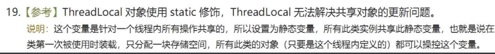

  Threadlocal能实现了线程的数据隔离，不在于它自己本身，而在于Thread的ThreadLocalMap，所以 ThreadLocal可以只初始化一次，只分配一块存储空间就足以了，没必要作为成员变量多次被初始化。

- <font color = 'red'>用完记得手动remove</font>

# ThreadLocal中ThreadLocalMap数据结构和关系

# ThreadLocal的key是弱引用，这是为什么

# ThreadLocal内存泄露问题你知道吗

# ThreadLocal中最后为什么要加remove方法