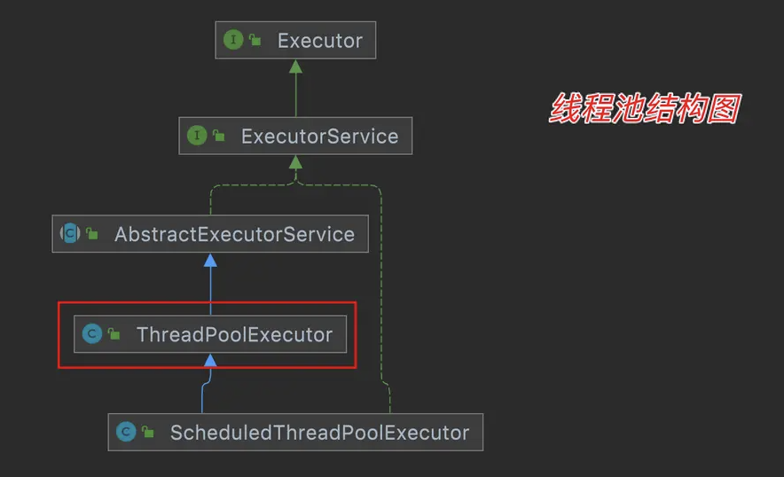
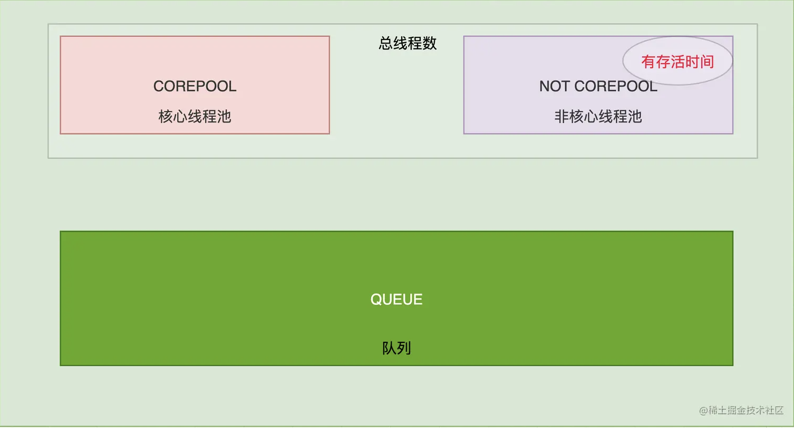
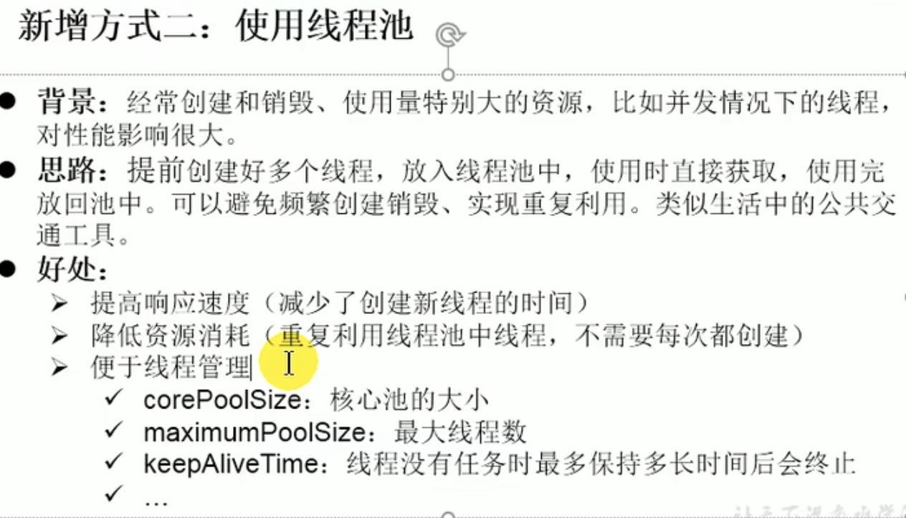

[toc]

# 线程池

```
public ThreadPoolExecutor(int corePoolSize,
                          int maximumPoolSize,
                          long keepAliveTime,
                          TimeUnit unit,
                          BlockingQueue<Runnable> workQueue,
                          ThreadFactory threadFactory,
                          RejectedExecutionHandler handler) {
    //...
}
```

这 7 个参数分别是：

1. corePoolSize：核心线程数。
2. maximumPoolSize：最大线程数。
3. keepAliveTime：空闲线程存活时间。
4. TimeUnit：时间单位。
5. BlockingQueue：线程池任务队列。
6. ThreadFactory：创建线程的工厂。
7. RejectedExecutionHandler：拒绝策略。



- 在很大并发量的情况下线程池不仅可以提供稳定的处理还可以减少线程之间的调度开销。
- 并且线程池提供了对线程和资源的回收及管理。



- 上面这张图可以解释`corePoolSize`、`maxiumPoolSize`、`keepAliveTime`、`TimeUnit`、`workQueue` 这五个参数。关于`threadFactory`、`handler`是形容过程中的两个参数。
- 关于`ThreadPoolExecutor`我们还得知道他虽然是线程池但是也并不是一开始就初始化好线程的。而是根据任务实际需求中不断的构建符合自身的线程池。那么构建线程依赖谁呢？上面也提到了官方推荐使用线程工厂。就是我们这里的`ThreadFactory`类。
- 比如`Executors.newFixedThreadPool`是设置了固定的线程数量。那么当任务超过线程数和队列长度总和时，该怎么办？如果真的发生那种情况我们只能拒绝提供线程给任务使用。那么该如何拒绝这里就涉及到我们的`RejectExecutionHandler`
- 点进源码我们可以看到默认的队列好像是`LinkedBlockingQueue` ; 这个队列是链表结构的怎么会有长度呢？ 的确是但是`Executors`还给我们提供了很多扩展性。如果我们自定义的话我们能够发现还有其他的

# 线程池四种拒绝策略

1. corePoolSize - 核心线程数，也即最小的线程数。
2. workQueue - 阻塞队列 。
3. maximumPoolSize - 最大线程数

​    当提交的任务数大于（workQueue.size() + maximumPoolSize ），就会触发线程池的拒绝策略。jdk默认提供了四种拒绝策略：

- **AbortPolicy** - 抛出异常，中止任务。(默认)
- **CallerRunsPolicy** - 主线程调用当前线程的run方法,不去用线程池
- **DiscardPolicy** - 直接丢弃
- **DiscardOldestPolicy** - 丢弃队列最老任务，添加新任务。丢弃阻塞队列 workQueue 中最老的一个任务，并将新任务加入

# 线程池知道哪些，用过哪些

1.Executors.newFixedThreadPool(int nThreads); //参数为线程的总数
2.Executors.newFixedThreadPool(int nThreads,ThreadFactory threadFactory); //参数为线程的总数 和 创建线程的工厂

# 线程池核心参数



# 线程池工作流程

# 线程池的好处

# 创建多线程的四种方式

- 继承Thread类，重写run方法

```java
class MyThread extends Thread {
    private int i = 0;

    @Override
    public void run() {
        for (i = 0; i < 100; i++) {
            System.out.println(Thread.currentThread().getName() + " " + i);
        }
    }
}

public class ThreadDemo1 {
    public static void main(String[] args) {
        for (int i = 0; i < 100; i++) {
            System.out.println(Thread.currentThread().getName() + " " + i);
            if (i == 30) {
                // 创建一个新的线程  myThread1  此线程进入新建状态
                Thread myThread1 = new MyThread();
                // 创建一个新的线程 myThread2 此线程进入新建状态
                Thread myThread2 = new MyThread();
                // 调用start()方法使得线程进入就绪状态
                myThread1.start();
                // 调用start()方法使得线程进入就绪状态
                myThread2.start();
            }
        }
    }
}

```

- 实现Runnable接口，重写run方法，实现Runnable接口的实现类的实例对象作为Thread构造函数的targe

创建Runnable实现类的实例，并以此实例作为Thread类的target来创建Thread对象，该Thread对象才是真正的线程对象。

```java
class MyRunnable implements Runnable {
    private int i = 0;

    @Override
    public void run() {
        for (i = 0; i < 100; i++) {
            System.out.println(Thread.currentThread().getName() + " " + i);
        }
    }
}


public class ThreadDemo2 {
    public static void main(String[] args) {
        for (int i = 0; i < 100; i++) {
            System.out.println(Thread.currentThread().getName() + " " + i);
            if (i == 30) {
                // 创建一个Runnable实现类的对象
                Runnable myRunnable = new MyRunnable();
                // 将myRunnable作为Thread target创建新的线程
                Thread thread1 = new Thread(myRunnable);
                Thread thread2 = new Thread(myRunnable);
                // 调用start()方法使得线程进入就绪状态
                thread1.start();
                thread2.start();
            }
        }
    }
}

```


- 通过Callable和FutureTask创建线程

```java
public class ThreadDemo3 {
    public static void main(String[] args) {
        // 创建MyCallable对象
        Callable<Integer> myCallable = new MyCallable();
        //使用FutureTask来包装MyCallable对象
        FutureTask<Integer> ft = new FutureTask<Integer>(myCallable);

        for (int i = 0; i < 100; i++) {
            System.out.println(Thread.currentThread().getName() + " " + i);
            if (i == 30) {
                //FutureTask对象作为Thread对象的target创建新的线程
                Thread thread = new Thread(ft);
                //线程进入到就绪状态
                thread.start();
            }
        }

        System.out.println("主线程for循环执行完毕..");

        try {
            //取得新创建的新线程中的call()方法返回的结果
            int sum = ft.get();
            System.out.println("sum = " + sum);
        } catch (InterruptedException e) {
            e.printStackTrace();
        } catch (ExecutionException e) {
            e.printStackTrace();
        }
    }
}

class MyCallable implements Callable<Integer> {
    private int i = 0;

    // 与run()方法不同的是，call()方法具有返回值
    @Override
    public Integer call() {
        int sum = 0;
        for (; i < 100; i++) {
            System.out.println(Thread.currentThread().getName() + " " + i);
            sum += i;
        }
        return sum;
    }
}

```

1:创建Callable接口的实现类 ，并实现Call方法
2:创建Callable实现类的实现，使用FutureTask类包装Callable对象，该FutureTask对象封装了Callable对象的Call方法的返回值
3:使用FutureTask对象作为Thread对象的target创建并启动线程
4:调用FutureTask对象的get()来获取子线程执行结束的返回值

- 通过线程池创建线程

```java
public class ThreadDemo4{
    //线程池数量 
    private static int POOL_NUM = 10;
    /**
     * @param args
     * @throws InterruptedException
     */
    public static void main(String[] args) throws InterruptedException {
        // TODO Auto-generated method stub 
        ExecutorService executorService = Executors.newFixedThreadPool(5);
        for(int i = 0; i<POOL_NUM; i++) {
            RunnableThread thread = new RunnableThread();
            //Thread.sleep(1000); 
            executorService.execute(thread);
        }
        //关闭线程池 
        executorService.shutdown();
    }
}

class RunnableThread implements Runnable {
    @Override
    public void run() {
        System.out.println("通过线程池方式创建的线程：" + Thread.currentThread().getName() + " ");
    }
}
```