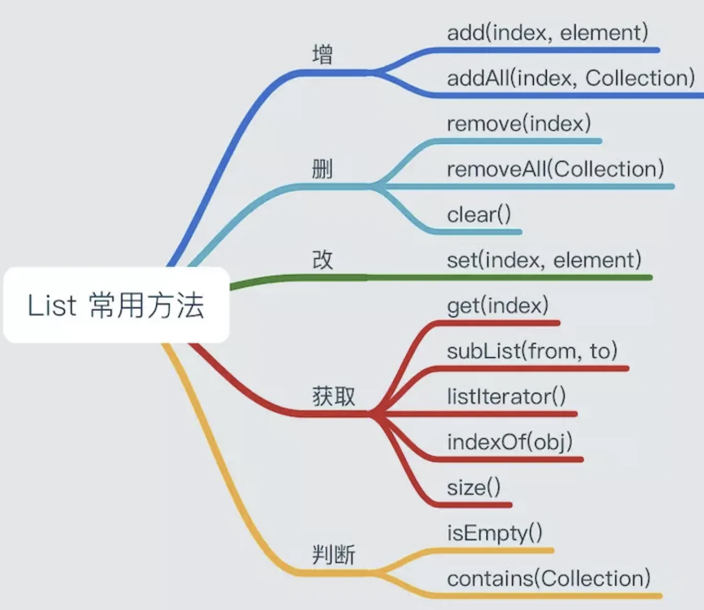
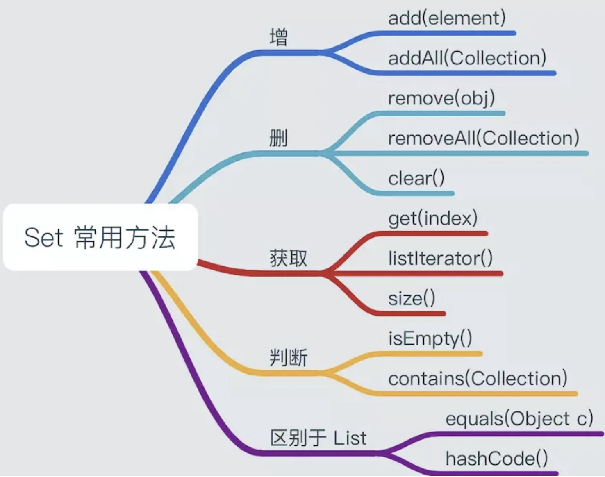
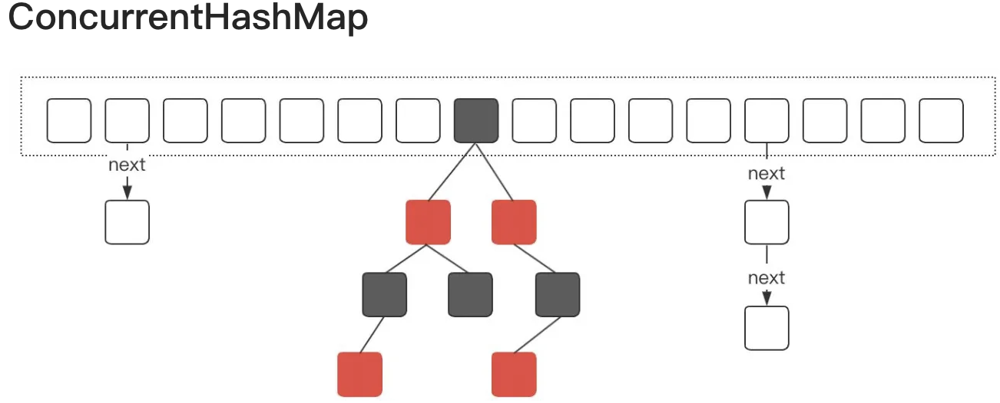
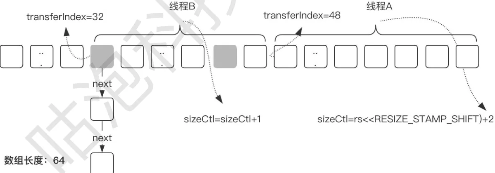
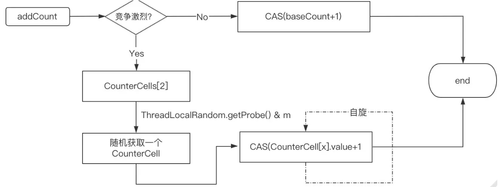
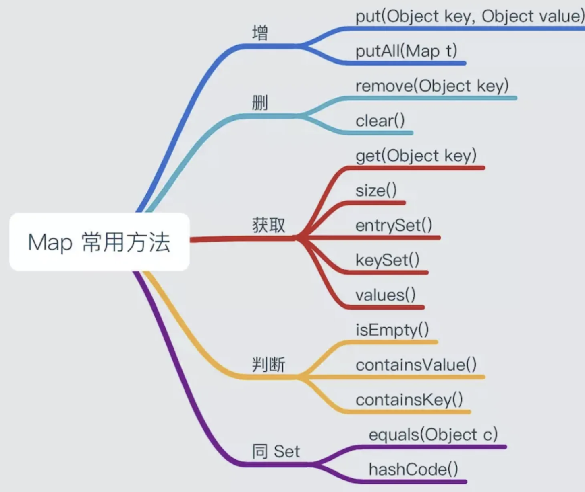
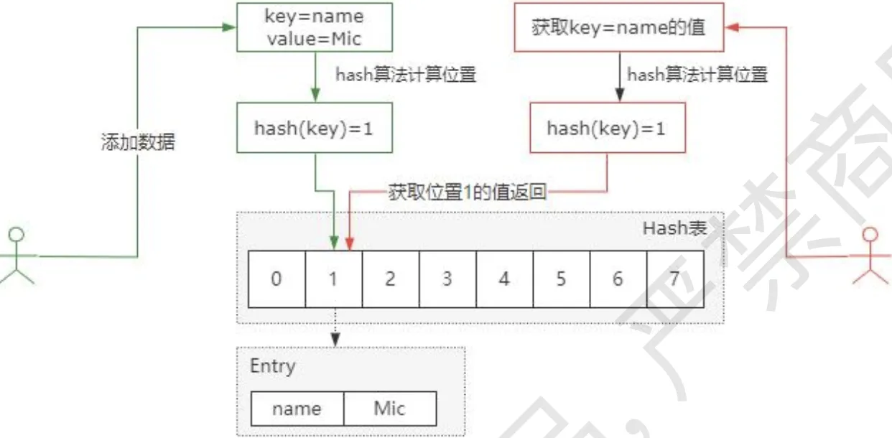
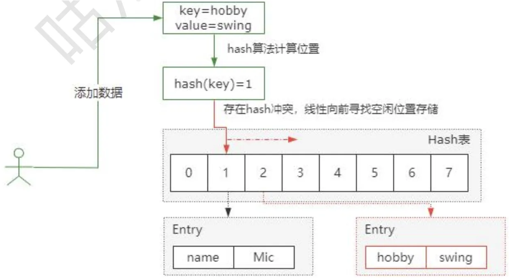
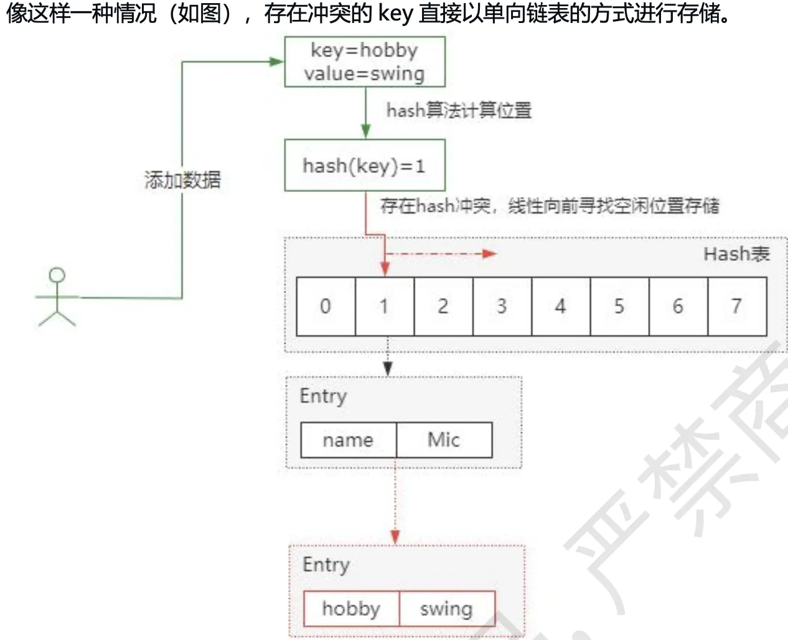
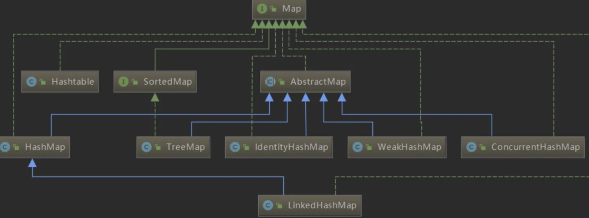

[TOC]

# 集合的定义

所有集合类都位于java.util包下。Java的集合类主要由两个接口派生而出：Collection和Map，Collection和Map是Java集合框架的根接口，这两个接口又包含了一些接口或实现类。

- Collection一次存一个元素，是单列集合；
- Map一次存一对元素，是双列集合。Map存储的一对元素：键--值，键（key）与值（value）间有对应（映射）关系

Collection集合主要有List和Set两大接口

# Collection接口

## Collection的子接口之----List

```java
reverse(List):反转List中的顺序
shuffle(List)：对List集合元素进行随机排序
sort(List):根据元素的自然排序对指定List集合元素按照升序排序
sort(List,Conparator):根据指定的Comparator产生的顺序对List集合进行排序
swap(List,int,int):将指定list集合中的i处元素和j处元素进行调换
    
Object max(Collection):根据元素的自然顺序，返回给定集合中最大的元素
Object max(Collection,Comparator):根据Comparator指定的顺序，返回给定集合中的最大
Object min(Collecion)
Object min(Collection,Comparator)
int frequency(Collecion,Object):返回指定集合中指定元素出现的次数
void copy(List dest,List src):将src中的内容复制到dest中
boolean replaceAll(List list,Object oldVal,Object newVal):使用新值替换list对
```

List是有序的，是可重复的，动态数组，一旦初始化了，长度就不能改变。 

List的主要实现：ArrayList、LinkedList、Vetor 

List的常用方法：



### ArrayList、LinkList和Vector三者的区别

| ArrayList    | LinkedList                                 | Vector                                                       |                                 |
| ------------ | ------------------------------------------ | ------------------------------------------------------------ | ------------------------------- |
| 底层实现     | 动态数组                                   | 双向链表                                                     | 数组                            |
| 同步性几效率 | 不同步，非线程安全，效率高，支持随机访问   | 不同步，非线程安全，效率高                                   | 同步，线程安全，效率低          |
| 特点         | 开辟的内存空间是连续的，查询快，但是增删慢 | 开辟的内存空间是可连续的，也可不连续，节点与节点之间通过指针关联，当增删时不需要关心位置，这也为它增删效率奠定了基础。但是查询慢 | 查询快增删慢                    |
| 默认容量     | 10                                         | 无初始容量                                                   | 10                              |
| 扩容机制     | 而后按照当前的容量的1.5倍进行扩容          | 无扩容机制                                                   | 而后按照当前的容量的2倍进行扩容 |

都是List接口的实现类，存储数据的特点相同，都是有序，可重复。底层使用object[]存储。

- ArrayList：作为list接口的主要实现类，是线程不安全的，效率高。
- LinkList：对频繁的插入，删除操作，使用此类的效率必ArrayList高，底层使用的是双向链表。
- Vector：古老实现类，线程安全的，效率低。底层使用object[]存储。

### Arrayist

1基于索引的动态数组，开辟的内存空间是连续的，这也为他查询效率奠定了基础。

2初始化时默认容量是10，而后按照当前的容量的1.5被进行扩容。

3适用在查找多，增删少的场景。

### LinkedList 

1双向链表，开辟的内存空间是可连续的，也可不连续，节点与节点之间通过指针关联，当增删时不需要关心位置，这也为它增删效率奠定了基础。

2由于是双向链表，所以无初始容量，无扩容机制。

3适用在增删多，查找少的场景。

## Collection的子接口之----Set

Set接口是无序的，不可重复的。 Set接口的主要实现类：HashSet、TreeSet 

Set接口的常用方法：



Set接口的框架

| HashSet    | TreeSet                                           | LinkedHashSet                                                |                                                              |
| ---------- | ------------------------------------------------- | ------------------------------------------------------------ | ------------------------------------------------------------ |
| 底层实现   | HashMap                                           | 红黑树                                                       | LinkedHashMap                                                |
| 重复性     | 不允许重复                                        | 不允许重复                                                   | 不允许重复                                                   |
| 有无序     | 无序                                              | 有序，支持两种排序方式，自然排序和定制排序，其中自然排序为默认的排序方式。 | 有序，以元素插入的顺序来维护集合的链接表                     |
| 时间复杂度 | add()，remove()，contains()方法的时间复杂度是O(1) | add()，remove()，contains()方法的时间复杂度是O(logn)         | LinkedHashSet在迭代访问Set中的全部元素时，性能比HashSet好，但是插入时性能稍微逊色于HashSet，时间复杂度是 O(1)。 |
| 同步性     | 不同步，线程不安全                                | 不同步，线程不安全                                           | 不同步，线程不安全                                           |
| null值     | 允许null值                                        | 不支持null值，会抛出 java.lang.NullPointerException 异常。因为TreeSet应用 compareTo() 方法于各个元素来比较他们，当比较null值时会抛出 NullPointerException异常。 | 允许null值                                                   |
| 比较       | equals()                                          | compareTo()                                                  | equals()                                                     |

collection接口；单列集合，用来存储一个一个的对象。
Set接口；存储无序的，不可重复的数据。
HashSet：作为Set接口的主要实现类，线程是不安全的，可以存储null值。
LinkedHashSet：作为HashSet的子类，遍历其内部数据时i，可以按照添加的。
TreeSet：可以按照添加对象的指定属性，进行排序。
Set接口中没有额外定义新的方法，使用的都是collection中声明的方法。

# Map接口

 Map接口 

Map：双列数据，存储key-value对的数据。Map 是一种把键对象和值对象映射的集合，它的每一个元素都包含一对键对象和值对象。 Map没有继承于Collection接口，从Map集合中检索元素时，只要给出键对象，就会返回对应的值对象。 Map 的常用实现类：HashMap、TreeMap、HashTable、LinkedHashMap、ConcurrentHashMap

 HashMap 

HashMap的底层实现原理？以jdk7为例说明：

HashMap map = new HashMap（）：

在实例化以后，底层创建了长度是16的一維数组Entry［］ table。

map.put（key1, value1）：

首先，调用key1所在类的hashCode（）计算key1哈希值，此哈希值经过某种算法计算以后，得到在Entry数组中的存放位置。

如果此位置上的数据为空，此时的key1-value1添加成功。

如果此位置上的数据不为空，（意味着此位置上存在一个或多个数据（以链表形式存在）），比较key1和已经存在的一个或多个数据的哈希值：

如果key1的哈希值与已经存在的数据的哈希值都不相同，此时key1-vaLue1添加成功。

如果key1的哈希值和已经存在的某一个数据（key2-vaLue2）的哈希值相同，继续比较：调用key1所在类的equals（key2）.

如果equals（）返回false：此时key1-value1添加成功。

如果equals（）返回true：使用value1替换vaLue2。

补充:关于情况2和情况3:此时key1value1和原来的数据以链表的方式存储

在不断的添加过程中，会涉及到扩容问题，默认的扩容方式:扩容为原来容量的2倍

jdk8 相较于jdk7在底层实现方面的不同

长度为16的数组

1.new HashMap():底层没有创建一个长度为16的数组

2.jdk 8底层的数组是:Node[]，而非Entry[]

3.首次调用put()方法时，底层创建长度为16的数组

4.jdk7底层结构只有:数组+链表。jdk8中底层结构:数组+链表+红黑树

当数组的某一个索引位置上的元素认链表形式存在的数据个数>8 且当前数组此时此索引位置上的所有数据改为吏用红黑树存储。

# ConcurrentHashMap



## 是什么

由数组链表红黑树构成,由于核心是hash表,所以必然会引起hash冲突,默认会初始化一个长度为16的node数组,当数组长度大于64,并且链表长度大于8时会升级为红黑树

## 用来干什么

ConcurrentHashMap 本质上是一个 HashMap，因此功能和 HashMap 一样，但是 ConcurrentHashMap 在 HashMap 的基础上，提供了并发安全的实现。 并发安全的主要实现是通过对指定的 Node 节点加锁，来保证数据更新的安全性(如图所示)。 

 性能优化 

如果在并发性能和数据安全性之间做好平衡，在很多地方都有类似的设计，比如 cpu 的三级缓存、mysql 的 buffer_pool、Synchronized 的锁升级等等。 ConcurrentHashMap 也做了类似的优化，主要体现在以下几个方面: 

### 一

在 JDK1.8 中，ConcurrentHashMap 锁的粒度是数组中的某一个节点，而在 JDK1.7，锁定的是 Segment，锁的范围要更大，因此性能上会更低。

### 二

引入红黑树，降低了数据查询的时间复杂度，红黑树的时间复杂度是 O(logn)。

### 三

(如图所示)，当数组长度不够时，ConcurrentHashMap 需要对数组进行扩容，在扩容的实 现上，ConcurrentHashMap 引入了多线程并发扩容的机制，简单来说就是多个线程对原始数组进行分片后，每个线程负责一个分片的数据迁移，从而提升了扩容过程中数据迁移的效率。



### 四

ConcurrentHashMap 中有一个 size()方法来获取总的元素个数，而在多线程并发场景中， 在保证原子性的前提下来实现元素个数的累加，性能是非常低的。ConcurrentHashMap 在这 个方面的优化主要体现在两个点:  当线程竞争不激烈时，直接采用 CAS 来实现元素个数的原子递增。
 如果线程竞争激烈，使用一个数组来维护元素个数，如果要增加总的元素个数，则直接从 数组中随机选择一个，再通过 CAS 实现原子递增。它的核心思想是引入了数组来实现对 并发更新的负载。



# Map的常用方法



HashMap：作为Map的主要实现类，线程是不安全的，效率高，存储null的key和value。
ConcurrentHashMap:
LinkedHashMap：保证在遍历map元素时，可以按照提那家店顺序实现遍历；原因：在原有的HashMap底层的结构基础上，添加了一对指针，指向前一个和后一个元素，对于频繁的遍历操作，子类执行效率高于HashMap。、
TreeMap保证按照添加到key-value对进行排序，实现排序遍历，此时考虑key的自然排序或定制排序；底层时红黑树。
hashTable：作为古老的实现类。线程是安全的，但是效率很低，不能存储null的key和value。
properties：常用来处理配置文件，key和value都是String类型。

| HshMap   | HashTable                                                    | TreeMap                                       |                                                              |
| -------- | ------------------------------------------------------------ | --------------------------------------------- | ------------------------------------------------------------ |
| 底层实现 | 哈希表（数组+链表+红黑树）                                   | 哈希表（数组+链表）                           | 红黑树                                                       |
| 同步性   | 线程不同步                                                   | 同步                                          | 线程不同步                                                   |
| null值   | 允许 key 和 Vale 是 null，但是只允许一个 key 为 null，且这个元素存放在哈希表 0 角标位置 | 不允许key、value 是 null                      | value允许为null。 当未实现 Comparator 接口时，key 不可以为null 当实现 Comparator 接口时，若未对 null 情况进行判断，则可能抛 NullPointerException 异常。如果针对null情况实现了，可以存入，但是却不能正常使用get()访问，只能通过遍历去访问。 |
| hash     | 使用hash(Object key)扰动函数对 key 的 hashCode 进行扰动后作为 hash 值 | 直接使用 key 的 hashCode() 返回值作为 hash 值 |                                                              |
| 容量     | 容量为 2^4 且容量一定是 2^n                                  | 默认容量是11，不一定是 2^n                    |                                                              |
| 扩容     | 两倍，且哈希桶的下标使用 &运算代替了取模                     | 2倍+1，取哈希桶下标是直接用模运算             |                                                              |

 HashMap和HashSet的区别 

HashSet的实现方式大致如下，通过一个HashMap存储元素，元素是存放在HashMap的Key中，而Value统一使用一个Object对象。

 HashMap和TreeMap的区别 

Map：在数组中是通过数组下标来对 其内容进行索引的，而Map是通过对象来对 对象进行索引的，用来 索引的对象叫键key，其对应的对象叫值value。

●HashMap是通过hashcode()对其内容进行快速查找的；HashMap中的元素是没有顺序的；TreeMap中所有的元素都是有某一固定顺序的，如果需要得到一个有序的结果，就应该使用TreeMap。 HashMap和TreeMap都不是线程安全的。

●HashMap继承AbstractMap类；覆盖了hashcode() 和equals() 方法，以确保两个相等的映射返回相同的哈希值；TreeMap继承SortedMap类；他保持键的有序顺序；

●HashMap：基于hash表实现的；使用HashMap要求添加的键类明确定义了hashcode() 和equals() （可以重写该方法）；为了优化HashMap的空间使用，可以调优初始容量和负载因子；

●TreeMap：基于红黑树实现的；TreeMap就没有调优选项，因为红黑树总是处于平衡的

●HashMap：适用于Map插入，删除，定位元素。

●TreeMap：适用于按自然顺序或自定义顺序遍历键（key）。

# 如何解决hash冲突

要了解 Hash 冲突，那首先我们要先了解 Hash 算法和 Hash 表。(如图) 



## Hash算法

就是把任意长度的输入，通过散列算法，变成固定长度的输出，这个输出结果是 散列值。 

## Hash表

又叫做“散列表”，它是通过 key 直接访问在内存存储位置的数据结构，在具体实现 上，我们通过 hash 函数把 key 映射到表中的某个位置，来获取这个位置的数据，从而加快查 找速度。

## hash冲突

是由于哈希算法被计算的数据是无限的，而计算后的结果范围有限，所以总会存在不同的数据经过计算后得到的值相同，这就是哈希冲突。

## 通常解决 hash 冲突的方法有4种。

### 开放定址法

也称为线性探测法，就是从发生冲突的那个位置开始，按照一定的次序从hash 表中找到一个空闲的位置，然后把发生冲突的元素存入到这个空闲位置中。ThreadLocal 就用到了线性探测法来解决 hash 冲突的。像这样一种情况(如图)，在 hash 表索引1的位置存了一个key=name，当再次添加 key=hobby时，hash 计算得到的索引也是1，这个就是 hash 冲突。而开放定址法，就是按顺序向前找到一个空闲的位置来存储冲突的 key。



### 链式寻址法

这是一种非常常见的方法，简单理解就是把存在 hash 冲突的 key，以单向 链表的方式来存储，比如 HashMap 就是采用链式寻址法来实现的。 



### 再hash 法

就是当通过某个 hash 函数计算的 key存在冲突时，再用另外一个 hash 函数对这个 key 做 hash，一直运算直到不再产生冲突。这种方式会增加计算时间，性能影响较大。

### 建立公共溢出区

就是把 hash 表分为基本表和溢出表两个部分，凡是存在冲突的元素iv.一律放入溢出表中。

HashMap 在JDK1.8 版本中，通过链式寻址法+红黑树的方式来解决 hash 冲突问题，其中红黑树是为了优化 Hash 表链表过长导致时间复杂度增加的问题。当链表长度大于8并且 hash表的容量大于 64 的时候，再向链表中添加元素就会触发转化。

# 双列集合继承关系图



# 集合工具类Collections

Collections：集合工具类，方便对集合的操作。这个类不需要创建对象，内部提供的都是静态方法。

# Collection 和 Collections的区别

Collections是个java.util下的类，是针对集合类的一个工具类,提供一系列静态方法,实现对集合的查找、排序\替换、线程安全化（将非同步的集合转换成同步的）等操作。

Collection是个java.util下的接口，它是各种集合结构的父接口，继承于它的接口主要有Set和List,提供了关于集合的一些操作,如插入、删除、判断一个元素是否其成员、遍历等。

[typora快捷键](https://blog.suhuayue.com/archives/889)

