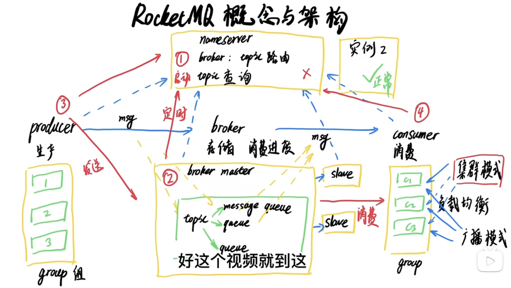
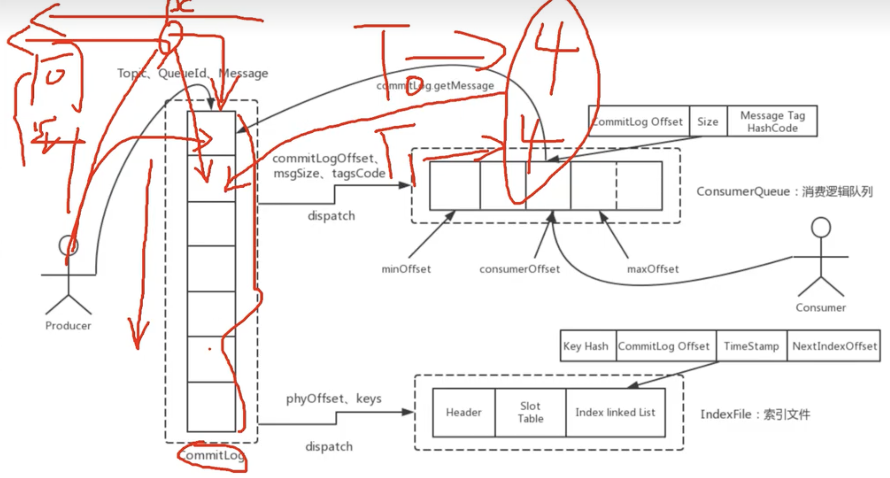
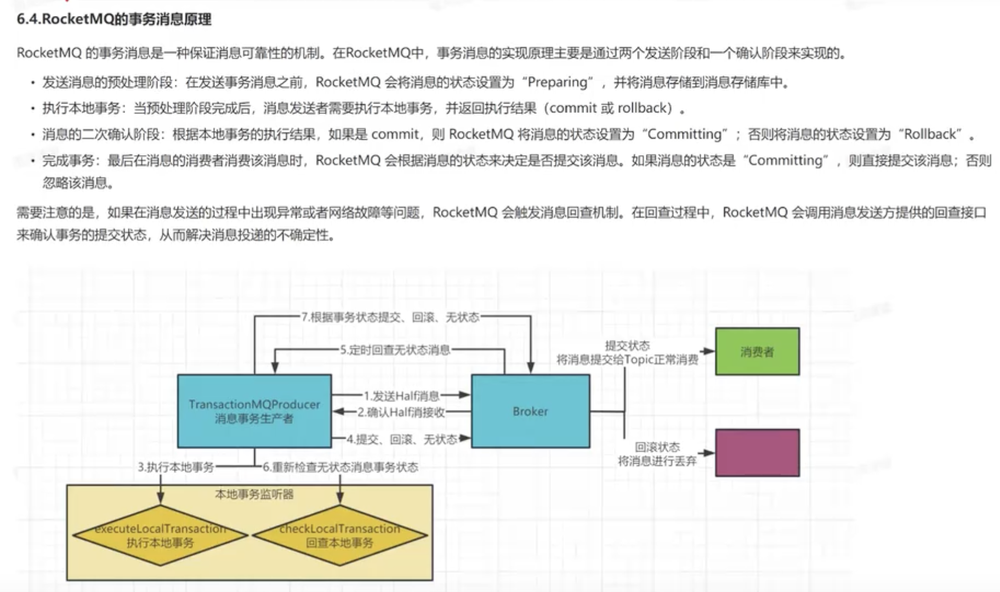

[toc]

# 单表做分页查询会很慢，有什么优化方法

# 对中间件了解吗，为什么选择rocketmq

# 项目的问题 死锁

# mq怎么实现消息顺序消费

# 消息队列的选型，为什么延时任务不用rabbitmq

# 消息丢失怎么解决

# 6 rocketmq有没有遇到生产上的问题

# 7 rocketmq的特性和其他用法了解吗

# 8 rocketmq的持久化是怎么实现的

# RocketMQ底层工作原理

1. 启动NameServer，NameServer启动后开始监听端口，等待Broker、Producer、Consumer连接。 
2. 启动Broker时，Broker会与所有的NameServer建立并保持长连接，然后每30秒向NameServer定时 发送心跳包。  				
3. 发送消息前，可以先创建Topic，创建Topic时需要指定该Topic要存储在哪些Broker上，当然，在创建Topic时也会将Topic与Broker的关系写入到NameServer中
4. Producer发送消息，启动时先跟NameServer集群中的其中一台建立长连接，并从NameServer中获 取路由信息，即当前发送的Topic消息的Queue与Broker的地址(IP+Port)的映射关系。然后根据算法 策略从队选择一个Queue，与队列所在的Broker建立长连接从而向Broker发消息。当然，在获取到路由 信息后，Producer会首先将路由信息缓存到本地，再每30秒从NameServer更新一次路由信息
5. Consumer跟Producer类似，跟其中一台NameServer建立长连接，获取其所订阅Topic的路由信息， 然后根据算法策略从路由信息中获取到其所要消费的Queue，然后直接跟Broker建立长连接，开始消费 其中的消息。Consumer在获取到路由信息后，同样也会每30秒从NameServer更新一次路由信息。不过不同于Producer的是，Consumer还会向Broker发送心跳，以确保Broker的存活状态。 

首先有一个producer  broker

# Rocketmq同步发送

同步发送:

消费者:发送消息会有一个返回值,判断返回值是否错误,错误的话进行重新发送

# 如何保证消息不会丢失

生产者阶段如果失败就进行重试,然后提交ACK

异步刷盘改成同步刷盘(可以用集群方式), 进入磁盘再进行发送给生产者, 异步是放在内存的, 效率高

消息成功处理, 再提交ACK,再返回一个确认, 性能下降, 消息重复, rocket mq消息自动重试机制

# 消息幂等（重复消费）

消费者在接收到消息之后，在消息处理之前，先查询数据库中是否存在，存在则不处理。如果不存在，则首先将消息存入数据库，存入成功后，在处理消息。

这里注意的是，要使用一定的规则来界定消息的重复性，比如使用订单id，如果使用mysql，这个订单id要加唯一索引，避免并发时，两个线程同时查询数据库，发现不存在，然后同时将消息存入数据库的情况。

# 如何保证消息有序性

6.3.RocketMQ如何保证消息顺序
RocketMQ架构本身是无法保证消息有序的，但是提供了相应的API保证消息有序消费。RocketMQ API利用==FIFO先进先出==的特性，保证生产者消息有序进入同一队列，消费者在同一队列消费就能达到消息的有序消费。

- 使用==MessageQueueSelector==编写有序消息生产者
  有序消息生产者会按照一定的规则将消息发送到同一个队列中，从而保证同一个队列中的消息是有序的。RocketMQ并不保证整个主题内所有队列的消息都是按照发送顺序排列的。
- 在定义选择器的选择算法时，一般需要使用选择ey。这个选择key可以是消息key也可以是其它
  数据。但无论谁做选key,都不能重复，都是唯一的。
  一般性的选择算法是，让选ey或hash值)与该Topic所包含0ueue的数量取模，其结果
  即为选择出的Queue Queueid。
- 消费端自己保证消息顺序消费(pull模式)

# rocketmq持久化

RocketMQ的消息持久化机制是指将消息存储在磁盘上，以确保消息能够可靠地存储和检索。RocketMQ的消息持久化机制涉及到以下三个角色：==CommitLog、ConsumeQueue indexFile==
CommitLog:消息真正的存储文件，所有的消息都存在CommitLog文件中。
RocketMQ默认会将消息数据先存储到内存中的一个缓冲区，每当缓冲区中积累了一定量的消息或者一定时间后，就会将缓冲区中的消息批量写入到磁盘上的
CommitLog文件中。消息在写入CommitLog文件后就可以被消费者消费了。
Commitlog文件的大小图定1G,写满之后生成新的文件，并且采用的是顺序写的方式。
·ConsumeQueue:消息消费逻辑队列，类似数据库的索引文件，
RocketMQ中每个主题下的每个消息队列都会对应一个ConsumeQueue。.ConsumeQueue存储了消息的offsetl以及该offset对应的消息在CommitLog.文件中的位置
信息，便于消费者快速定位并消费消息。
每个ConsumeQueue文件固定由30万个固定大小20byte的数据块组成：据块的内容包括：msgPhyOffset(8byte,消息在文件中的起始位置)+msgSize(4byte,消息
在文件中占用的长度)+msgTagCode(8byte,消息的tag的Hash值).
·IndexFile:消息索引文件，主要存储消息Key与offset的对应关系，提升消息检索速度。
如果生产者在发送消息时设置了消息Key,那么RocketMQ会将消息Key值和消息的物理偏移量(offset)存储在IndexFile文件中，这样当消费者需要根据消息Key查询
消息时，就可以直接在IndexFile文件中查找对应的offset,.然后通过ConsumeQueue文件快速定位并消费消息。
IndexFile文件大小固定400M,可以保存2000W个索引。
三个角色构成的消息存储结构如下：

# 事务消息

# 消息积压

1. 扩容消费者：

  增加消费者数量可以提高消息的消费速度，从而减少消息堆积。您可以根据实际情况增加消费者的数量，确保消费者能够及时处理消息。

2. 调整消费者配置：

  检查消费者的配置参数，如消费线程数、消费批量大小等，确保其能够充分利用[系统资源](https://so.csdn.net/so/search?q=系统资源&spm=1001.2101.3001.7020)，提高消息的消费效率。

3. 调整消息队列数量：

  根据消息堆积的情况，可以考虑增加[消息队列](https://so.csdn.net/so/search?q=消息队列&spm=1001.2101.3001.7020)的数量。通过增加消息队列，可以提高消息的并发处理能力，加快消息的消费速度。

4. 增加消息消费的并发度：

  如果消费者的处理逻辑允许[并行处理](https://so.csdn.net/so/search?q=并行处理&spm=1001.2101.3001.7020)消息，可以增加消息消费的并发度。通过增加并发度，可以提高消息的处理速度，减少消息堆积。
