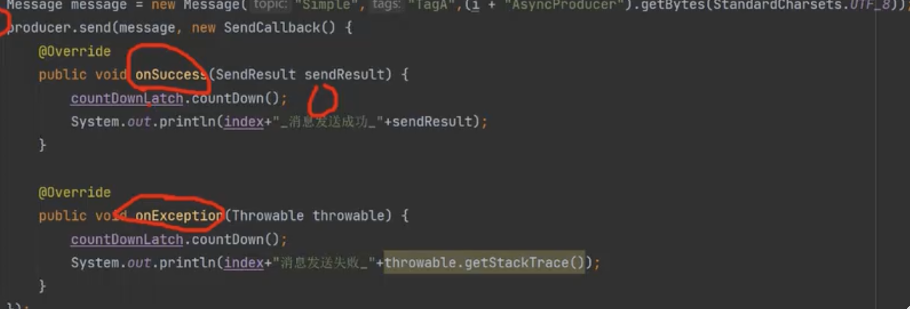
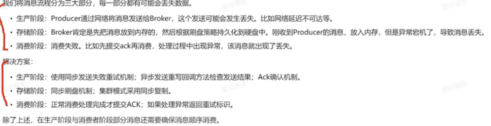
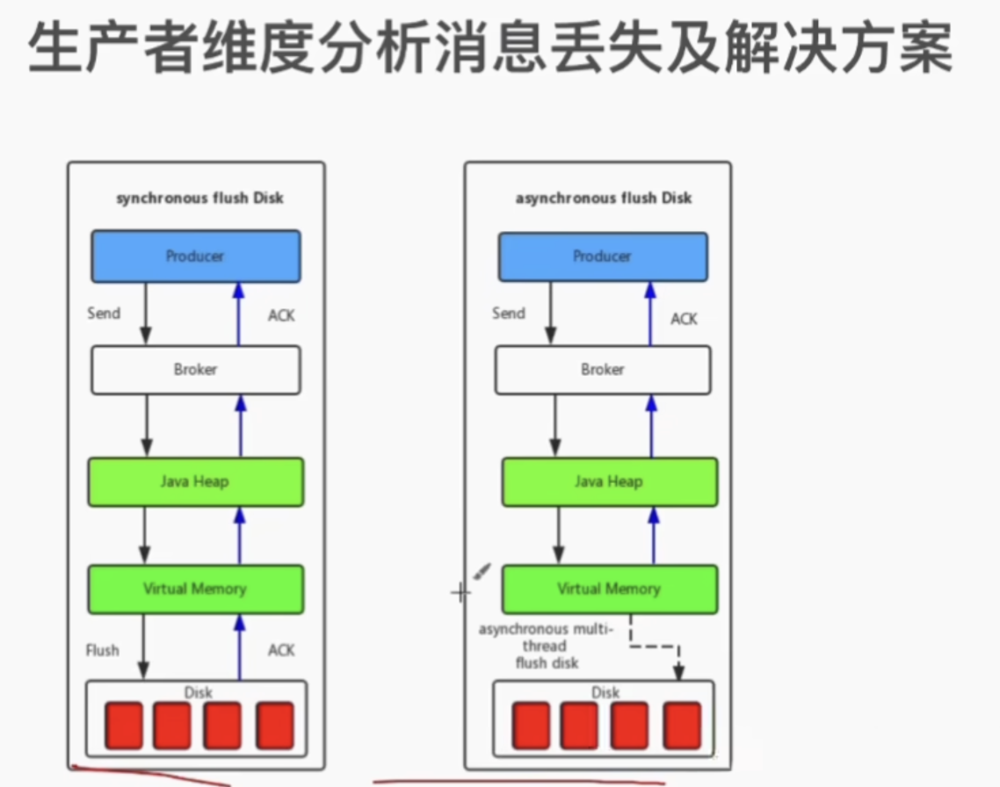
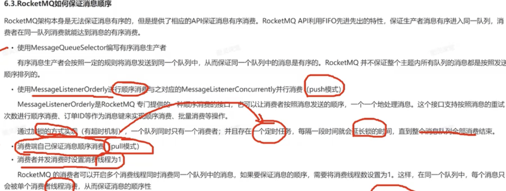

# RocketMQ底层工作原理

1. 启动NameServer，NameServer启动后开始监听端口，等待Broker、Producer、Consumer连接。 
2. 启动Broker时，Broker会与所有的NameServer建立并保持长连接，然后每30秒向NameServer定时 发送心跳包。  				
3. 发送消息前，可以先创建Topic，创建Topic时需要指定该Topic要存储在哪些Broker上，当然，在创 建Topic时也会将Topic与Broker的关系写入到NameServer中。不过，这步是可选的，也可以在发送消息时自动创建Topic。 						
4. Producer发送消息，启动时先跟NameServer集群中的其中一台建立长连接，并从NameServer中获 取路由信息，即当前发送的Topic消息的Queue与Broker的地址(IP+Port)的映射关系。然后根据算法 策略从队选择一个Queue，与队列所在的Broker建立长连接从而向Broker发消息。当然，在获取到路由 信息后，Producer会首先将路由信息缓存到本地，再每30秒从NameServer更新一次路由信息
5. Consumer跟Producer类似，跟其中一台NameServer建立长连接，获取其所订阅Topic的路由信息， 然后根据算法策略从路由信息中获取到其所要消费的Queue，然后直接跟Broker建立长连接，开始消费 其中的消息。Consumer在获取到路由信息后，同样也会每30秒从NameServer更新一次路由信息。不过不同于Producer的是，Consumer还会向Broker发送心跳，以确保Broker的存活状态。 

# Rocketmq

同步发送:

消费者:发送消息会有一个返回值,判断返回值是否错误,错误的话进行重新发送

# 如何保证消息不会丢失

异步刷盘改成同步刷盘, 进入磁盘再进行发送给生产者, 异步是放在内存的, 效率高

消费者用ACK确认机制, 消息成功处理, 再返回一个确认, 性能下降, 消息重复, rocket mq消息自动重试机制

# 如何保证消息有序性

