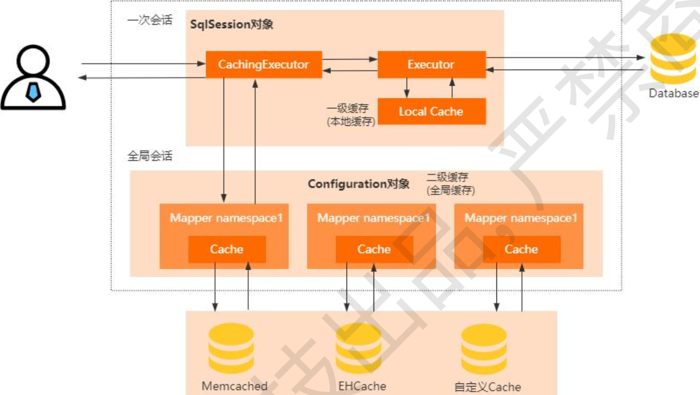

[toc]

# Mybatis缓存机制

## 是什么

为了避免每次都去查数据库，Mybatis 把查询出来的数据保存到 SqlSession 的本地缓存中，后续的 SQL 如果命中缓存，就可以直接从本地缓存读取了

如果想要实现跨 SqlSession 级别的缓存?那么一级缓存就无法实现了，因此在 Mybatis 里面引入了二级缓存，就是当多个用户在查询数据的时候，只要有任何一个 SqlSession 拿到了数据就会放入到二级缓存里面，其他的 SqlSession 就可以从二级缓存加载数据

## 一级缓存底层原理

在 SqlSession 里面持有一个 Executor，每个 Executor 中有一个 LocalCache 对象。 当用户发起查询的时候，Mybatis 会根据执行语句在 Local Cache 里面查询，如果没命中，再去查询数据库并写入到 LocalCache，否则直接返回。

一级缓存的生命周期是SqlSession，在多个SqlSession或分布式环境下写数据库会出现脏数据

## 二级缓存底层原理

使用 CachingExecutor 装饰了 Executor，它是一个全局缓存，会被多个 SqlSession 共享。先通过 CachingExecutor 进行二级缓存的查询，查不到再进入一级缓存的查询。只要有任何一个 SqlSession 拿到了数据就会放入到二级缓存里面，其他的 SqlSession 就可以从二级缓存加载数据

# #{} 和 ${}的区别

是占位符，是预编译处理的，Mybatis 在处理#{}时 ，会将 sql 中的#{}替换为?号 ，调用 PreparedStatement 的 set 方 法来赋值，可以防止sql注入

`$`是动态参数，字符串替换。 $ 符号适合应用在一些动态 SQL 场景中，比如动态传递表名、动态设置排序字段等。
