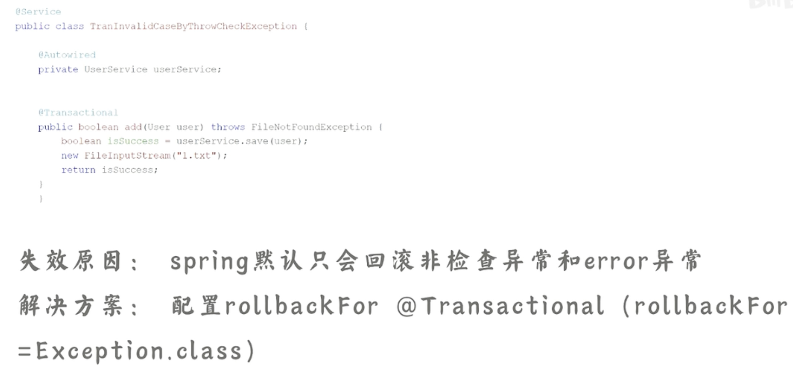
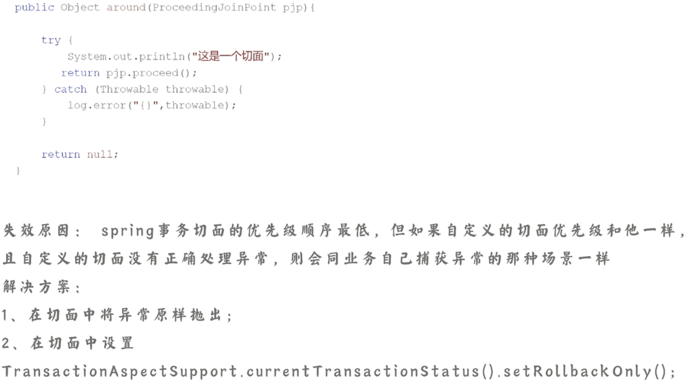
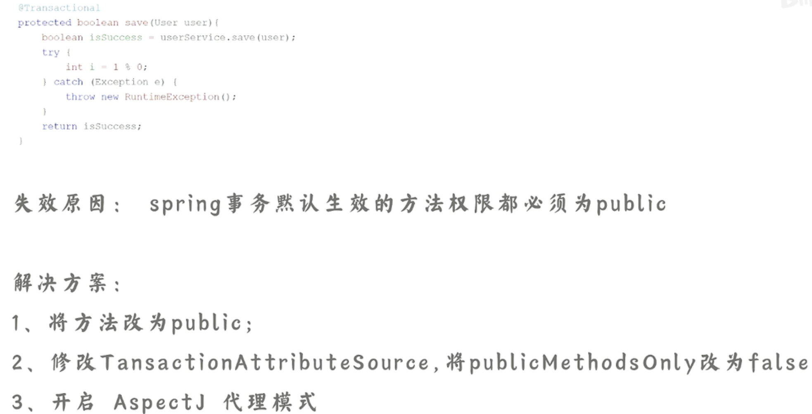

[toc]

# Spring事务失效的场景

## 抛出受检异常

## 业务自己捕获了异常

## 切面顺序导致

## 非public方法 

# @Controller

`@Controller` 注解主要用于定义一个控制器类，该类负责处理用户的HTTP请求，并返回相应的视图。

`@RestController` 注解是 `@Controller` 的一个特化版本，专门用于构建 RESTful 风格的Web服务。它组合了 `@Controller` 和 `@ResponseBody` 注解的功能。

`@Controller` 和 `@RestController` 分别用于不同的场景。`@Controller` 适用于传统的Web应用，处理方法返回的是视图名称，而 `@RestController` 则适用于构建 RESTful 风格的 Web 服务，处理方法返回的是数据。在选择时，根据项目的需求和设计目标选择适当的注解，使得应用能够更好地满足业务需求。

