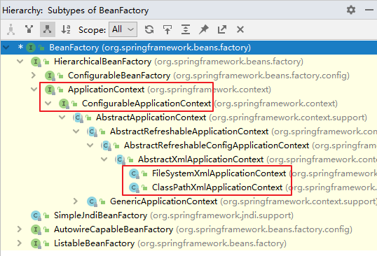
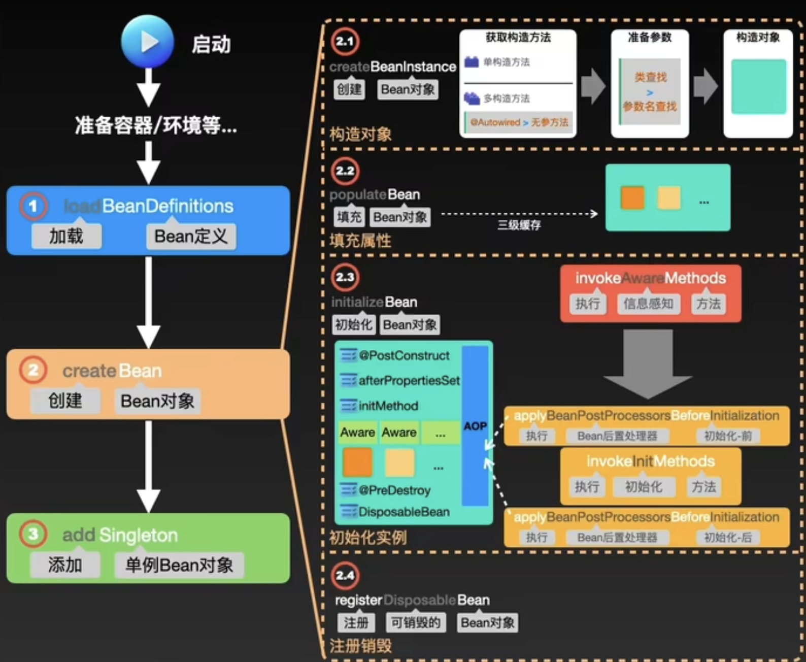
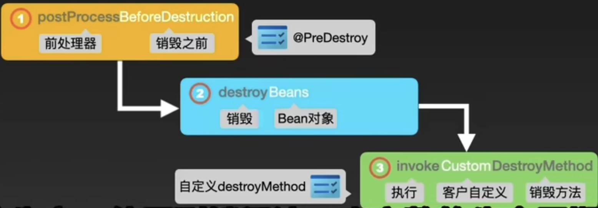
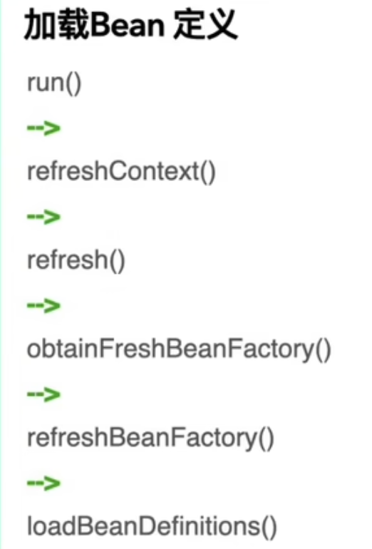
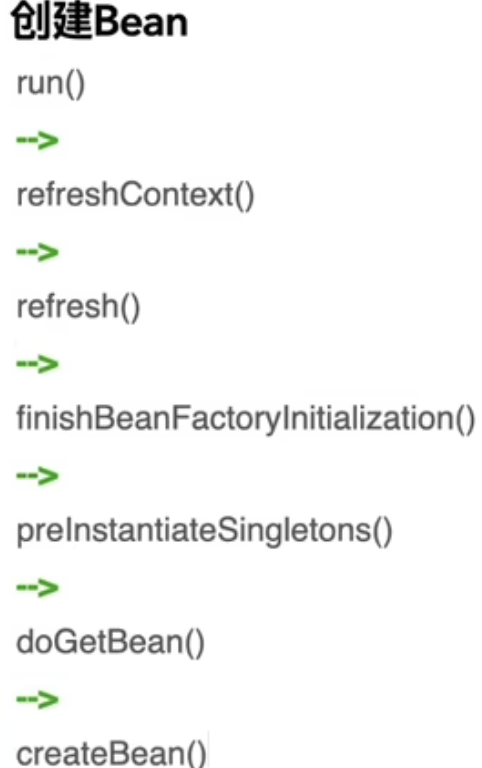
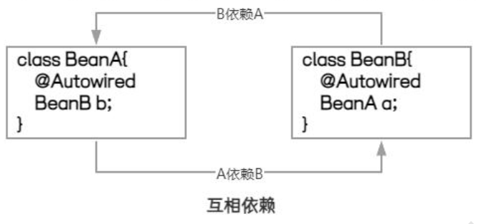
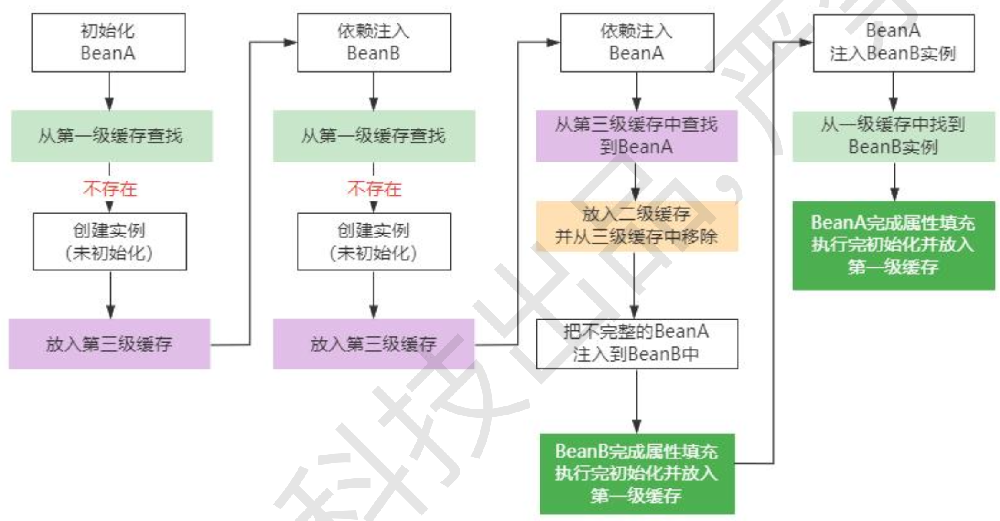
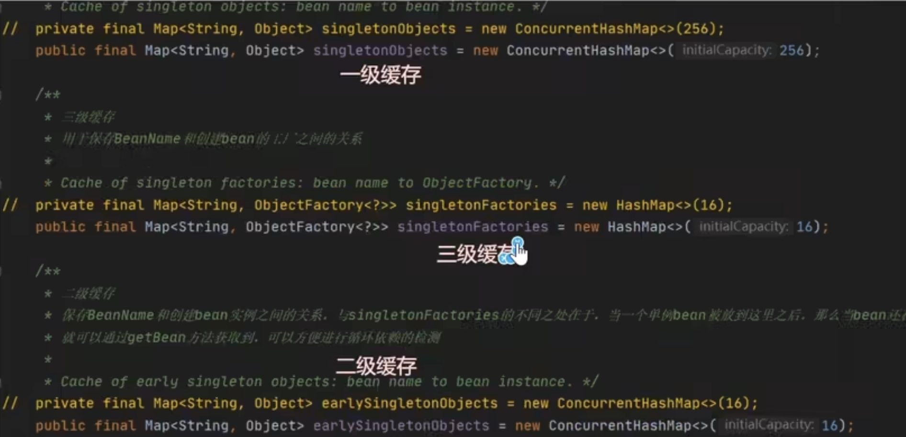

[toc]

# Sping

## IOC

控制反转，反转的是什么？

- 将对象的创建权利交出去，交给第三方容器负责。
- 将对象和对象之间关系的维护权交出去，交给第三方容器负责。

依赖注入常见的实现方式包括两种：

- 第一种：set注入
- 第二种：构造注入

所以结论是：IOC 就是一种控制反转的思想， 而 DI 是对IoC的一种具体实现。

Spring 的 IoC 容器就是 IoC思想的一个落地的产品实现。IoC容器中管理的组件也叫做 bean。在创建 bean 之前，首先需要创建IoC 容器。Spring 提供了IoC 容器的两种实现方式：

**①BeanFactory**

这是 IoC 容器的基本实现，是 Spring 内部使用的接口。

**②ApplicationContext**

BeanFactory 的子接口，几乎所有场合都使用 ApplicationContext 而不是底层的 BeanFactory。

**③ApplicationContext的主要实现类**



| 类型名                          | 简介                                                         |
| ------------------------------- | ------------------------------------------------------------ |
| ClassPathXmlApplicationContext  | 通过读取类路径下的 XML 格式的配置文件创建 IOC 容器对象       |
| FileSystemXmlApplicationContext | 通过文件系统路径读取 XML 格式的配置文件创建 IOC 容器对象     |
| ConfigurableApplicationContext  | ApplicationContext 的子接口，包含一些扩展方法 refresh() 和 close() ，让 ApplicationContext 具有启动、关闭和刷新上下文的能力。 |
| WebApplicationContext           | 专门为 Web 应用准备，基于 Web 环境创建 IOC 容器对象，并将对象引入存入 ServletContext 域中。 |

### 基于xml管理bean

基于xml的set方法依赖注入

```xml
<bean id="helloworld" class="com.atguigu.spring6.bean.HelloWorld"></bean>
```

```java
// 根据id获取
@Test
public void testHelloWorld2(){
	ApplicationContext ac = new ClassPathXmlApplicationContext("beans.xml");
    HelloWorld bean = ac.getBean("helloworld");
    bean.sayHello();
}

// 根据类型获取
@Test
public void testHelloWorld1(){
	ApplicationContext ac = new ClassPathXmlApplicationContext("beans.xml");
    HelloWorld bean = ac.getBean(HelloWorld.class);
    bean.sayHello();
}

// 根据id和类型获取
@Test
public void testHelloWorld2(){
	ApplicationContext ac = new ClassPathXmlApplicationContext("beans.xml");
    HelloWorld bean = ac.getBean("helloworld", HelloWorld.class);
    bean.sayHello();
}
```

还有基于xml的构造器方法依赖注入

### 基于注解管理bean

基于注解的set方法依赖注入

```xml
<!--开启组件扫描功能-->
<context:component-scan base-package="com.atguigu.spring6">

<!-- context:exclude-filter标签：指定排除规则 -->
<!-- 
type：设置排除或包含的依据
type="annotation"，根据注解排除，expression中设置要排除的注解的全类名
type="assignable"，根据类型排除，expression中设置要排除的类型的全类名
-->
    <context:exclude-filter type="annotation" expression="org.springframework.stereotype.Controller"/>
        <!--<context:exclude-filter type="assignable" expression="com.atguigu.spring6.controller.UserController"/>-->

</context:component-scan>
```

```java
// 基于注解的set方法依赖注入
@Controller
public class UserController {

    private UserService userService;

    @Autowired
    public void setUserService(UserService userService) {
        this.userService = userService;
    }

    public void out() {
        userService.out();
        System.out.println("Controller层执行结束。");
    }
}

// 基于注解的构造器方法依赖注入
@Controller
public class UserController {

    private UserService userService;

    @Autowired
    public UserController(UserService userService) {
        this.userService = userService;
    }

    public void out() {
        userService.out();
        System.out.println("Controller层执行结束。");
    }

}
```

## AOP


代理对象工厂类

```java
public class ProxyFactory {

    //目标对象
    private Object target;
    public ProxyFactory(Object target) {
        this.target = target;
    }

    //返回代理对象
    public Object getProxy() {
        /**
         * Proxy.newProxyInstance()方法
         * 有三个参数
         */
        //第一个参数：ClassLoader: 加载动态生成代理类的来加载器
        ClassLoader classLoader = target.getClass().getClassLoader();
        //第二个参数： Class[] interfaces：目录对象实现的所有接口的class类型数组
        Class<?>[] interfaces = target.getClass().getInterfaces();
        //第三个参数：InvocationHandler：设置代理对象实现目标对象方法的过程
        InvocationHandler invocationHandler =new InvocationHandler() {
            //第一个参数：代理对象
            //第二个参数：需要重写目标对象的方法
            //第三个参数：method方法里面参数
            @Override
            public Object invoke(Object proxy,
                                 Method method,
                                 Object[] args) throws Throwable {
                //方法调用之前输出
                System.out.println("[动态代理][日志] "+method.getName()+"，参数："+ Arrays.toString(args));

                //调用目标的方法
                Object result = method.invoke(target, args);

                //方法调用之后输出
                System.out.println("[动态代理][日志] "+method.getName()+"，结果："+ result);
                return result;
            }
        };
      
        return Proxy.newProxyInstance(classLoader,interfaces,invocationHandler);
    }
}
```

测试

```java
@Test
public void testDynamicProxy(){
    ProxyFactory factory = new ProxyFactory(new CalculatorLogImpl()); // 初始化代理对象工厂
    Calculator proxy = (Calculator) factory.getProxy(); // 获取代理
    proxy.div(1,0); // 动态代理
    //proxy.div(1,1);
}
```

### 总结

```java
/**
new ProxyInstance()：创建一个代理实例

其中有三个参数：
//第一个参数：ClassLoader: 加载动态生成代理类的来加载器
ClassLoader classLoader = target.getClass().getClassLoader();
//第二个参数： Class[] interfaces：目录对象实现的所有接口的class类型数组
Class<?>[] interfaces = target.getClass().getInterfaces();
第三个参数：
invocationHandler：设置代理对象实现目标对象方法的过程，重写invoke方法
            
InvocationHandler invocationHandler =new InvocationHandler() {

// invoke方法里面需要传入三个参数
// 第一个参数：代理对象
// 第二个参数：需要重写的目标对象的方法
// 第三个参数：method方法里面参数
@Override
public Object invoke(Object proxy, Method method, Object[] args) throws Throwable { 
//调用需要重写的目标对象的方法的invoke方法，然后将目标对象和目标对象参数传入invoke方法
Object result = method.invoke(target, args);
}

}

return Proxy.newProxyInstance(classLoader, interfaces, invocationHandler);

最后
ProxyFactory factory = new ProxyFactory(new CalculatorLogImpl()); // 初始化代理对象工厂
Calculator proxy = (Calculator) factory.getProxy(); // 获取代理
proxy.div(1,0); // 动态代理
*/
```

### 重用切入点表达式

```java
// @Aspect表示这个类是一个切面类
@Aspect
// @Component注解保证这个切面类能够放入IOC容器
@Component
public class LogAspect {

// 前置通知
@Before("execution(public int com.atguigu.aop.annotation.CalculatorImpl.*(..))")

// 后置通知
@After("execution(* com.atguigu.aop.annotation.CalculatorImpl.*(..))")

// 返回通知
@AfterReturning(value = "execution(* com.atguigu.aop.annotation.CalculatorImpl.*(..))", returning = "result")

// 异常通知
@AfterThrowing(value = "execution(* com.atguigu.aop.annotation.CalculatorImpl.*(..))", throwing = "ex")

// 环绕通知
@Around("execution(* com.atguigu.aop.annotation.CalculatorImpl.*(..))")
```

## 事务

```markdown
@Transactional标识在方法上，则只会影响该方法
@Transactional标识的类上，则会影响类中所有的方法

只读
@Transactional(readOnly = true)

超时
//超时时间单位秒
@Transactional(timeout = 3)

回滚策略
@Transactional(noRollbackFor = ArithmeticException.class)
- rollbackFor属性：需要设置一个Class类型的对象
- rollbackForClassName属性：需要设置一个字符串类型的全类名
- noRollbackFor属性：需要设置一个Class类型的对象
- rollbackFor属性：需要设置一个字符串类型的全类名

隔离级别
@Transactional(isolation = Isolation.REPEATABLE_READ)//可重复读

传播属性
@Transactional(propagation = Propagation.REQUIRED)
```

# Spring 底层原理

# Spring bean 的生命周期

启动之后首先准备容器/环境等





**1. 准备阶段**

**2. 创建实例阶段**

通过反射来创建 Bean 的实例对象，并且扫描和解析 Bean 声明的一些属性

**3. 依赖注入阶段**

如果被实例化的 Bean 存在依赖其他 Bean 对象的情况，则需要对这些依赖 bean 进行对象注入

**4. 容器缓存阶段**

容器缓存阶段主要是把 bean 保存到容器以及 Spring 的缓存中，到了这个阶段，Bean 就可以被开发者使用了。

**5. 销毁实例阶段**

当 Spring 应用上下文关闭时，该上下文中的所有 bean 都会被销毁。





# Spring 如何解决循环依赖问题





- singletonObjects：第一级缓存里面存储完整的 Bean 实例
- earlySingletonObjects：第二级缓存里面存储的是已经实例化的， 但是没有bean没有依赖注入（早期bean）
- singletonFactories：第三级缓存用来存放 Bean 工厂，它主要用来生成原始 Bean 对象并放到第二级缓存里面

1. 三级缓存的核心思想是把 Bean 的==实例化和依赖注入进行分离==
2. 首先A初始化，去一级缓存里面找，找不到就创建实例和加入三级缓存
3. 然后B初始化，也去一级缓存里面找，找不到就创建实例和加入三级缓存
4. 然后B里面的A进行依赖注入，去一级缓存里面找，找不到去二级，然后去三级里面找到了，然后缓存到二级缓存并从三级里面移除，然后早期A就注入到B中了，并放入一级缓存

# 三级缓存

- singletonObjects：第一级缓存里面存储完整的 Bean 实例
- earlySingletonObjects：第二级缓存里面存储的是已经实例化的， 但是没有bean没有依赖注入（早期bean）
- singletonFactories：第三级缓存用来存放 Bean 工厂，它主要用来生成原始 Bean 对象并放到第二级缓存里面



# Spring 事务失效的场景

## 抛出受检异常


## 业务自己捕获了异常


## 切面顺序导致


## 非 public 方法 


# @Controller 和 @RestController

@Controller 注解主要用于定义一个控制器类，该类负责处理用户的HTTP请求，并返回相应的视图。

@RestController 注解是 @Controller 的一个特化版本，专门用于构建 RESTful 风格的Web服务。它组合了 @Controller 和 @ResponseBody 注解的功能。

@Controller 和 @RestController 分别用于不同的场景。@Controller 适用于传统的Web应用，处理方法返回的是视图名称，而 @RestController 则适用于构建 RESTful 风格的 Web 服务，处理方法返回的是数据。

