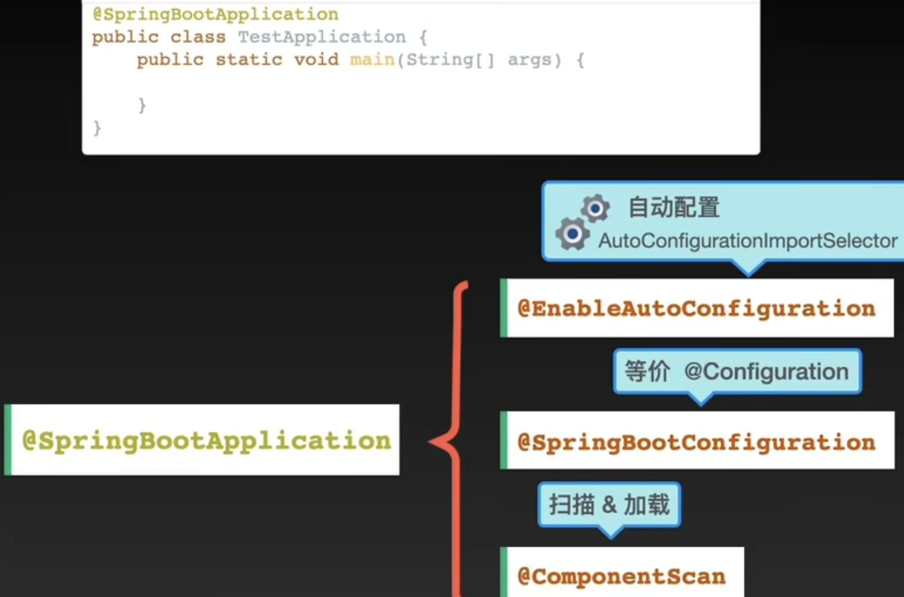

[toc]

# springboot如何响应一个请求

# springboot 的启动原理

@Configuration 运行的主类中使用 @Bean 配置类

@ComponentScan 主启动类的同级路径及子路径，扫描到特定的@Component、@Service、@Controller、@Repository、@Configuration等等注解后，会做相应的bean注册和配置文件bean注册工作

@EnableAutoConfiguration

@Import(AutoConfigurationImportSelector.class) 导入 **AutoConfigurationImportSelector** 类的bean定义，这个类实现了ImportSelector接口，重写selectImports方法

selectImports返回的是字符串数组，是我们返回的是要加载的Config配置文件的全包名列表，通过返回这个全包名列表，我们就能自动装配上这些配置文件下定义的bean对象，从而达到了自动装配的目的！

通过注解类的名字来查找，并且最终得到需要加载的Config类的全类名，最后返回的，这里必然有一个根据注解类名字来查找相应的Config文件的操作
如何找到全类名
**autoConfigurationEntry**中保存着我们需要的配置信息，它是通过**getAutoConfigurationEntry**方法获取的，返回的是新建的**AutoConfigurationEntry对象**，有两个配置参数configurations 和 exclusions，configurations显然使我们需要的配置文件，也是我们最关心的，而exclusions字面意思是排除，也就是不需要的，**getAutoConfigurationEntry**方法的参数确实传递过来了一个东西，**Annotation**（注解）

**getCandidateConfigurations**方法

**loadFactoryNames** 返回了一个包含我们需要的Config全类名（字符串）的集合容器，然后从这个集合容器中拿出来的东西就是我们的configurations