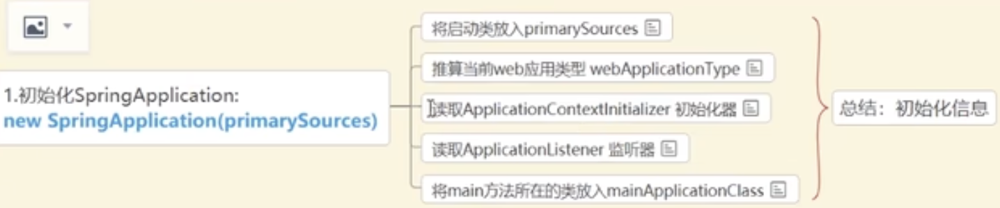
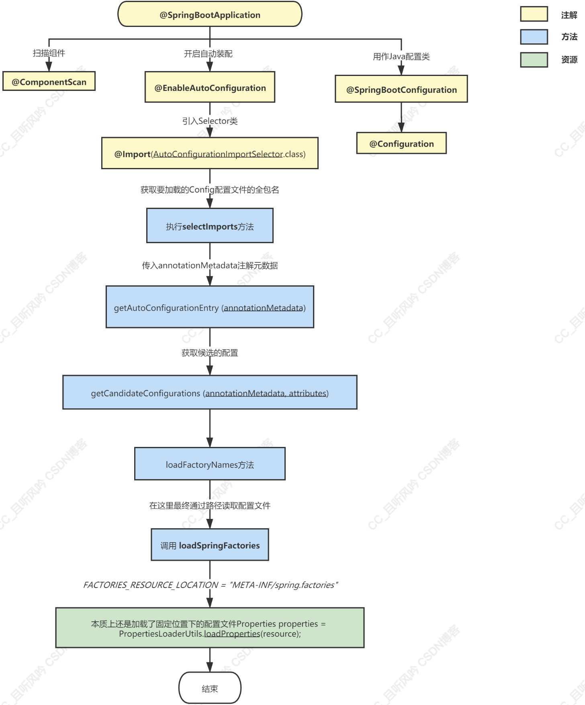

[toc]

# springboot如何响应一个请求

# springboot 的启动原理

1. 运行main方法之后，初始化new SpringApplication 从 spring.factories 读取 listener ApplicationContextlnitializer
   
2. 运行run方法
3. 读取环境变量 配置信息
4. ServletWebServerApplicationContext创建Bean的实例
5. 读取启动类 BeanDefinition预初始化Bean
6. 调用 refresh 加载 ioc 容器
   invokeBeanFactoryPostProcessor 类解析 @lmport 加载所有的自动配置类
   onRefresh 创建servlet容器

# SpringBoot的自动装配原理

@Configuration 运行的主类中使用 @Bean 配置类

@ComponentScan 主启动类的同级路径及子路径，扫描到特定的@Component、@Service、@Controller、@Repository、@Configuration等等注解后，会做相应的bean注册和配置文件bean注册工作

@EnableAutoConfiguration ➡️ ==@Import(AutoConfigurationImportSelector.class)==

这个注解会得到我们要加载的Config配置文件的全包名列表，我们就能自动装配上这些配置文件下定义的bean对象

他获得全包名的原理是：

有一个 getAutoConfigurationEntry方法获取配置信息，loadFactoryNames会找到META-INF/spring.factories 返回了一个包含我们需要的Config全类名（字符串）的集合容器