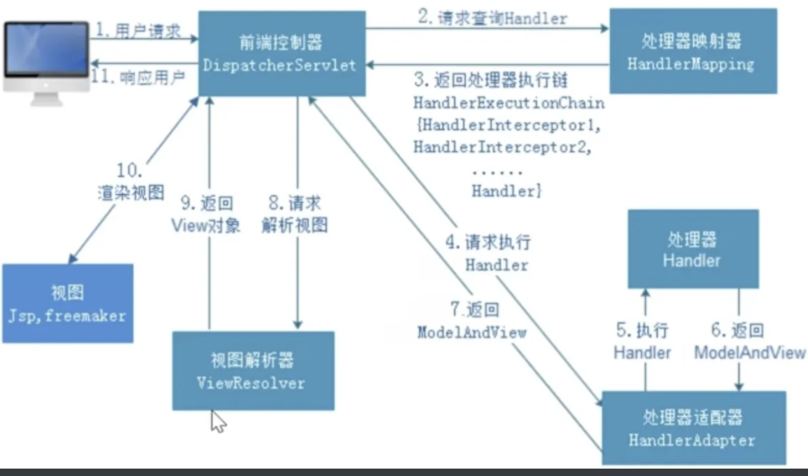

[toc]

# SpringMVC工作流程

用户请求➡️前端控制器 DispatcherServlet 接受并拦截请求

➡️Dispatcherservlet 调用 HandlerMapping 处理映射器，然后 HandlerMapping 根据请求 url 查找具体的 Handler 然后返回处理器执行链给 Dispatcherservlet

➡️Dispatcherservlet 调用 HandlerAdapter 处理器适配器调用刚刚拿到的执行链中的 Handler，然后返回视图逻辑名或模型 ModelAndView 给 HandlerAdapter，然后再返回给 Dispatcherservlet，如果方法上加了 @ResponseBody，那么就把返回值直接返回给浏览器

➡️如果方法上没有加 @ResponseBody，DispatcherServlet 调用视图解析器 ViewResolver 来解析 HandlerAdapter 传递的 ModelAndView，解析完再返回给 DispatcherServlet

➡️DispatcherServlet 调用具体的视图比如 Jsp，freemaker 进行渲染，然后返回给客户端

# Spring MVC 中有 9 大重要的组件

SpringMVC ，通过把 Model，View，Controller 分离，将 Web 层进行职责解耦， 在 Spring MVC 中有 9 大重要的组件。 
1、MultipartResolver 文件处理器
对应的初始化方法是 initMultipartResolver(context)，用于处理上传请求。
2、LocaleResolver 当前环境处理器
其对应的初始化方法是 initLocaleResolver(context)
SpringMVC 主要有两个地方用到了 Locale:
一是 ViewResolver 视图解析的时候; 
二是用到国际化资源或者主题的时候。
3、ThemeResolver 主题处理器
其对应的初始化方法是 initThemeResolver(context)，
用于解析主题。 也就是解析样式、图片及它们所形成的显示效果的集合。 
4、HandlerMapping 处理器映射器
其对应的初始化方法是 initHandlerMappings(context) ，
在 SpringMVC 中会有很多请求，每个请求都需要一个 Handler 处理。
HandlerMapping 的作用便是找到请求响应的处理器 Handler 和 Interceptor。 
5、HandlerAdapter 处理器适配器
其对应的初始化方法是 initHandlerAdapters(context) 从名字上看，它就是一个适配器。HandlerAdapters 要做的事情就是如何让固定的Servlet 处理方法调用灵活的 Handler 来进行处理
6、HandlerExceptionResolver 异常处理器
对应的初始化方法是 initHandlerExceptionResolvers(context) 它的主要作用是处理其他组件产生的异常情况。
7、RequestToViewNameTranslator 视图名称翻译器
其对应的初始化方法是 initRequestToViewNameTranslator(context)
它的作用是从请求中获取 ViewName。
有的 Handler 处理完后并没有设置 View 也没有设置 ViewName，这时就需要从 request 中获取，而 RequestToViewNameTranslator 就是为 request 提供获取 ViewName 的实现。 
8、ViewResolvers 页面渲染处理器
其对应的初始化方法是 initViewResolvers(context)
ViewResolvers 的主要作用是将 String 类型的视图名和 Locale 解析为 View 类型的视图。 
9、FlashMapManager 参数传递管理器
其对应的初始化方法是 initFlashMapManager(context) 在实际应用中，为了避免重复提交，我们可以在处理完 post 请求后重定向到另外一个 get 请求，这个 get 请求可以用来返回页面渲染需要的信息。
FlashMap 就是用于这种请求重定向场景中的参数传递。

ModelAndView 和 View 并不属于 Spring MVC 九大组件之列

