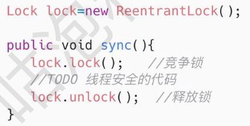

[toc]

# Volatile 

# Synchronized和Lock的区别

42. 从功能角度来看，Lock 和 Synchronized 都是 Java 中用来解决线程安全问题的工具。
43. 从特性来看，

1. Synchronized 是 Java 中的同步关键字，Lock 是 J.U.C 包中提供的接口，这个接口有很多实 现类，其中就包括 ReentrantLock 重入锁

2. Synchronized 可以通过两种方式来控制锁的粒度，

一种是把 synchronized 关键字修饰在方法层面，
 另一种是修饰在代码块上，并且我们可以通过 Synchronized 加锁对象的生命周期来控制锁的作用范 围，比如锁对象是静态对象或者类对象，那么这个锁就是全局锁。 如果锁对象是普通实例对象，那这个锁的范围取决于这个实例的生命周期。
 Lock 锁的粒度是通过它里面提供的 lock()和 unlock()方法决定的(贴图)，包裹在这两个方法之间 的代码能够保证线程安全性。而锁的作用域取决于 Lock 实例的生命周期。

3. Lock 比 Synchronized 的灵活性更高，Lock 可以自主决定什么时候加锁，什么时候释放锁， 只需要调用 lock()和 unlock()这两个方法就行，同时 Lock 还提供了非阻塞的竞争锁方法 tryLock()方法，这个方法通过返回 true/false 来告诉当前线程是否已经有其他线程正在使用 锁。

Synchronized 由于是关键字，所以它无法实现非阻塞竞争锁的方法，另外，Synchronized 锁的释放 是被动的，就是当 Synchronized 同步代码块执行完以后或者代码出现异常时才会释放。

d. Lock 提供了公平锁和非公平锁的机制，公平锁是指线程竞争锁资源时，如果已经有其他线程 正在排队等待锁释放，那么当前竞争锁资源的线程无法插队。而非公平锁，就是不管是否有线 程在排队等待锁，它都会尝试去竞争一次锁。 Synchronized 只提供了一种非公平锁的实现。

44. 从性能方面来看，Synchronized 和 Lock 在性能方面相差不大，在实现上会有一些区别， Synchronized 引入了偏向锁、轻量级锁、重量级锁以及锁升级的方式来优化加锁的性能，而 Lock 中则用到了自旋锁的方式来实现性能优化。

