[toc]

# 为了提高项目的并发量，将项目中主干业务(渠道支付、商户回调)和核心业务(记账和失败重试)拆分成异步，主干业务中只处理三方请求和核心业务需要的消费型数据入库或缓存，将核心业务拆分成异步批量处理

## 将项目中主干业务(渠道支付、商户回调)和核心业务(记账和失败重试)拆分成异步

### 渠道支付

比如微信渠道,兴业银行渠道,光大银行渠道

```java
BillBuy("BillBuy", "00", "普表缴费", "ICF22"),
IotBuy("IotBuy", "01", "物联网充值","ICF32"),
ICBuy("ICBuy", "02", "IC卡充值","ICF52"),
;
```

```java
// 发送MQ处理延时关单处理的需求
Integer delayInterval = tenantConf.getDelayOrderInterval();
delayInterval = delayInterval == null ? -1 : delayInterval;
mqSenderService.sendDelayOrderMsg(orderInfo.getOrderId(),delayInterval);
```

```java
  // 新版支付，发送mq消息处理支付结果轮询
  if(isNewPay){
      Integer newQueryDelayLevel = tenantConf.getNewPayQueryInterval();
      newQueryDelayLevel = newQueryDelayLevel == null ? -1 : newQueryDelayLevel;
      mqSenderService.sendNewPayQueryMsg(resp.getPaySerialNo(),newQueryDelayLevel);
  }
```

### 商户回调

商户有一个回调接口,当传入支付请求给银行或者微信时,不能同步请求回调信息,所以就用mq对银行或者微信的回调进行异步处理

### 记账和失败重试

账单库进行异步入库,雪峰填谷减轻并发压力

失败了将重新发起扣款,调用扣款接口

## 主干业务中只处理三方请求和核心业务需要的消费型数据入库或缓存

第三方请求包括: 查询缴费信息

核心业务: 比如支付,下单,销账,对账,

# 使用互斥锁+Lua脚本保证订单唯一，解决项目中的订单重复和支付幂等问题

## 订单重复

 防抖就是防止用户的手抖动，针对同一行为不断的触发，我们在进行购物的时候，提交订单是产生支付行为的最开始的入口，提交订单之前，大家可以看到与我们的订单中台还有支付中台其实不会有任何的交互。如果用户快速点击，那么可能会提交两单一模一样。所以前端要控制在间隔毫秒内，最多只会执行一次。前端使我们的第一道防线。防止用户的订单列
表出现重复的两单。

提交订单后，我们进入的页面就是会跳转到支付界面，在跳转的过程中，我们针对这个订单会通过后端生成一个订单号，我们之前已经通过前端做了防抖，但是这个时候如果有人通过接口等方式进行非正常恶意请求，那么前端的防抖就已经不奏效了。这里要引入令牌toKn机制。我们在进入提交订单的页面的时候，前端会去获取token。这个token由我们后端进行发放。同样的token不可以生成多个订单。这个token只能使用一次，用完既删除。后端判断有这个token的时候，就是第一次进行请求，如果通过接口等方式，同一个tokn来了很多次，那么会拒绝服务。这里就要借助一下lua脚本和分布式锁，从redis获取令牌，对比令牌，生成订单号，删除令牌。不可分割。

## 支付幂等

此时我们已经进入了支付的界面。此时订单号就可以作为我们后续各种操作的基点，因为订单号不会重复，那么我们要做的就是保证该订单的支付为幂等操作，防止重复支付。比如同一笔订单，用户点击两次支付，进入了支付网关，那么我们一要靠分布式锁，保证同一订单，同一时间在处理。二是要验证订单的状态，防止重复支付。那么我们的支付订单只要一进入后端，都要改为一个支付中的中间状态。有了中间态，及时后续没有完成，我们也可以防止重复支付。

# 使用 Redis 实现分布式锁解决项目高并发问题，使用Redis对数据库全局进行缓存处理，提高常用业务的响应速度，使用布隆过滤器做缓冲层，以防大量请求访问Mysql导致问题。购气订单充值需要拉取支付凭证（存在过期），使用 List 结构存储支付凭证，使用左进左出的策略防止拉去的支付凭证都是过期凭证

## 使用Redis对数据库全局进行缓存处理

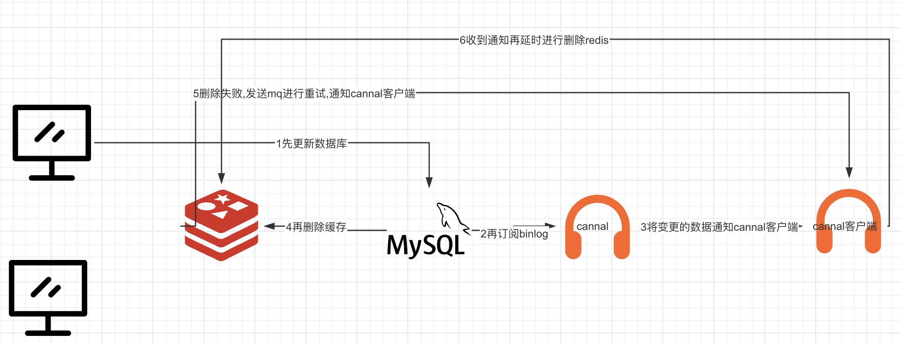

请求过来先操作数据库,然后cannal订阅binlog日志,将变更mysql通知到cannal客户端,再删除redis缓存,redis缓存删除失败就发mq进行重试,重试请求发送给cannal客户端,然后客户端延时进行删除

## 使用布隆过滤器做缓冲层，以防大量请求访问Mysql导致问题

## 购气订单充值需要拉取支付凭证（存在过期），使用 List 结构存储支付凭证，使用左进左出的策略防止拉去的支付凭证都是过期凭证


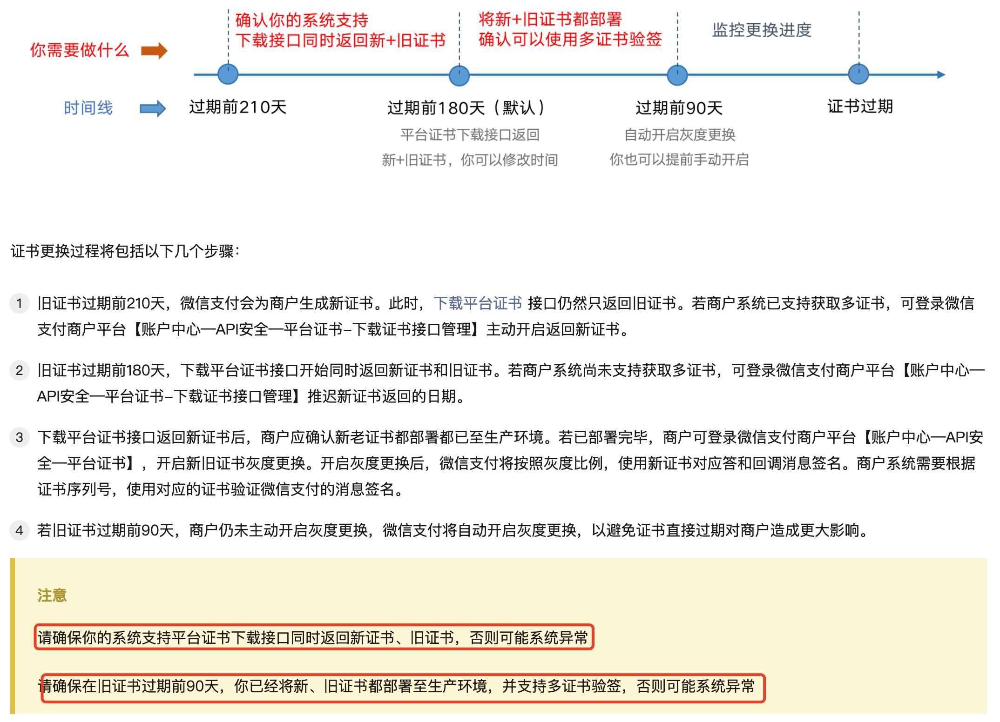

# 定期扫描订单状态，使用RocketMQ延迟消息处理超时订单，防止失败订单堆积

## 定期扫描订单状态

用定时任务xxjob向支付宝进行扫描

根据订单号调用支付宝查单接口，核实订单状态
如果订单末创建，则更新商户端订单状态
如果订单已支付，则更新商户端订单状态，并记录支付日志
如果订单未支付，则调用关单接口关闭订单，并更新商户端订单状态

## 使用RocketMQ延迟消息处理超时订单，防止失败订单堆积

使用mq对修改订单的状态,如果未支付就延时进行关单

# 使用 sftp地址进行存储账单同步文件，用Xxjob做定时器进行每日对账，保证双边账单一致性

# 使用 Nginx 做反向代理，静态资源访问，整合 Lua 脚本用来统计代理支付用户的访问量

# RocketMQ异步处理

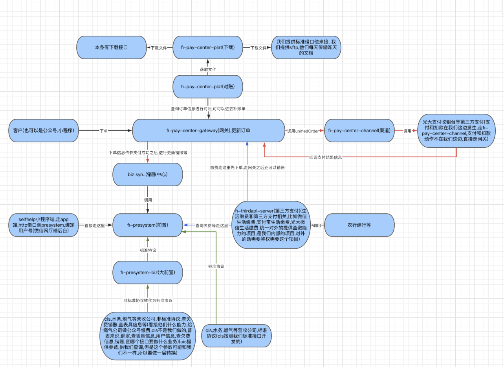
付款在我们这里走网关再走channel, 付款不在我们这边直接走网关

# 支付问题

> 1 你们有几种支付方式，有没有自己支付网关，支付网关是不是把所有的支付方式都聚合了，怎么做设计的

有刷码支付,扫码支付,公众号支付,现金支付,app支付,小程序支付

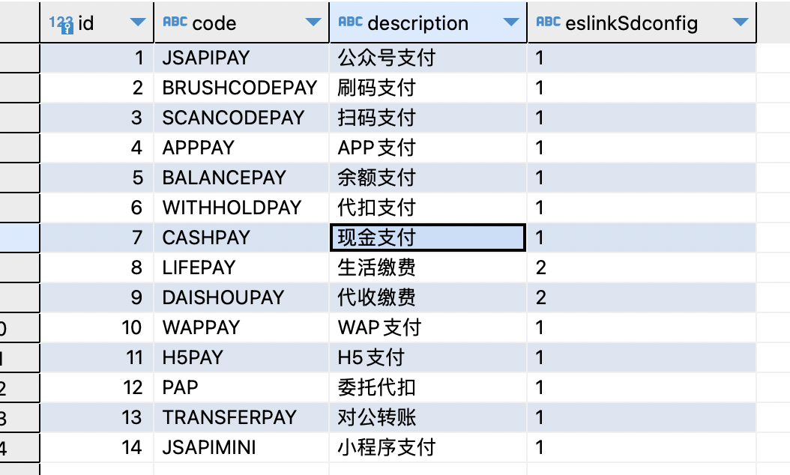

有自己的getway网关,缴费业务过来走网关,判断扣款是否在我们这一方,是的话,就直接走channel,不是的话,就直接走网关,网关统一可以进行调用销账,对账信息需要在网关里面拿

如何聚合支付的?


>  2 支付回调，是不是都统一了，方便管理，没有收到回掉怎么办，还有如果暴露的回调接口是如何保证安全，如何验证正确性

mq重试机制

> 3 重复支付问题，也就是幂等怎么解决的，从订单到支付过程都要说一遍怎么解决

防抖就是防止用户的手抖动，针对同一行为不断的触发，我们在进行购物的时候，提交订单是产生支付行为的最开始的入口，提交订单之前，大家可以看到与我们的订单中台还有支付中台其实不会有任何的交互。如果用户快速点击，那么可能会提交两单一模一样。所以前端要控制在间隔毫秒内，最多只会执行一次。前端使我们的第一道防线。防止用户的订单列
表出现重复的两单。

提交订单后，我们进入的页面就是会跳转到支付界面，在跳转的过程中，我们针对这个订单会通过后端生成一个订单号，我们之前已经通过前端做了防抖，但是这个时候如果有人通过接口等方式进行非正常恶意请求，那么前端的防抖就已经不奏效了。这里要引入令牌toKn机制。我们在进入提交订单的页面的时候，前端会去获取token。这个token由我们后端进行发放。同样的token不可以生成多个订单。这个token只能使用一次，用完既删除。后端判断有这个Ky的时候，就是第一次进行请求，如果通过接口等方式，同一个tokn来了很多次，那么会拒绝服务。这里就要借助一下lua脚本和分布式锁，从redis获取令牌，对比令牌，生成订单号，删除令牌。不可分割。

此时我们已经进入了支付的界面。此时订单号就可以作为我们后续各种操作的基点，因为订单号不会重复，那么我们要做的就是保证该订单的支付为幂等操作，防止重复支付。比如同一笔订单，用户点击两次支付，进入了支付网关，那么我们一要靠分布式锁，保证同一订单，同一时间在处理。二是要验证订单的状态，防止重复支付。那么我们的支付订单只要一进入后端，都要改为一个支付中的中间状态。有了中间态，及时后续没有完成，我们也可以防止重复支付。

> 4 支付过程，你有没有涉及到其他业务的调用，分布式事务如何解决

有,订单表和用户信息表这些,用seata解决分布式事务问题

> 5 对账怎么做的，这些你应该可以讲清楚

> 6 订单超时未支付取消问题，如何解决，延迟队列 还是定时任务全量

订单超时未支付就用mq进行重试,是用延迟队列

> 7 如果订单量很大，峰值很高，生成订单写入库，库会有压力，你怎么进行优化

用mq进行削峰填谷

> 8 风控 如何处理，会不会有交易风险，如何识别

> 9 退款是怎么操作

先充钱再充值气和水量,回调中确认失败,放到异常表中,每15分钟即那个这些确认失败的订单费用原路返回,退款前先查询第三方订单信息是否可以退,可以退再调用退费接口退款

> 5、你们有支付中心吗，如何处理回调的

rocketmq 异步进行

mq延时处理

```java
//end:启动调度任务，执行退款调度处理
try {
  String mqMsgId =  tradeMessageProducer.sendRefundMsg(String.valueOf(refundOrderId));
  orderService.changeMqMsgId(refundOrderId, mqMsgId);
} catch (Exception e) {
  logBiz.error("退款申请处理后发布MQ消息异常！", e);
}
```

```java
/**
	 * 由redis控制同一订单的并发处理<br>
	 * 所有程序必须调用此方法，由此方法调用proecess进行处理
	 * 逻辑：<br>
	 * 1:根据key查看redis中是否存在
	 * 2：存在则代表订单有程序在处理，返回false，消息放回
	 * 3：不存在，则先setKey,成功则处理，失败则返回false，消息放回
	 * 4：[end]只有当前任务放置的key，才会在处理完成后删除
	 * @param orderId 交易订单
	 * @return true/false 表示处理结果,告知MQ消息放回还是完成
	 */
	private boolean excuteRefund(Long orderId){
		String key = "CHANNELTRADEORDER_"+orderId;
		logBiz.info("反交易订单调度处理,key：{}.准备处理",key);
		// 并发控制，是否能够处理此订单
		boolean excistKeyFlag = false;
		try{
			// 并发控制
			excistKeyFlag = concurrencyControl.excuterControl(key);
			if(excistKeyFlag){
				logBiz.info("反交易订单调度处理,key：{}.该订单被处理当中，消息放回",key);
				return false;
			}
			logBiz.info("反交易订单调度处理,key：{}.开始处理订单",key);
			//查询系统内支付日志状态
			ChannelTradeOrder order = tradeOrderService.get(orderId);
			boolean processFlag = this.process(order);
			logBiz.info("反交易订单调度处理,key：{}.订单处理完成，结果：{}",key,(processFlag?"处理完成，调度停止":"未完成，继续，等待下一次调度"));
			return processFlag;
		}catch(Exception e){
			logBiz.error("反交易订单调度处理,key：{}.发生异常，消息放回。异常原因：{}",key,e.getMessage());
			logBiz.error("反交易订单调度处理,key：{}.发生异常!!!",key,e);
			return false;
		}finally{
			try{
				//只有excuterControl在返回false时，代表当前任务放置的key，才可以删除
				if(!excistKeyFlag){
					logBiz.info("反交易订单调度处理,key：{}.开始删除Redis中的key",key);
					redisClient.del(key);
					logBiz.info("反交易订单调度处理,key：{}.成功删除Redis中的key",key);
				}
			}catch(Exception e){
				logBiz.error("反交易订单调度处理,key：{}.删除RedisKEY异常，原因：",key,e.getMessage());
				logBiz.error("反交易订单调度处理,key：{}.删除RedisKEY异常!!!",key,e);
			}
				
		}
	}
```

```java
/**
	 * 正/反交易自动处理（(Refund)TradeOrderExcuter）<br>
	 * 并发控制，用于控制多线程（mq）（多节点）情况下<br>
	 * 同一交易，被同时执行
	 * @param redisKey 存储在redis中的key
	 * @return redis中是否存在(是否存在并发执行)<br>
	 * 	存在：true，不存在false
	 */
	public boolean excuterControl(String redisKey){
		logBiz.debug("(正反)交易自动处理-并发控制，收到redisKey：{}",redisKey);
		long currentTime = (new Date()).getTime();
		// 支持分布式锁的redis控制，无时间限制，执行完成之后，需要del掉
		// 当且仅当key不存在，将key值设置为value，并返回1.若已存在，不做任何操作，并返回0
		int nxValue = 0;
		try {
			nxValue = redisClient.setNx(redisKey, String.valueOf(currentTime));
			logBiz.debug("(正反)交易自动处理-并发控制，收到redisKey：{}，setNx结果：{}",redisKey,nxValue);
		} catch (Exception e) {
			logBiz.error("(正反)交易自动处理-并发控制，redisKey：{}，redis加锁失败，异常原因：{}",redisKey,e.getMessage(),e);
			// set时，发生异常，不知是否成功，认为存在
			nxValue = 0;
		}
		// setnx时若已存在，则返回0
		// redis中存在，表示当前【有】程序在处理，需要getredis获取时间，判别是否死锁【进而判别是否可处理】
		if(nxValue == 0) {
			long orderIdRedis;
			try {
				Object objValue = redisClient.get(redisKey);
				if(objValue != null){
					orderIdRedis = Long.parseLong(objValue.toString());
				} 
				// redis中获取到key所对应的value为空
				// 且setnx为零，代表加锁失败，不能处理
				else {
					orderIdRedis = currentTime;
				}
			} catch (Exception e) {
				logBiz.error("(正反)交易自动处理-并发控制，redisKey：{}，redis中存在获取redisvalue异常，异常原因：{}",redisKey,e.getMessage(),e);
				orderIdRedis = currentTime;
			}
			/**  存在del redis 异常情况，因此限定，锁的时间限制为45秒 */
			// 锁超时情况，可以继续处理
			if(EXCUTERCONTROL_TIMEOUT  <= currentTime - orderIdRedis){
				nxValue = 1;
			}
			// 未超时，则不能处理
			else {
				nxValue = 0;
			}
		}
		
		boolean rtnValue = true;
		// 为1，代表未存在并发，setnx成功，或并发处理超时
		// 为0，代表存在并发且处理并发处理未超时
		if(nxValue == 1){
			rtnValue = false;
		}
		logBiz.info("(正反)交易自动处理-并发控制，redisKey：{}，响应结果(redis中是否存在(是否存在并发执行))：{}。",redisKey,rtnValue);
		return rtnValue;
		
	}
```

1. // 根据订单Id，对订单进行处理
   boolean result = orderExcuter.excute(Long.*parseLong*(orderId));

2. *根据订单**Id**处理反交易订单*
3. // 并发控制
   excistKeyFlag = concurrencyControl.excuterControl(key);
4. //查询系统内支付日志状态
5. */**
   \* *** *先由业务系统退费销账
   \* *** *业务系统退费销账成功后再退商户费用
   \* ** syncBiz**判断是否需要执行业务退费
   \* **/*
6. 同步订单

> 10 如果支付流量很大，超过了三方接口限定的流量qps量，你怎么处理

流量削峰填谷

# 用Redis的String结构升级为Hash结构存储系统参数(灵活配置的信息)，节约了40%的内存

SET tradepaytype:1 "{\"id\":1,\"code\":\"ALIPAY\",\"description\":\"Alipay\",\"eslinkSdconfig\":\"1\"}" HSET tradepaytype:1 code ALIPAY description Alipay eslinkSdconfig 1

比如提醒配置

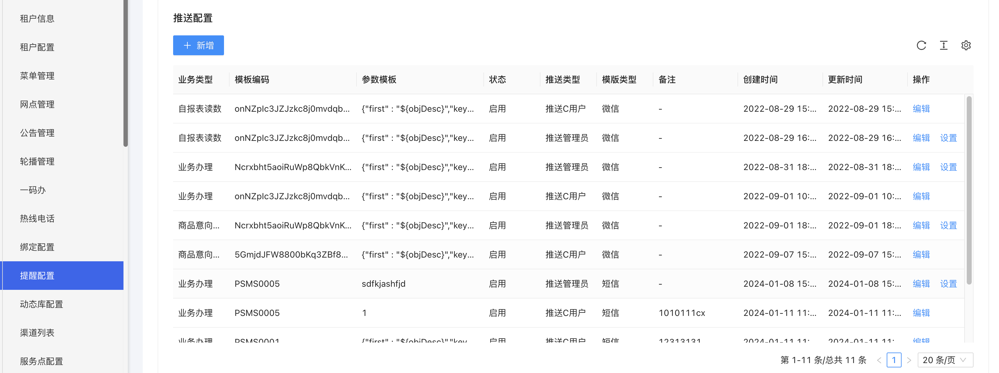

白名单配置

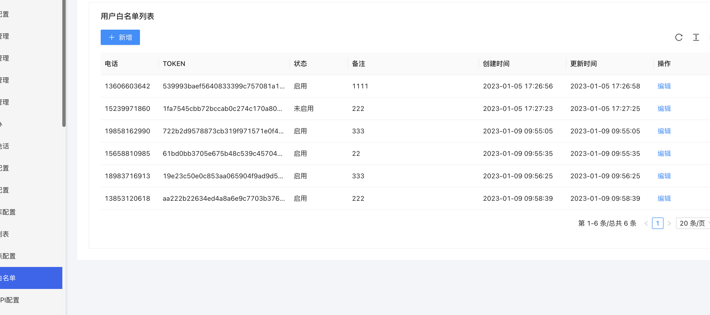

热线电话

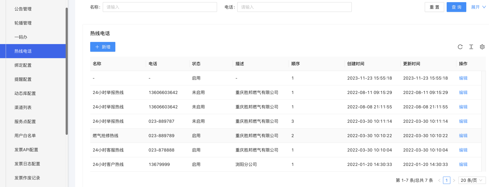

# 用MongoDB 存取业务办理记录、登录日志、操作日志等数据，减少 Mysql 压力

# 用 Dubbo进行微服务架构开发，使用工作流来对用户的诉求进行审核，审核完通过消息队列MQ通知用户

使用工作流对用户诉求进行审核, 审核完会调用通知url,然后通知url异步通知用户

# 在双预防生成排查任务的定时任务中，由于需要切换所有的数据源去生成所有企业的排查任务，使用单例模式解决生成数据库连接速度比回收数据库连接线程的速度快导致的 OOM 问题

# 由于每月都会有大量的数据，导致数据库性能急剧下降，每个月都会进行数据归档操作

用doris进行归档,归档什么数据?比如历史交易订单,推送记录等,在ds中用doris建立数仓,在数仓中维护这些数据

# 开发解析动态库dll，开发燃气卡的购气写卡，读卡功能，配置到atm机，用户可自助购气

# 用MQ配置类和工具类，基于RocketMQ发布订阅模型对用户动态解耦、对高并发推送进行限流削峰和异步存储，减轻了数据库的压力

对用户动态解耦,

对高并发推送限流削峰

# 解决了项目中出现的死锁问题，将update时根据批次号排序的方案升级为热点数据垂直分表，避免了业务对代码的入侵，提升了系统的可维护性

死锁问题:

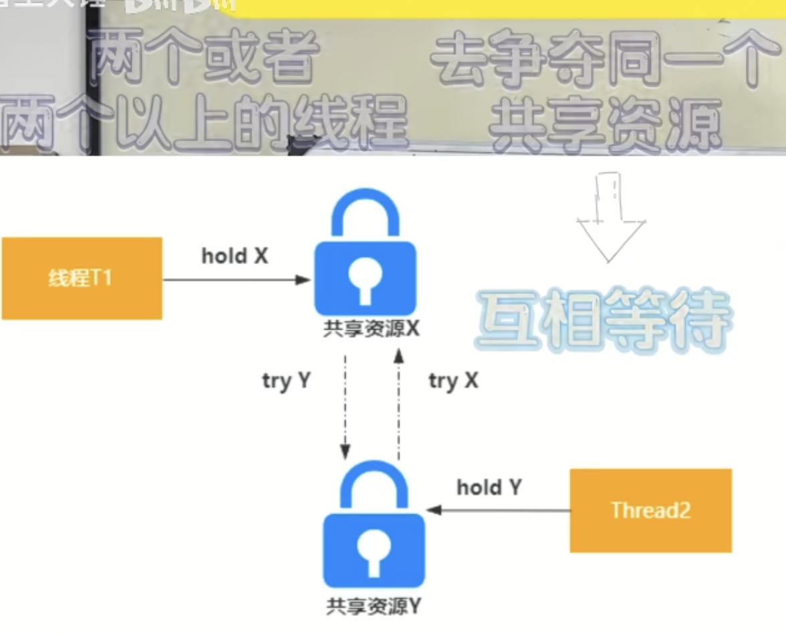

导致死锁的条件有四个，也就是这四个条件同时满足就会产生死锁。

- 互斥条件，共享资源 X 和 Y 只能被一个线程占用;

- 请求和保持条件，线程 T1 已经取得共享资源 X，在等待共享资源 Y 的时候，不释放共享资源 X;

- 不可抢占条件，其他线程不能强行抢占线程 T1 占有的资源;

- 循环等待条件，线程 T1 等待线程 T2 占有的资源，线程 T2 等待线程 T1 占有的资源，就是循

  环等待。 导致死锁之后，只能通过人工干预来解决，比如重启服务，或者杀掉某个线程。 所以，只能在写代码的时候，去规避可能出现的死锁问题。

  按照死锁发生的四个条件，只需要破坏其中的任何一个，就可以解决，但是，互斥条件是没办法破坏的， 因为这是互斥锁的基本约束，其他三方条件都有办法来破坏:

  -   对于“请求和保持”这个条件，我们可以一次性申请所有的资源，这样就不存在等待了。

  -   对于“不可抢占”这个条件，占用部分资源的线程进一步申请其他资源时，如果申请不到，可以主

      动释放它占有的资源，这样不可抢占这个条件就破坏掉了。

  -   对于“循环等待”这个条件，可以靠按序申请资源来预防。所谓按序申请，是指资源是有线性顺序

    的，申请的时候可以先申请资源序号小的，再申请资源序号大的，这样线性化后自然就不存在循环了

线程会一直在阻塞状态

jstack命佘
导出线程的dump日志
定位到具体
死锁的程序代码

只能重启或者 kill线程

将update时根据批次号排序的方案升级为热点数据垂直分表

1. **更新时根据批次号排序的方案**：在传统的更新操作中，可能会根据某个字段（例如批次号）对数据进行排序，然后进行更新。这种方案可能在处理大批量数据时效率较低，特别是当批次号比较分散，更新操作需要涉及到跨越大量数据的情况下。
2. **热点数据**：指的是访问频率非常高的数据，可能会导致数据库中某些表或字段的访问压力非常大。
3. **垂直分表**：是一种数据库分表的方式，将一张大表按照列进行划分，将不同的列存储在不同的物理表中。这种分表方式可以用来优化查询性能，尤其是当某些列的访问频率非常高时。

好处

1. **提高并发性能**：通过将热点数据分散到不同的物理表中，可以减少单表的访问压力，从而提高数据库的并发性能，减少数据库锁竞争，降低系统的响应时间。
2. **降低IO压力**：将热点数据单独存储在一个表中，可以降低对整个表的IO压力，减少数据库的读写负载，提高数据库的性能和稳定性。
3. **优化查询效率**：将不同访问频率的数据分别存储在不同的表中，可以根据业务需求对不同的表进行优化，例如添加索引、分区等操作，从而提高查询效率。
4. **提高扩展性**：垂直分表可以更灵活地根据业务需求进行扩展，可以根据不同的业务场景将数据分散到不同的表中，更好地满足业务发展的需求。
5. **降低风险**：通过将热点数据分散到不同的表中，可以降低单表数据量的大小，减少单表数据异常和损坏的风险，提高数据的安全性和可靠性。


# 解决因为网络抖动造成的线程池任务堆积连锁反应产生的 OOM

```
        调整线程池参数
        
        // 创建一个任务
        Runnable task = () -> System.out.println("执行任务");

        // 创建一个任务限速器，限制任务提交速率为每秒一次
        TaskRateLimiter rateLimiter = new TaskRateLimiter(task, 1000);

        // 启动任务限速器
        rateLimiter.start();
```

1. **监控线程池状态**：实时监控线程池的状态，及时发现线程池任务积压的情况，并采取相应的措施进行处理。可以使用监控工具或自定义监控机制来监控线程池的状态。
2. **实现任务拒绝策略**：当线程池无法处理更多的任务时，可以实现任务拒绝策略来处理新提交的任务。可以采取拒绝策略，如抛出异常、丢弃任务、阻塞等方式来处理新提交的任务，避免线程池因任务过多而导致的OOM问题。

# 使用zookeeper多个节点协同工作，使用zookeeper的协调机制来构建高可用、高灵活的分布式系统

# threadlocal应用场景

有场景,新对接一个公司,与其他业务关联不是很大,就用AOP切面为爱山东app封装了一个日志,记录操作和用户信息,其中一个需要记录方法执行的时间,在方法开始将当前时间存入threadlocal,然后方法结束,首先记录当前方法的开始时间放到threadlocal里面, 然后最后用当前时间减去threadlocal存储的时间,如果不用threadlocal可能会产生并发问题,其他线程会修改开始时间,导致时间不准

# 解决跨域

1. 实现implements WebMvcConfigurer这个bean
2. 重写addCorsMapping方法
   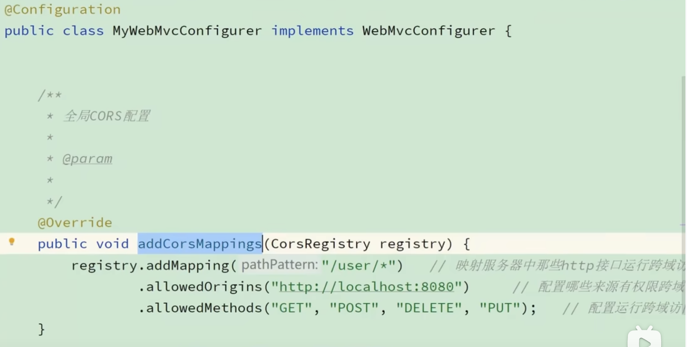
3. 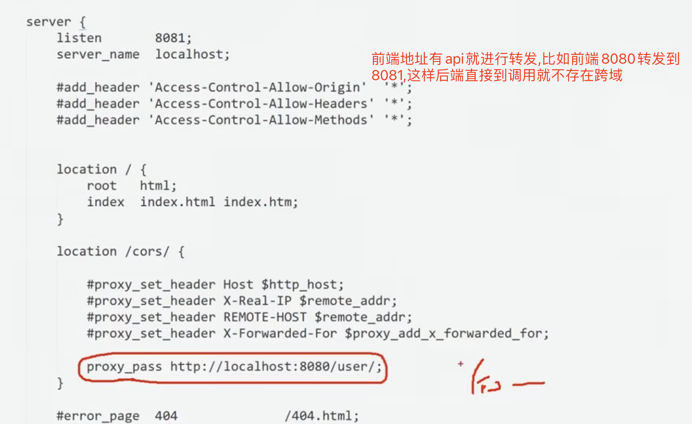
   前端还是调用当前域,前端请求过来当检测到api之后,就将8080转发到8081,这样前端调用还是自己的域,但是后端是不变的


# 事务消息

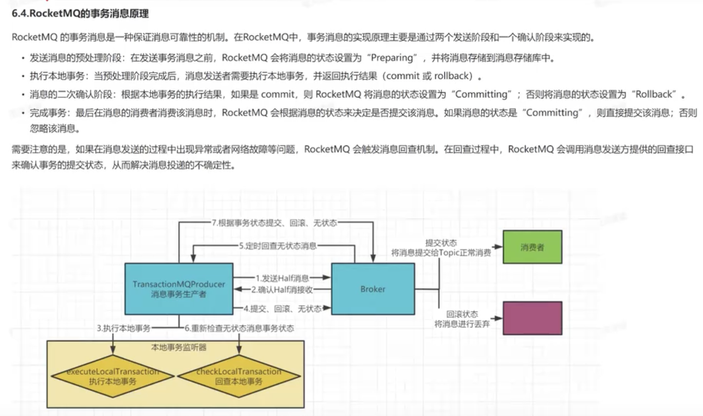

# websocket

## VebSocket是一种协议

设计用于提供低延迟、全双工和长期运行的连接
全双工：通信的两个参与方可以同时发送和接收数据，不需要等待对方的响应或传输完成

## 优点

双向实时通信
允许在单个、长时间的连接上进行双向实时通信。在需要快速实时更新的应用程序里，比HTTP更加高效
降低延迟
链接一旦建立便会保持开放，数据可以在客户端和服务器之间以比HTTP更低的延迟进行传输
更高效的资源利用
可以减少重复请求和响应的开销，因为它的连接只需要建立一次

## 心跳包

为了保持websocket稳定的长连接，在连接建立之后,服务器和客户端之间通过心跳来保持连接状以防止连接因为长时间没有数据专输而被切断

一种特殊的数据包
不包含任何实际数据，仅用来维持连接状态
一个空数据帧
定期发送，确保链接仍然有效，避免长时间没有数据传输而被中断

# 技能

l 深入理解MySql**事务隔离级别**、**MVCC****工作原理**、**索引**，会用Explain对数据库调优，了解百万级数据库优化方案

> dsf 

l 有扎实java基础知识，比如**集合**、**多线程**、**锁**、**ThreadLocal**、异常，研读过AQS、ThreadLocal、Java集合等源码

l 深入理解**Spring**、MyBatis、SpringMVC、 **SpringBoot**等主流 Java 开发框架，知道其原理，可二次开发框架

l 熟悉**SpringCloud**，熟练使用Nacos、Sentinel、Feign、Getway等微服务开发组件，知道CAP等概念

l 深入理解Redis核心数据结构使用场景，熟悉 **Redis** **持久化**和过期策略，熟悉多级缓存架构，知道使用**布隆过滤器降低并发压力**，熟悉各种缓存高并发的使用场景，比如缓存雪崩，缓存穿透，缓存击穿等

l 深入理解RocketMq消息中间件原理，会用**Mq****进行异步通信，应用解耦，削峰填谷**

l 熟悉一些分布式场景的技术，比如分布式事务**Seata**，分布式锁

l 熟悉设计模式，并可以在项目中熟练使用**单例**、**策略**、观察者、代理等模式

l 会使用Zookeeper中间件，知道脑裂，Leader选举机制，可以维护项目配置中心

l 熟悉并发编程，熟练使用 **Volatile**、**Synchronized**、**ReentrantLock**, 研读过**Synchronized**、**ReentrantLock**源码

l 了解JVM内存模型，了解垃圾回收算法，类的加载过程，垃圾回收器的特性

l 会Vue、**React**等主流前端框架，熟练使用Element UI，Antd，AntdPro等组件

